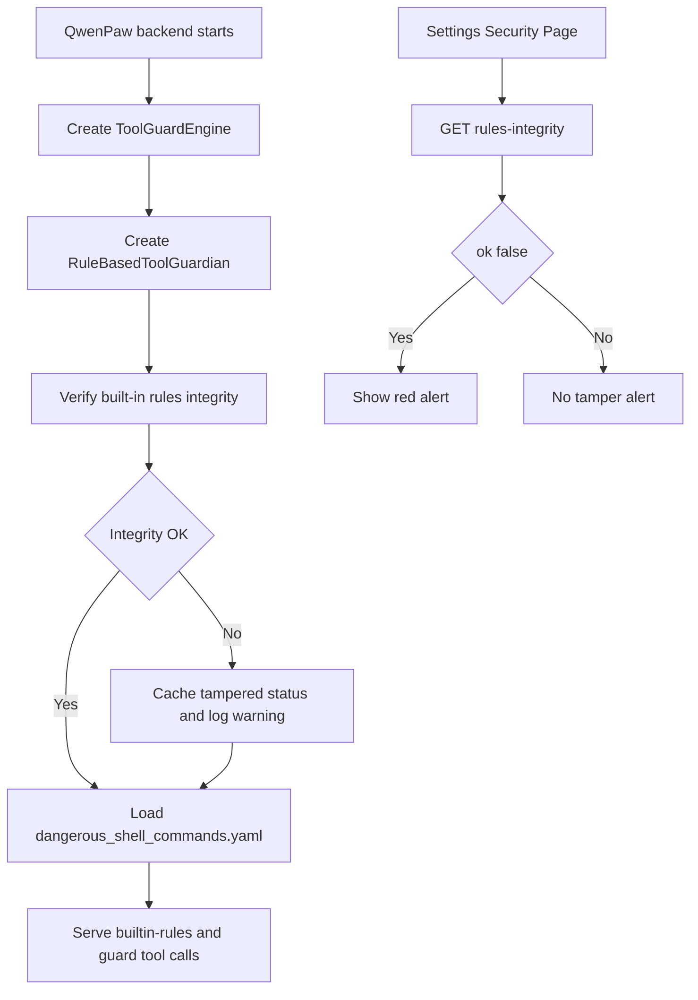

# QwenPaw 内置工具检测规则完整性保护设计

## 1. 背景

当前 QwenPaw 的工具防护内置规则主要来自：

```text
src/qwenpaw/security/tool_guard/rules/dangerous_shell_commands.yaml
```

例如前端“设置 / 安全 / 工具防护”中看到的 `TOOL_CMD_DANGEROUS_RM`，不是前端硬编码出来的规则，而是后端读取上述 YAML 后通过 API 返回给前端展示。

当前加载链路是：

```text
RuleBasedToolGuardian
  -> load_rules_from_directory()
  -> dangerous_shell_commands.yaml
  -> GuardRule
  -> ToolGuardEngine
  -> /api/config/security/tool-guard/builtin-rules
  -> 前端规则表格
```

目前这个 YAML 文件没有 hash、签名、manifest 或启动校验。如果有人直接删除、修改或弱化其中的规则，后端下一次启动或 reload 时会读取被修改后的内容，前端规则表格也会同步反映被修改后的规则集。

本设计的小目标是：**只保护 `dangerous_shell_commands.yaml` 这个内置规则文件的完整性；发现篡改时先报警，不阻断业务运行。**

## 2. 目标

1. 检测 `dangerous_shell_commands.yaml` 是否被篡改。
2. 检测 `rules_manifest.json` 是否被篡改。
3. 检测签名文件是否缺失或无效。
4. 后端日志中明确报警。
5. 前端“设置 / 安全”页面顶部以醒目红字提示：

```text
内置检测规则已被篡改
```

6. 方案尽量解耦，减少对现有规则加载逻辑的侵入。
7. 第一版只报警，不阻断规则加载。
8. 兼容源码运行、editable install、wheel 安装和后续 exe 打包。

## 3. 非目标

1. 第一版不保护整个 `config.json`。
2. 第一版不保护所有后端安全配置。
3. 第一版不保护用户自定义规则 `custom_rules`。
4. 第一版不改变现有工具防护规则匹配逻辑。
5. 第一版不实现 strict 阻断模式。
6. 第一版不把完整性状态写入 `config.json`。
7. 第一版不试图绝对阻止本机管理员修改程序。目标是提高篡改成本，并做到篡改后可发现。

## 4. 当前代码分析

### 4.1 内置规则文件

当前内置工具规则文件：

```text
src/qwenpaw/security/tool_guard/rules/dangerous_shell_commands.yaml
```

其中包含 `TOOL_CMD_DANGEROUS_RM` 等规则：

```yaml
- id: TOOL_CMD_DANGEROUS_RM
  tools: [execute_shell_command]
  params: [command]
  category: command_injection
  severity: HIGH
  patterns:
    - "\\brm\\b"
    - "\\bdel\\b"
    - "\\bRemove-Item\\b"
```

如果整条规则从 YAML 中删除，后端不会再加载它，前端规则表也不会再显示它。

### 4.2 后端规则加载位置

规则加载代码在：

```text
src/qwenpaw/security/tool_guard/guardians/rule_guardian.py
```

关键逻辑：

```python
_DEFAULT_RULES_DIR = Path(__file__).resolve().parent.parent / "rules"

_DEFAULT_RULE_FILES: list[str] = [
    "dangerous_shell_commands.yaml",
]
```

默认加载逻辑：

```python
def load_rules_from_directory(
    rules_dir: Path | None = None,
    *,
    rule_files: list[str] | None = None,
) -> list[GuardRule]:
    directory = rules_dir or _DEFAULT_RULES_DIR
    ...
    else:
        yaml_files = [directory / f for f in _DEFAULT_RULE_FILES]

    rules: list[GuardRule] = []
    for yaml_file in yaml_files:
        if yaml_file.is_file():
            rules.extend(load_rules_from_yaml(yaml_file))
```

### 4.3 前端规则展示来源

前端调用：

```text
GET /api/config/security/tool-guard/builtin-rules
```

后端接口在：

```text
src/qwenpaw/app/routers/config.py
```

它也是直接调用：

```python
rules = load_rules_from_directory()
```

因此，前端看到的内置规则列表和后端实际加载的内置规则，都依赖同一个 YAML 文件。

### 4.4 package data

当前 `pyproject.toml` 已包含：

```toml
"qwenpaw" = [
    "security/tool_guard/rules/**",
]
```

所以如果把 manifest 和签名文件放到 `security/tool_guard/rules/` 目录下，后续打包 wheel 或 exe 时可以作为 package data 一起带上。

## 5. 威胁模型

### 5.1 能防什么

本方案可以发现：

1. 只修改 `dangerous_shell_commands.yaml`。
2. 删除 `TOOL_CMD_DANGEROUS_RM` 等关键规则。
3. 修改规则正则，使检测变弱。
4. 修改规则 severity。
5. 修改 manifest 但没有合法签名。
6. 删除 manifest 或签名文件。
7. 发布包中文件被非预期改动。

### 5.2 不能绝对防什么

如果使用者拥有本机管理员权限，且 Python 源码明文发布，他可以同时修改：

```text
dangerous_shell_commands.yaml
rules_integrity.py
rule_guardian.py
```

这种情况下，任何运行在同一份本地代码里的校验逻辑都不能提供绝对防护。

因此，本方案的安全目标是：

```text
防误改
防低成本静默篡改
让只改规则文件或 manifest 的篡改可发现
为后续 exe 签名和 strict 模式打基础
```

## 6. 总体方案

采用“官方签名 manifest + 文件 hash”模式。

新增三个核心部分：

```text
src/qwenpaw/security/tool_guard/rules/rules_manifest.json
src/qwenpaw/security/tool_guard/rules/rules_manifest.sig
src/qwenpaw/security/tool_guard/rules_integrity.py
```

同时新增生成脚本：

```text
scripts/update_tool_rule_manifest.py
```

运行时流程：

```text
1. 后端准备加载内置规则
2. 调用 rules_integrity.py
3. 使用代码内置公钥验证 rules_manifest.sig
4. 确认 rules_manifest.json 未被篡改
5. 从 manifest 读取 dangerous_shell_commands.yaml 的 expected sha256
6. 计算当前 YAML 文件 actual sha256
7. 对比 expected 和 actual
8. 如果不一致，写日志并更新内存状态
9. 继续加载 YAML
10. 前端通过状态 API 读取完整性状态
11. 如果状态异常，在“设置 / 安全”顶部显示红色告警
```

## 7. 解耦与低侵入设计

为了减少侵入式修改，设计上遵循以下原则：

1. `rule_guardian.py` 只增加一个薄集成调用。
2. 完整性校验逻辑独立放在 `rules_integrity.py`。
3. 前端不解析文件、不计算 hash、不判断篡改，只读取后端状态。
4. 不修改 `ToolGuardConfig`。
5. 不写入 `config.json`。
6. 不改变 `load_rules_from_directory()` 的返回类型。
7. 不影响传入自定义 `rules_dir` 的测试和扩展场景。
8. 校验失败不抛异常，第一版只报警。

建议后端集成点只保留类似：

```python
if rules_dir is None:
    verify_builtin_rule_files(directory, _DEFAULT_RULE_FILES)
```

这样 `RuleBasedToolGuardian` 仍然只负责加载和匹配规则，完整性检查作为旁路能力存在。

## 8. 文件布局

建议新增：

```text
src/qwenpaw/security/tool_guard/rules/
  dangerous_shell_commands.yaml
  rules_manifest.json
  rules_manifest.sig

src/qwenpaw/security/tool_guard/
  rules_integrity.py

scripts/
  update_tool_rule_manifest.py
```

其中：

```text
dangerous_shell_commands.yaml
```

是被保护对象。

```text
rules_manifest.json
```

记录官方发布时该 YAML 的 SHA-256。

```text
rules_manifest.sig
```

是开发者私钥对 manifest 的 Ed25519 签名。

```text
rules_integrity.py
```

负责运行时验证 manifest 签名和 YAML hash。

```text
update_tool_rule_manifest.py
```

负责开发/发布时重新生成 manifest 和签名。

## 9. Manifest 设计

`rules_manifest.json` 建议格式：

```json
{
  "files": {
    "dangerous_shell_commands.yaml": {
      "required": true,
      "sha256": "<hex>"
    }
  },
  "generated_at": "2026-06-07T00:00:00Z",
  "hash_scheme": "sha256",
  "schema_version": 1,
  "signature_scheme": "ed25519-v1"
}
```

为保证签名稳定，生成脚本输出 manifest 时使用 canonical JSON：

```python
json.dumps(
    data,
    sort_keys=True,
    ensure_ascii=False,
    separators=(",", ":"),
)
```

签名对象是 `rules_manifest.json` 的原始 UTF-8 bytes。

## 10. 签名设计

使用 Ed25519 非对称签名。

原因：

1. 项目已有 `cryptography>=43.0.0` 依赖。
2. Ed25519 签名短，验证快，使用简单。
3. 私钥不需要进入用户机器。
4. 运行时只需要内置公钥。

密钥放置：

```text
私钥：只保存在发布机器或 CI 的安全环境中，不进仓库
公钥：写入 rules_integrity.py 或独立 rules_public_key.py
```

开发或发布时：

```text
QWENPAW_RULE_SIGNING_PRIVATE_KEY_FILE=/secure/path/ed25519_private.pem
python scripts/update_tool_rule_manifest.py
```

## 11. 后端校验模块设计

新增：

```text
src/qwenpaw/security/tool_guard/rules_integrity.py
```

建议对外暴露：

```python
def verify_builtin_rule_files(
    rules_dir: Path,
    rule_files: list[str],
) -> RuleIntegrityResult:
    ...


def get_last_rule_integrity_status() -> RuleIntegrityResult:
    ...
```

建议数据结构：

```python
@dataclass
class RuleIntegrityFinding:
    file: str
    reason: str
    expected_sha256: str | None = None
    actual_sha256: str | None = None
    detail: str = ""


@dataclass
class RuleIntegrityResult:
    ok: bool
    status: str
    message: str
    checked_at: str | None
    findings: list[RuleIntegrityFinding]
```

状态枚举：

```text
unknown
ok
tampered
manifest_invalid
missing_manifest
missing_signature
check_failed
```

模块内部维护最近一次校验状态：

```python
_last_status: RuleIntegrityResult | None = None
```

`verify_builtin_rule_files()` 每次执行后更新 `_last_status`。

`get_last_rule_integrity_status()` 只读取 `_last_status`，不重新读文件、不重复打印日志。

## 12. 后端集成点

### 12.1 规则加载前校验

修改：

```text
src/qwenpaw/security/tool_guard/guardians/rule_guardian.py
```

只在默认内置规则路径启用校验：

```python
if rules_dir is None:
    verify_builtin_rule_files(directory, _DEFAULT_RULE_FILES)
```

不对自定义 `rules_dir` 强制校验。

原因：

1. 单元测试常用临时 `rules_dir`。
2. 自定义规则目录不属于官方内置规则。
3. 避免把完整性保护逻辑扩散到扩展场景。

### 12.2 状态 API

新增只读接口：

```text
GET /api/config/security/tool-guard/rules-integrity
```

位置：

```text
src/qwenpaw/app/routers/config.py
```

放在工具防护相关 API 附近。

该接口：

1. 不触发重新校验。
2. 不读取 YAML。
3. 只返回最近一次校验状态。
4. 如果还没校验过，返回 `unknown`。

响应示例：

```json
{
  "status": "tampered",
  "ok": false,
  "message": "内置检测规则已被篡改",
  "checked_at": "2026-06-07T00:00:00Z",
  "findings": [
    {
      "file": "dangerous_shell_commands.yaml",
      "reason": "sha256_mismatch",
      "expected_sha256": "expected...",
      "actual_sha256": "actual...",
      "detail": ""
    }
  ]
}
```

## 13. 前端告警设计

### 13.1 展示位置

前端需要在“设置 / 安全”页面顶部显示红色告警。

建议位置：

```text
console/src/pages/Settings/Security/index.tsx
```

放在：

```text
PageHeader 下方
Tabs 上方
```

这样用户不管当前打开的是“工具防护”“文件防护”“Skill 扫描”还是“免认证主机”，都能看到告警。

### 13.2 展示文案

主文案：

```text
内置检测规则已被篡改
```

辅助文案：

```text
请检查 dangerous_shell_commands.yaml、rules_manifest.json 和 rules_manifest.sig 是否来自官方发布包。
```

### 13.3 样式

建议样式：

```text
红色文字
浅红背景
红色边框
页面顶部
较高视觉权重
```

对应样式文件：

```text
console/src/pages/Settings/Security/index.module.less
```

可以新增：

```less
.integrityAlert {
  margin: 12px 16px 0;
  padding: 12px 14px;
  border: 1px solid #ff4d4f;
  background: #fff1f0;
  color: #cf1322;
  border-radius: 8px;
  font-weight: 600;
}
```

暗色模式下可补充对应样式。

### 13.4 前端数据流

修改：

```text
console/src/api/modules/security.ts
```

新增：

```typescript
getToolGuardRulesIntegrity: () =>
  request<ToolGuardRulesIntegrityResponse>(
    "/config/security/tool-guard/rules-integrity",
  )
```

修改：

```text
console/src/pages/Settings/Security/useSecurityPage.ts
```

在安全页加载时请求完整性状态，并返回给页面：

```typescript
rulesIntegrity
```

修改：

```text
console/src/pages/Settings/Security/index.tsx
```

当：

```typescript
rulesIntegrity?.ok === false
```

渲染红色告警。

前端不要自行计算 hash，也不要根据规则列表是否缺失来判断篡改。

## 14. 运行时流程



## 15. 校验失败策略

第一版：

```text
warn only
```

行为：

1. 后端写 warning/error 日志。
2. 更新最近一次完整性状态。
3. 前端安全页显示红色告警。
4. 继续加载 YAML。
5. 不阻断启动。
6. 不阻断规则 API。
7. 不阻断工具调用。

后续可升级为：

```text
strict
```

strict 模式下可以考虑：

1. 拒绝加载被篡改规则。
2. 拒绝启动后端。
3. 禁止保存工具防护设置。
4. 要求用户恢复官方文件。

## 16. 日志设计

YAML hash 不一致：

```text
Built-in tool guard rule integrity check failed: dangerous_shell_commands.yaml
reason=sha256_mismatch
expected=<manifest hash>
actual=<actual hash>
action=warn_only_loaded_anyway
```

manifest 签名失败：

```text
Built-in tool guard rule manifest signature verification failed
reason=signature_invalid
action=warn_only_loaded_anyway
```

manifest 缺失：

```text
Built-in tool guard rule manifest missing
reason=missing_manifest
action=warn_only_loaded_anyway
```

签名文件缺失：

```text
Built-in tool guard rule manifest signature missing
reason=missing_signature
action=warn_only_loaded_anyway
```

## 17. Manifest 生成脚本设计

新增：

```text
scripts/update_tool_rule_manifest.py
```

职责：

1. 定位 `src/qwenpaw/security/tool_guard/rules/dangerous_shell_commands.yaml`。
2. 计算 SHA-256。
3. 生成 canonical `rules_manifest.json`。
4. 读取 Ed25519 私钥。
5. 对 manifest bytes 签名。
6. 写出 `rules_manifest.sig`。

输入：

```text
QWENPAW_RULE_SIGNING_PRIVATE_KEY_FILE
```

输出：

```text
src/qwenpaw/security/tool_guard/rules/rules_manifest.json
src/qwenpaw/security/tool_guard/rules/rules_manifest.sig
```

发布流程要求：

```text
只要修改 dangerous_shell_commands.yaml，就必须重新生成 manifest 和签名。
```

## 18. exe 打包兼容性

这套方案兼容 exe。

### 18.1 onedir

可能形态：

```text
QwenPaw/
  qwenpaw.exe
  _internal/
    qwenpaw/security/tool_guard/rules/
      dangerous_shell_commands.yaml
      rules_manifest.json
      rules_manifest.sig
```

运行时读取这些 package data 并校验。

### 18.2 onefile

可能形态：

```text
qwenpaw.exe
```

PyInstaller 运行时会把资源解压到临时目录。只要这三个文件被作为 package data 打包进去，运行时仍能读取并校验。

### 18.3 exe 签名

后续正式发布建议：

1. `rules_manifest.sig` 保护 manifest。
2. manifest hash 保护 YAML。
3. Windows Authenticode 保护 exe 本体。

这样：

```text
只改 YAML -> hash 校验失败
改 YAML 和 manifest -> manifest 签名失败
改 exe 校验逻辑 -> exe 代码签名失效
```

## 19. 测试计划

### 19.1 后端单元测试

测试文件建议：

```text
tests/unit/security/tool_guard/test_rules_integrity.py
```

测试场景：

1. 正常 manifest + 正常 YAML，返回 `ok=True`。
2. 修改 YAML 不更新 manifest，返回 `ok=False`，status 为 `tampered`。
3. 修改 manifest 不更新 sig，返回 `ok=False`，status 为 `manifest_invalid`。
4. 删除 manifest，返回 `ok=False`，status 为 `missing_manifest`。
5. 删除 sig，返回 `ok=False`，status 为 `missing_signature`。
6. manifest 中缺少 required 文件，返回异常状态。
7. hash 算法不支持，返回异常状态。
8. 校验失败时不抛异常。
9. `get_last_rule_integrity_status()` 返回最近一次结果。

### 19.2 规则加载测试

现有测试位置：

```text
tests/unit/security/tool_guard/guardians/test_rule_guardian.py
```

新增或调整：

1. 默认内置规则路径会调用完整性校验。
2. 自定义 `rules_dir` 不强制官方签名。
3. 校验失败后仍继续加载规则。

### 19.3 API 测试

测试：

```text
GET /api/config/security/tool-guard/rules-integrity
```

场景：

1. 正常状态返回 `ok: true`。
2. 篡改状态返回 `ok: false`。
3. 篡改状态返回文案 `内置检测规则已被篡改`。
4. 未校验过返回 `unknown`。

### 19.4 前端测试

测试：

1. `rulesIntegrity.ok === false` 时显示红色告警。
2. 告警文案包含 `内置检测规则已被篡改`。
3. `rulesIntegrity.ok === true` 时不显示告警。
4. `rulesIntegrity.status === "unknown"` 时不显示篡改告警。
5. 后端接口失败时不阻塞安全页主体展示。

## 20. 实施步骤

### Phase 1：后端校验模块

1. 新增 `rules_integrity.py`。
2. 定义结果模型。
3. 实现 manifest 读取。
4. 实现 Ed25519 签名验证。
5. 实现 YAML SHA-256 校验。
6. 实现最近状态缓存。
7. 校验失败只日志报警，不抛异常。

### Phase 2：生成 manifest 和签名

1. 新增 `scripts/update_tool_rule_manifest.py`。
2. 生成 `rules_manifest.json`。
3. 生成 `rules_manifest.sig`。
4. 将两个文件放入 `rules/` 目录。

### Phase 3：接入规则加载

1. 在 `load_rules_from_directory()` 默认内置规则路径前调用校验。
2. 自定义 `rules_dir` 不校验。
3. 保持原返回类型和加载行为。

### Phase 4：后端状态 API

1. 新增 `GET /api/config/security/tool-guard/rules-integrity`。
2. 返回最近一次状态。
3. 未校验时返回 `unknown`。

### Phase 5：前端红色告警

1. `security.ts` 新增 API 类型和调用。
2. `useSecurityPage.ts` 加载完整性状态。
3. `index.tsx` 在 `PageHeader` 下方展示红色告警。
4. `index.module.less` 新增样式。

### Phase 6：测试

1. 后端单元测试。
2. 路由测试。
3. 前端组件或 hook 测试。
4. 手工验证：改 YAML 后刷新安全页，看到红字。

## 21. 后续增强方向

1. 增加 strict 模式。
2. 把更多内置规则文件纳入 manifest。
3. 把完整性事件写入安全审计日志。
4. 在首页或状态栏展示安全异常。
5. exe 发布时增加 Authenticode 签名。
6. 在 CI 中强制检查：修改 YAML 后必须同步更新 manifest 和签名。
7. 发布页面提供官方 checksum，方便外部独立验证。

## 22. 最终结论

推荐采用：

```text
Ed25519 签名 manifest
+ dangerous_shell_commands.yaml SHA-256
+ 后端低侵入校验模块
+ 后端状态 API
+ 前端设置/安全页红色告警
```

该方案的优点：

1. 对现有规则加载逻辑侵入小。
2. 不污染 `config.json`。
3. 不改变工具防护行为。
4. 能发现只篡改 YAML 或 manifest 的情况。
5. 前端能给用户明确安全提示。
6. 后续可平滑升级到 strict 模式和 exe 代码签名。

