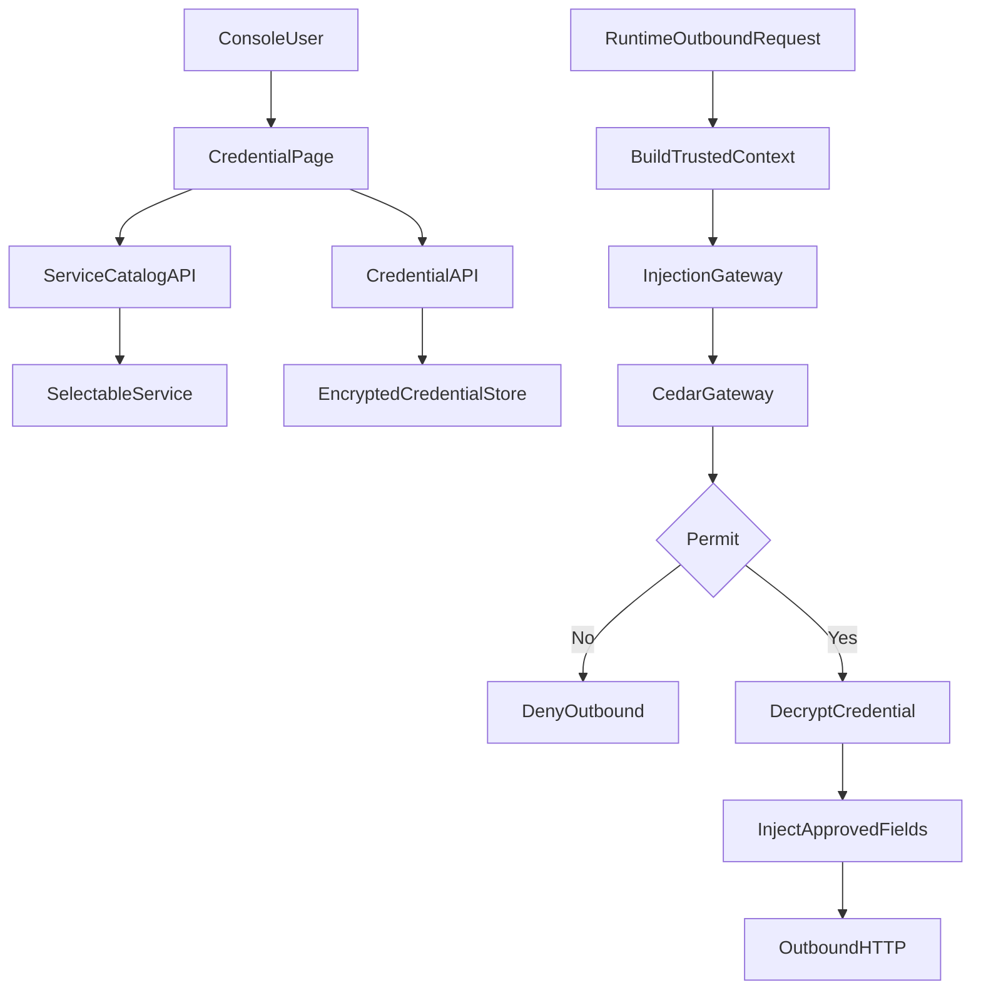

# Agent 凭据统一纳管与 Cedar 网关注入设计方案

## 1. 背景

QwenPaw 已经具备基础凭据中心能力：用户可以在 Console 中为 Agent 创建凭据，后端负责加密存储，并按 Agent 维度隔离。接下来需要解决的是运行时安全注入问题：

- 用户如何知道一个凭据应该绑定到哪个服务；
- 网关如何验证当前请求确实来自某个可信 Agent；
- 网关如何判断当前 Agent 是否允许把某条凭据明文注入到某个请求；
- 如何避免把 A 服务的凭据错误注入到 B 服务，造成明文泄露；
- 如何让普通用户不用理解 `service_id`、Cedar、字段映射等内部概念。

因此，本方案的目标不是让用户手写底层绑定字段，而是提供一个用户友好的闭环：

> 用户在 Console 选择“某个 Agent 的某个服务需要使用某个凭据”，系统自动生成绑定关系和策略上下文，运行时由 Cedar 网关授权后再注入对应明文。

---

## 2. 设计目标

1. **Console 统一配置**  
   用户通过 Console 为 Agent 配置凭据，不需要手工编辑配置文件。

2. **凭据加密与 Agent 隔离**  
   凭据明文只在创建/更新和运行时注入瞬间出现，持久化时加密；Agent A 默认不能使用 Agent B 的凭据。

3. **服务目录替代手填 `service_id`**  
   系统根据当前 Agent 的 MCP、工具、已接入渠道等配置自动生成“可绑定服务目录”，用户通过下拉选择服务。

4. **Cedar 策略集中管理**  
   Cedar 策略在“安全策略中心”统一配置和管理，不散落在凭据数据中。

5. **网关运行时授权后注入**  
   网关基于可信上下文（Agent、服务、操作、目标 host、候选凭据字段）做授权；只有 permit 后应用侧才解密并注入。

6. **Provider 链路保持不变**  
   大模型 Provider 的 API Key UI 和调用逻辑不纳入本期动态注入治理，避免影响高频模型调用体验。

---

## 3. 非目标

- 不要求普通用户直接写 Cedar 策略。
- 不把凭据明文交给 Cedar 策略文本或远端策略服务。
- 不在本期改造 Provider（大模型）配置页面。
- 不在本期做进程级或容器级强隔离。
- 不在本期继续扩展飞书、微信等更多渠道接入。

---

## 4. 总体架构



核心分工：

- Console：负责把复杂策略配置变成用户可理解的选择项。
- 服务目录：负责告诉用户“这个 Agent 当前有哪些服务可以绑定凭据”。
- 凭据中心：负责加密存储、Agent 隔离和凭据元数据。
- 注入网关：负责运行时组装可信上下文、调用 Cedar、执行注入。
- Cedar 网关：负责策略评估，只返回授权结果，不处理明文。

---

## 5. 用户体验设计

### 5.1 凭据创建流程

用户进入 Console 的凭据页面，创建凭据时看到以下表单：

- Agent：当前选中的 Agent。
- 凭据名称：例如 `GitHub Token`。
- 凭据类型：API Key / Token / Custom KV。
- 使用场景：
  - MCP
  - 外部工具
  - 插件/渠道
- 目标服务：从服务目录下拉选择，例如 `MCP: github`。
- 注入位置：用字段映射表单配置，例如：
  - `token` -> `header.Authorization`
  - `token` -> `env.GITHUB_TOKEN`
- 允许访问 Host：默认由服务目录推导，例如 `api.github.com`。
- 高级策略：默认关闭，高级用户可查看或编辑 Cedar 策略。

用户不需要知道内部 `service_id` 是 `mcp:github`，也不需要手写 Cedar。

### 5.2 凭据详情展示

凭据详情页应展示：

- 凭据作用域：Agent / Global。
- 所属 Agent。
- 绑定服务：例如 `MCP: github`。
- 允许 Host。
- 字段映射。
- 策略状态：默认策略 / 自定义策略 / 兼容模式。
- 最近一次注入审计结果：allow / deny / fallback。

### 5.3 旧凭据兼容提示

旧凭据如果没有绑定服务，应显示：

> 未绑定服务，当前处于兼容模式。建议绑定到具体服务后启用严格策略。

并提供“一键绑定服务”的入口。

---

## 6. 服务目录设计

### 6.1 服务目录的作用

服务目录用于替代用户手填 `service_id`。它是后端根据当前 Agent 配置动态生成的可绑定目标列表。

建议 API：

```text
GET /api/credential-bindings/services?agent_id=<agent_id>
```

返回示例：

```json
[
  {
    "service_id": "mcp:github",
    "type": "mcp",
    "name": "github",
    "display_name": "MCP: github",
    "allowed_hosts": ["api.github.com"],
    "supported_fields": ["header.Authorization", "env.GITHUB_TOKEN"],
    "enabled": true
  },
  {
    "service_id": "tool:agent_api",
    "type": "tool",
    "name": "agent_api",
    "display_name": "Tool: Agent API",
    "allowed_hosts": ["127.0.0.1", "localhost"],
    "supported_fields": ["header.Authorization"],
    "enabled": true
  },
  {
    "service_id": "channel:mattermost",
    "type": "channel",
    "name": "mattermost",
    "display_name": "Channel: Mattermost",
    "allowed_hosts": ["mattermost.example.com"],
    "supported_fields": ["header.Authorization"],
    "enabled": true
  }
]
```

### 6.2 服务目录来源

MCP 服务：

- 从当前 Agent 的 `mcp.clients` 生成；
- `service_id = mcp:<client_key>`；
- `allowed_hosts` 从 client URL 中解析；
- `supported_fields` 默认支持 `header.*` 和 `env.*`。

外部工具服务：

- 从已接入动态注入的工具注册表生成；
- 例如 `tool:agent_api`；
- 只暴露明确支持凭据注入的工具。

插件/渠道服务：

- 从已启用且已接入注入网关的渠道配置生成；
- 当前建议仅展示已接入的 Mattermost；
- 飞书、微信等暂不展示，避免用户以为已经支持。

插件服务：

- 后续由插件 manifest 声明：
  - service id；
  - service display name；
  - allowed hosts；
  - supported fields；
  - policy template。

---

## 7. 凭据存储与绑定模型

凭据仍由凭据中心统一保存，核心字段包括：

```json
{
  "id": "cred_xxx",
  "name": "GitHub Token",
  "type": "token",
  "scope": "agent",
  "agent_id": "assistant_a",
  "service_id": "mcp:github",
  "allowed_hosts": ["api.github.com"],
  "data": {
    "token": "<encrypted>"
  },
  "field_map": {
    "token": "header.Authorization"
  }
}
```

注意：

- `data` 中的值必须加密落盘；
- `service_id` 应由服务目录生成；
- `allowed_hosts` 默认由服务目录推导；
- `field_map` 应由 UI 表单生成；
- Agent scope 凭据必须绑定 `agent_id`；
- 动态注入路径默认不使用其他 Agent 的凭据。

---

## 8. Cedar 策略配置中心

### 8.1 策略在哪里配置

建议在 Console 新增：

```text
Settings -> Security -> Credential Policies
```

策略中心分为两种模式：

- 普通模式：用户通过表单配置策略。
- 高级模式：用户直接查看或编辑 Cedar 策略。

### 8.2 普通模式

普通用户看到：

- Agent：`assistant_a`
- 服务：`MCP: github`
- 凭据：`GitHub Token`
- 允许操作：`mcp:inject`
- 允许 Host：`api.github.com`
- 允许字段：`header.Authorization`

保存后系统自动生成 Cedar 策略。

### 8.3 高级模式

高级用户可以看到类似策略：

```cedar
permit(
  principal == Agent::"assistant_a",
  action == Action::"mcp:inject",
  resource == Service::"mcp:github"
)
when {
  context.credential_id == "cred_github_token"
  && context.target_host == "api.github.com"
  && context.mapped_keys.contains("header.Authorization")
};
```

### 8.4 策略保存位置

推荐本地保存：

```text
<working_dir>/security/cedar/policies/*.cedar
<working_dir>/security/cedar/schema.json
```

后端负责：

- 保存策略；
- 校验语法；
- 生成策略 ID；
- 通知 Cedar sidecar reload；
- 记录策略版本。

Cedar sidecar 负责：

- 加载策略；
- 接收授权请求；
- 返回 permit/deny；
- 不接触凭据明文。

---

## 9. 运行时网关注入流程

### 9.1 可信上下文来源

运行时上下文不能来自模型输出，也不能来自前端传参。必须来自后端可信运行时：

- `agent_id`：当前 Workspace / Agent runtime context。
- `request_type`：由接入点决定，例如 `mcp`、`tool`、`channel`。
- `service_id`：由服务目录和接入点生成。
- `target_host`：从实际请求 URL 解析。
- `action`：由请求类型生成，例如 `mcp:inject`。
- `candidate_credential_id`：来自当前服务绑定的 CredentialRef。
- `candidate_mapped_keys`：来自凭据字段映射结果。

### 9.2 Cedar 请求

应用侧向 Cedar 网关发送：

```json
{
  "principal": "assistant_a",
  "action": "mcp:inject",
  "resource": "mcp:github",
  "context": {
    "target_host": "api.github.com",
    "credential_id": "cred_github_token",
    "mapped_keys": ["header.Authorization"],
    "request_type": "mcp"
  }
}
```

请求需要带签名，防止伪造：

- timestamp；
- nonce；
- body hash；
- HMAC signature；
- TTL。

### 9.3 Cedar 响应

```json
{
  "permit": true,
  "policy_id": "policy_github_mcp",
  "approved_credential_id": "cred_github_token",
  "approved_mapped_keys": ["header.Authorization"],
  "reason": "matched github mcp policy"
}
```

应用收到 permit 后才：

1. 从本地加密 store 读取并解密凭据；
2. 只注入 `approved_mapped_keys` 中允许的字段；
3. 发送出站请求；
4. 写审计日志。

---

## 10. 安全策略

### 10.1 Agent 隔离

- Agent scope 凭据只能被同一 Agent 使用。
- Global 凭据默认不进入动态注入路径，除非策略显式允许。
- 当前 Agent ID 必须来自运行时上下文。

### 10.2 服务绑定

- 凭据必须绑定服务目录中的服务。
- 请求服务必须与凭据绑定服务一致。
- 不允许调用点自由构造不存在的 service id。

### 10.3 Host 校验

- 请求目标 host 必须在 `allowed_hosts` 中；
- `allowed_hosts` 默认由服务目录生成；
- 如果 host 缺失且服务需要 HTTP 出站，应拒绝。

### 10.4 字段白名单

- 仅允许注入明确映射字段；
- 默认允许：
  - `header.*`
  - `env.*`
- 不允许任意字段透传；
- Cedar 可进一步缩小允许字段集合。

### 10.5 Fail Closed

严格模式下以下情况均拒绝出站：

- 凭据不存在；
- 凭据不属于当前 Agent；
- 服务绑定不匹配；
- host 不匹配；
- Cedar deny；
- Cedar 网关不可用；
- 解密失败；
- 字段映射为空。

---

## 11. 审计与观测

审计记录：

- timestamp；
- agent_id；
- request_type；
- service_id；
- credential_id；
- target_host；
- decision：allow / deny；
- decision_source：cedar / legacy；
- policy_id；
- reason_code；
- mapped_keys。

禁止记录：

- 凭据明文；
- 完整 Authorization header；
- token、cookie、secret value。

审计用途：

- 用户排查“为什么没有注入”；
- 管理员排查策略误配；
- 安全审计凭据是否被跨服务使用。

---

## 12. 灰度与兼容

### 12.1 灰度模式

`strict_mode=false`：

- Cedar permit：按 Cedar 结果注入；
- Cedar deny：拒绝；
- Cedar 不可用：回退本地策略；
- 审计记录 `cedar_unavailable_fallback`。

### 12.2 强管控模式

`strict_mode=true`：

- Cedar 不可用直接拒绝；
- 无策略匹配直接拒绝；
- 旧凭据无绑定直接拒绝；
- 适合生产启用。

### 12.3 旧凭据迁移

旧凭据分三类：

- 已通过 MCP 迁移生成的凭据：可自动补全服务绑定；
- 手工创建但无绑定的 Agent 凭据：UI 提示绑定服务；
- Global 凭据：默认不进入动态注入，除非用户显式升级。

---

## 13. 分阶段落地

### 阶段 1：闭环最小化

- 新增服务目录 API；
- 凭据 UI 支持服务选择；
- 创建/更新凭据时保存 service binding；
- MCP 走完整闭环。

### 阶段 2：策略中心

- 新增 Credential Policies 页面；
- 支持表单生成 Cedar 策略；
- 支持高级 Cedar 编辑；
- 支持策略版本和 reload。

### 阶段 3：严格模式

- 增加 strict mode 开关；
- 对目标 Agent 灰度启用；
- 修复策略缺口；
- 最终对动态注入路径启用 fail closed。

### 阶段 4：扩展接入

- 外部工具按服务目录逐步接入；
- 插件通过 manifest 声明服务；
- 渠道按需接入，不一次性扩大范围。

---

## 14. 验收标准

### 功能验收

- 用户能在 Console 为指定 Agent 创建加密凭据；
- 用户能从下拉服务目录中选择绑定服务；
- 系统自动生成 service id 和 allowed hosts；
- MCP 请求能通过 Cedar permit 后注入正确字段。

### 安全验收

- Agent A 不能使用 Agent B 的凭据；
- 凭据绑定 `mcp:github` 时不能注入到 `mcp:slack`；
- host 不匹配时拒绝出站；
- Cedar deny 时不发生出站请求；
- 审计日志不出现明文 secret。

### 兼容验收

- Provider 大模型配置和调用逻辑不变；
- 未启用 Cedar 时现有 MCP 行为不破坏；
- Mattermost、外部工具的可选接入未配置时不改变原行为。

---

## 15. 推荐最终用户心智模型

用户不需要理解 `service_id`，只需要理解：

> 我给哪个 Agent 的哪个服务配置了什么凭据。

系统内部自动完成：

- Agent 隔离；
- 服务识别；
- 凭据加密存储；
- 字段映射；
- Cedar 策略评估；
- 明文注入；
- 审计记录。

这能让凭据中心从“存 secret 的地方”升级为“Agent 访问外部服务的安全控制面”。
