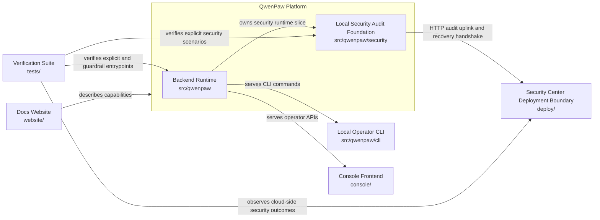

# QwenPaw 1-Layer Architecture

## Scope

This view is a level-1 architecture diagram for the current repository state. It keeps only the largest stable elements that are confirmed by the intent graph, implementation contracts, and current code layout.

## Recommended L1 View

Recommendation: treat the repository as one product boundary plus seven primary repository elements, for eight visible L1 elements in total.

Reason: the seven repository elements plus the product boundary are the coarsest stable units that are explicitly named in `design/KG/SystemArchitecture.json`, materialized in `OVERALL_ARCHITECTURE.md`, and backed by stable repository paths. Splitting them further would turn the diagram into an implementation-detail view rather than a level-1 view.

## Element Mapping

| L1 element | Intent anchor | Implementation anchor | Repository evidence |
| --- | --- | --- | --- |
| QwenPaw Platform | `intent-qwenpaw-platform` | repository root product boundary | `README.md`, `OVERALL_ARCHITECTURE.md` |
| Backend Runtime | `intent-backend-runtime` | `src/qwenpaw` | `src/qwenpaw/ARCHITECTURE.md` |
| Local Security Audit Foundation | `intent-local-security-audit-foundation` | `src/qwenpaw/security` | `src/qwenpaw/security/ARCHITECTURE.md` |
| Local Operator CLI | `intent-local-operator-cli` | `src/qwenpaw/cli` | `src/qwenpaw/cli/ARCHITECTURE.md` |
| Console Frontend | `intent-console-frontend` | `console` | `console/ARCHITECTURE.md` |
| Docs Website | `intent-docs-website` | `website` | `website/ARCHITECTURE.md` |
| Security Center Deployment Boundary | `intent-security-center` and `intent-cloud-integrity-stub` | `deploy` | `deploy/ARCHITECTURE.md`, `deploy/api/ARCHITECTURE.md`, `deploy/web/ARCHITECTURE.md` |
| Verification Suite | explicit testcase and guardrail ownership in the current implementation architecture | `tests` | `tests/ARCHITECTURE.md` |

## Interaction Rules Captured In This View

- Backend Runtime serves the Local Operator CLI and the Console Frontend.
- Local Security Audit Foundation is the stable security slice inside the Backend Runtime rather than an external service.
- Security Center stays a separate deployment boundary and is reached from the edge runtime through HTTP-based audit uplink rather than shared storage or in-process calls.
- Docs Website publishes and explains platform capabilities but does not participate in runtime execution.
- Verification Suite is repository-owned and validates the runtime, the security slice, and cloud-visible security outcomes through explicit entrypoints and architecture guardrails.

## Deliberate Omissions

- Internal security subcomponents such as the high-risk tool guard, audit uplink manager, and cloud integrity stub are intentionally collapsed into their parent coarse-grained elements.
- `deploy/api` and `deploy/web` are intentionally shown as one L1 Security Center boundary.
- Architecture validator assets are omitted from the diagram because they are governance support assets rather than a primary runtime collaboration element in a level-1 product view.
