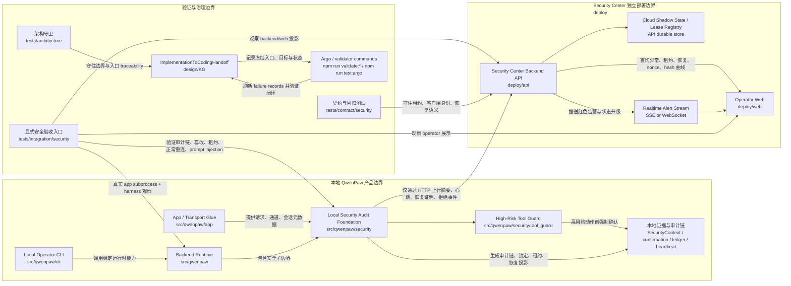
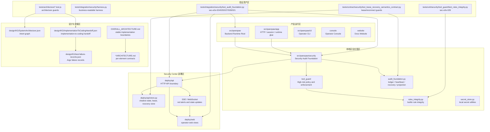

# QwenPaw Implementation Architecture Temp View

## Scope

This temporary view summarizes the current implementation architecture from `design/persistant-memory/implementation-design.md` and the implementation contracts it points to. It focuses on the security/audit delivery slice that repeatedly appears in the implementation memory: local runtime evidence, Security Center cloud boundary, operator visibility, explicit acceptance entrypoints, and the implementation-to-coding handoff.

## 实现架构图

## 关键架构元素分布图

## 关键架构元素

| 分布区域 | 核心元素 | 实现锚点 | 架构职责 |
| --- | --- | --- | --- |
| 产品运行区 | Backend Runtime | `src/qwenpaw` | 承载后端编排、运行时 glue、CLI/API 能力，并包含本地安全子边界。 |
| 产品运行区 | App / Transport Glue | `src/qwenpaw/app` | 提供请求、通道、会话等运行时元数据，但不拥有安全验收语义。 |
| 本地安全实现区 | Local Security Audit Foundation | `src/qwenpaw/security` | 统一拥有可信上下文、确认凭证、审计链、篡改锁定、租约心跳、恢复投影与高风险工具保护语义。 |
| 本地安全实现区 | High-Risk Tool Guard | `src/qwenpaw/security/tool_guard` | 在工具调用边界执行高风险确认与拒绝，确保执行前先持久化证据。 |
| 本地安全实现区 | Builtin Rule Integrity | `rules_integrity.py` / `scripts/update_tool_rule_manifest.py` | 使用共享 LF-normalized hash 规则，避免 Windows CRLF 签名误报，同时保留语义篡改检测。 |
| Security Center 部署区 | Backend API | `deploy/api` | 作为边缘运行时唯一 HTTP 云侧入口，接收 uplink、维护租约、处理恢复、发布 operator query。 |
| Security Center 部署区 | Operator Web | `deploy/web` | 展示异常、UNTRUSTED、恢复状态、hash-break 曲线、nonce Voucher 与实时红色告警。 |
| 验证资产区 | Explicit Security Entrypoints | `tests/integration/security` | 以真实 app subprocess 与业务可读 harness 验证 sec-e2e-024/025/027/028/021。 |
| 验证资产区 | Rule Integrity Entrypoint | `tests/unit/security/tool_guard/test_rules_integrity.py` | 验证 sec-e2e-029 的 LF/CRLF 不变量与语义篡改分支。 |
| 设计与交接区 | Implementation Handoff | `design/KG/ImplementationToCodingHandoff.json` | 记录显式入口、状态、验证命令、冻结文件和 Coding/Repair 目标。 |

## 当前实现主线

- `implementation-design.md` 记录的实现主线已经从安全验收缺口逐步收敛到 6 个显式入口全部通过：`sec-e2e-024`、`sec-e2e-025`、`sec-e2e-027`、`sec-e2e-028`、`sec-e2e-021`、`sec-e2e-029`。
- 安全语义集中在 `src/qwenpaw/security`；`src/qwenpaw/app` 可以提供 transport/session 证据，但不能重新定义审计、租约、恢复、锁定或高风险工具边界。
- Security Center 是独立部署边界，边缘运行时只能经由 `deploy/api` 的 HTTP API 上行，不能共享存储、导入云侧代码或绕过后端 API 直接写 Web。
- 显式验收入口保持冻结，由 `tests/integration/security/harness.py` 屏蔽运行时细节，测试主体保留 GIVEN/WHEN/THEN 风格的业务可读性。
- `design/KG/ImplementationToCodingHandoff.json` 与 `design/KG/test-failure-records.json` 是实现设计到修复阶段的交接状态面；当前交接记录显示 sec-e2e-029 已闭环，failure records 为空。

## 架构约束摘要

- 本地安全边界必须保存一个 canonical runtime client id，贯穿 startup heartbeat、recovery preflight、lockdown projection、restored-access projection 和 Security Center timeline。
- 租约过期后的恢复必须经过缺口验证；正常离线且在租约过期前重连的路径必须保持 `CLEAR`，不能误判为 `GAP_VALIDATION_REQUIRED`。
- 历史审计记录篡改必须验证完整 ledger，而不是只检查 checkpoint 或最新 tail record。
- `Security_Rejection_Nonce` 必须成为持久拒绝事件和 operator Voucher，并通过 SSE/WebSocket 在 500ms 内触发红色告警。
- 内置规则完整性校验必须共享 LF-normalized digest helper，使 CRLF-only checkout 不被视为篡改，语义内容修改仍被判定为 tampered。
