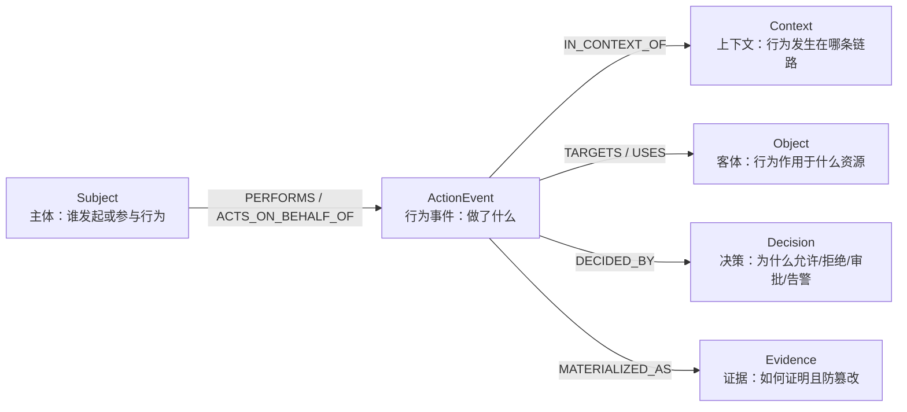
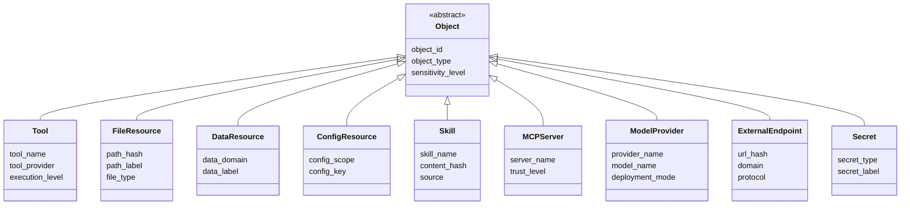
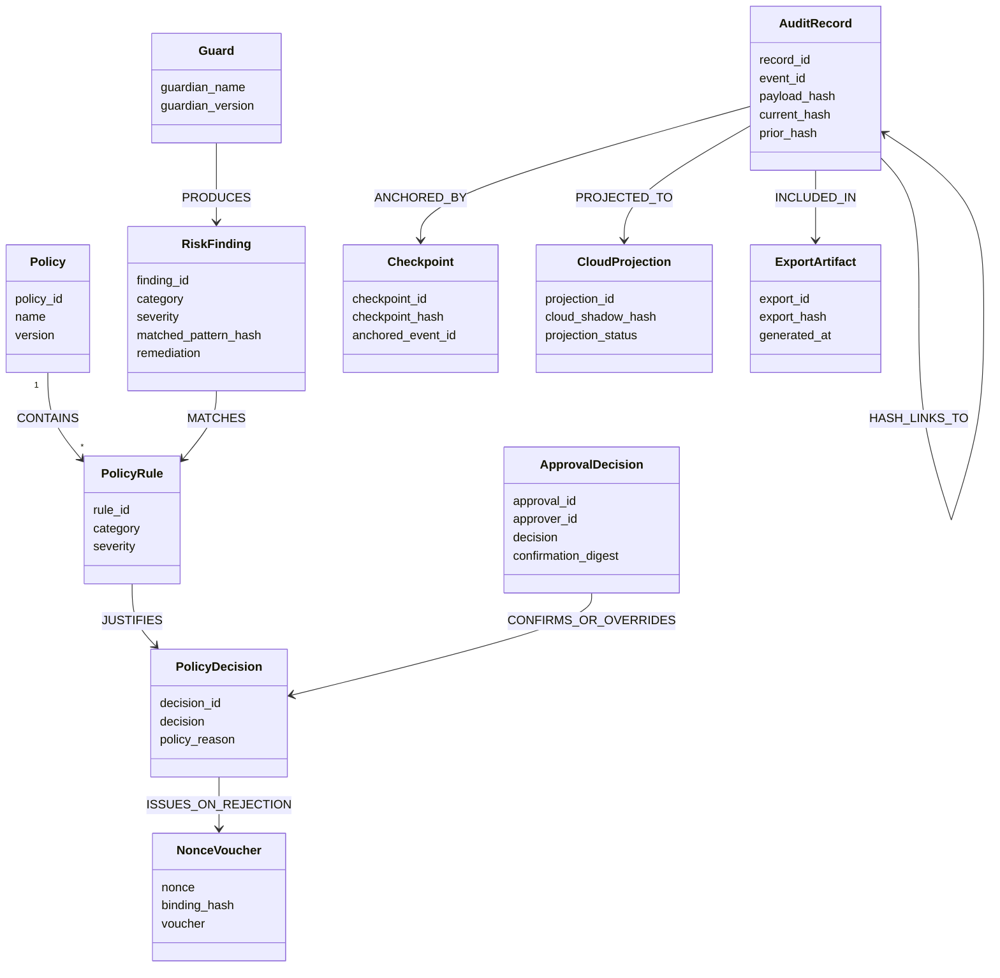
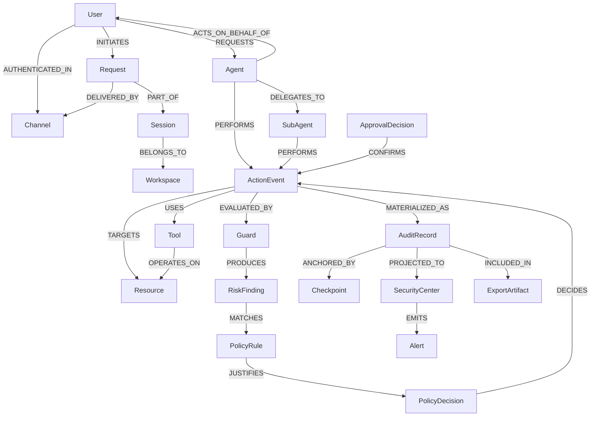
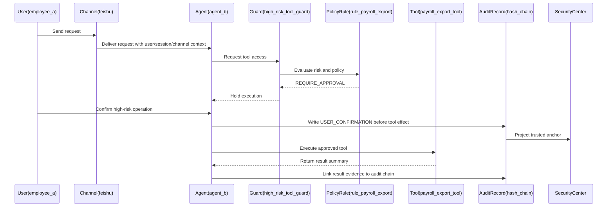
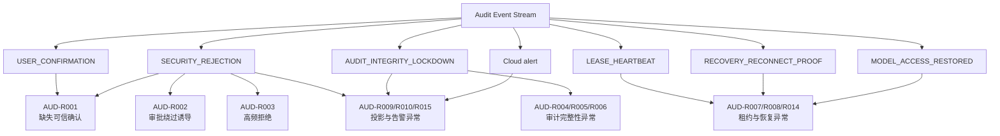

# 审计日志本体模型

本文档给出面向 QwenPaw 企业级日志审计目标的本体模型草案。模型以“可追责行为”为中心，而不是以日志字段为中心，用于支撑事后追责、实时告警和合规证明。

## 设计目标

- 能回答“谁在什么上下文中，对什么资源做了什么，系统为什么允许或拒绝，结果如何，证据是否可信”。
- 将用户、Agent、工具、资源、策略、证据统一建模，避免审计日志退化为不可关联的扁平字段。
- 支撑当前已有的高风险工具审计、哈希链、Security Center 投影，并为文件访问、配置变更、合规导出扩展预留语义基础。

## 顶层本体

## 核心实体

## 客体与资源

## 行为事件模型

行为应建模为事件节点，而不是简单边。原因是审计事件必须承载时间、上下文、策略决策、风险等级、结果、哈希和投影状态。

## 决策与证据模型

## 统一审计关系图

## 高风险工具访问示例

## 当前已定义事件的本体映射

下表基于当前工程已经实际定义或落盘的审计事件推导。边缘侧事件来自 `src/qwenpaw/security/audit_foundation.py`，云侧投影来自 `deploy/api` 的 Security Center store，事件字段说明参考 `design/audit_design/audit-event.md`。

| 当前事件 | 层级 | 本体事件类型 | 主体 Subject | 上下文 Context | 客体 Object | 决策 Decision | 证据 Evidence | 当前含义 |
| --- | --- | --- | --- | --- | --- | --- | --- | --- |
| `USER_CONFIRMATION` | 边缘侧 | `ApprovalEvent` | `User`、`Agent` | `Session`、`Channel`、`Trace` | `Tool` | `ApprovalDecision` | `AuditRecord`、`Checkpoint`、`HashAnchor` | 记录高风险工具执行前的人类确认，证明“先确认、后放行、再生效”。 |
| `SECURITY_REJECTION` | 边缘侧 | `SecurityRejectionEvent` | `User`、`Agent` | `Session`、`Channel`、`Trace` | `Tool` | `PolicyDecision`、`RiskFinding` | `AuditRecord`、`NonceVoucher`、`HashAnchor` | 记录高风险工具守卫拒绝，携带 `Security_Rejection_Nonce` 和守卫规则依据。 |
| `AUDIT_INTEGRITY_LOCKDOWN` | 边缘侧 | `AuditIntegrityEvent` | `User`、`Agent`、`SystemService` | `Session`、`Runtime`、`Trace` | `AuditRecord`、`Checkpoint`、`Tool` | `PolicyDecision` | `AuditRecord`、`Checkpoint`、`CloudProjection` | 记录审计链连续性失信，进入 `UNTRUSTED` 并阻止继续执行敏感工具。 |
| `LEASE_HEARTBEAT` | 边缘侧 | `RuntimeTrustEvent` | `SystemService` | `Runtime`、`Workspace`、`Session` | `Runtime` | `PolicyDecision` | `AuditRecord`、`CloudProjection` | 记录运行时租约心跳，用于 Security Center 判断边缘运行时是否仍可信在线。 |
| `MODEL_ACCESS_RESTORED` | 边缘侧 | `RuntimeTrustEvent` | `SystemService`、`User` | `Runtime`、`Session`、`Trace` | `ModelProvider`、`Runtime` | `PolicyDecision` | `AuditRecord`、`CloudProjection` | 记录恢复流程后模型访问重新放行，证明信任状态已恢复。 |
| `RECOVERY_RECONNECT_PROOF` | 边缘侧 | `AuditIntegrityEvent` | `SystemService`、`User` | `Runtime`、`Session`、`Trace` | `AuditRecord`、`Checkpoint` | `PolicyDecision` | `AuditRecord`、`HashAnchor`、`CloudProjection` | 记录重连后的缺口证明，用于证明断连期间审计链未被破坏或已完成恢复验证。 |
| 云侧 `SECURITY_REJECTION` 投影 | 云侧 | `CloudProjection` | `SystemService` | `Runtime`、`Trace` | `SecurityCenter`、`NonceVoucher` | `PolicyDecision` | `CloudProjection`、`Alert`、`NonceVoucher` | Security Center 接收边缘拒绝事件，生成可核验 Voucher 和实时告警。 |
| 云侧 `AUDIT_LOCKDOWN` 投影 | 云侧 | `CloudProjection` | `SystemService` | `Runtime`、`Trace` | `SecurityCenter`、`AuditRecord` | `PolicyDecision` | `CloudProjection`、`Alert`、`HashAnchor` | Security Center 接收锁定事件，形成本地哈希与云侧影子哈希的分叉时间线。 |
| 云侧 `alert` | 云侧 | `AlertEvent` | `SystemService` | `Runtime`、`Trace` | `SecurityCenter`、`Operator` | `PolicyDecision` | `Alert`、`CloudProjection` | 面向 Web/SSE 的实时告警记录，用于将拒绝、锁定、信任状态变化推送给管理员。 |

### 映射结论

- 当前工程的已实现事件集中在高风险工具确认、工具拒绝、审计完整性、运行时租约和 Security Center 投影上。
- 当前尚未形成独立的 `ToolAccessEvent` 通用事件；普通工具调用只有在触发高风险确认、拒绝或锁定时才进入规范化审计链。
- 当前尚未形成独立的 `FileAccessEvent` 通用事件；文件防护已有 `FilePathToolGuardian`，但文件访问本身尚未作为标准审计事件落盘。
- 当前尚未形成独立的 `ConfigChangeEvent`；安全配置 API 已存在，但配置变更尚未进入哈希链审计事件。
- 当前 `RuntimeTrustEvent` 是由本体推导出的归类名称，用于承载 `LEASE_HEARTBEAT` 和 `MODEL_ACCESS_RESTORED` 这类运行时信任状态事件；如果后续实现类型系统，可以将其作为 `ActionEvent` 的子类补入模型。

## 最小落地子集

第一阶段建议优先落地以下本体元素：

- `Subject`：`User`、`Agent`、`SystemService`
- `Context`：`Workspace`、`Channel`、`Session`、`Trace`
- `Object`：`Tool`、`FileResource`、`ConfigResource`、`ExternalEndpoint`
- `ActionEvent`：`ToolAccessEvent`、`FileAccessEvent`、`ConfigChangeEvent`、`SecurityRejectionEvent`、`ApprovalEvent`、`AuditIntegrityEvent`
- `Decision`：`PolicyDecision`、`RiskFinding`、`ApprovalDecision`
- `Evidence`：`AuditRecord`、`Checkpoint`、`NonceVoucher`、`CloudProjection`、`Alert`

## 建模原则

- `ActionEvent` 是中心节点。不要把 `Agent -> Tool` 直接当作完整审计事实，因为边无法承载决策、结果和证据完整性。
- 默认不保存原文。优先保存摘要、哈希、资源标识、风险标签和策略依据，避免审计日志本身成为敏感数据池。
- 人类责任与系统行为必须分离。`User` 是请求和确认主体，`Agent` 是执行主体，`SystemService` 是后台安全行为主体。
- 所有高风险动作必须能链接到 `PolicyDecision` 和 `AuditRecord`，否则无法支撑追责和合规证明。
- 完整性证据应至少包含 `prior_hash`、`current_hash`、`payload_hash` 和 `Checkpoint`，并允许投影到 Security Center 形成外部可观测点。

## 主要风险检测规则

本节基于当前已定义事件推导风险检测规则。规则的目标不是替代工具守卫，而是在审计层形成可追责、可告警、可合规解释的二次检测能力。

### 规则输入范围

第一阶段规则只依赖当前已经定义或可投影的事件：

- 边缘侧：`USER_CONFIRMATION`、`SECURITY_REJECTION`、`AUDIT_INTEGRITY_LOCKDOWN`、`LEASE_HEARTBEAT`、`MODEL_ACCESS_RESTORED`、`RECOVERY_RECONNECT_PROOF`
- 云侧：`SECURITY_REJECTION` 投影、`AUDIT_LOCKDOWN` 投影、`alert`

推荐检测维度：

- `Subject`：`user_id`、`request_user_id`、`agent_id`、`runtime_client_id`
- `Context`：`session_id`、`channel`、`trace_id/run_id`、`event_sequence`
- `Object`：`tool_name`、`high_risk_tool_name`、`ModelProvider`、`AuditRecord`、`Checkpoint`
- `Decision`：`decision`、`guard_decision`、`rejection_reason`、`guard_rule_id`、`trust_state`、`recovery_required`
- `Evidence`：`prior_hash`、`current_hash`、`payload_hash`、`Security_Rejection_Nonce`、`cloud_shadow_hash`、`alert_latency_ms`

### 规则表

| 规则 ID      | 风险名称                    | 关联本体                                                        | 依赖事件                                                                          | 检测逻辑                                                                                                                                          | 严重级别              | 推荐处置                                                                          |
| ---------- | ----------------------- | ----------------------------------------------------------- | ----------------------------------------------------------------------------- | --------------------------------------------------------------------------------------------------------------------------------------------- | ----------------- | ----------------------------------------------------------------------------- |
| `AUD-R001` | 高风险工具缺失可信确认             | `Agent -> ToolAccessEvent -> Tool`、`ApprovalDecision`       | `SECURITY_REJECTION`、`USER_CONFIRMATION`                                      | 同一 `session_id + tool_name` 出现 `SECURITY_REJECTION`，且近邻链路中不存在有效 `USER_CONFIRMATION` 或确认摘要不匹配。                                                 | `HIGH`            | 阻断工具执行，生成实时告警，要求用户重新确认。                                                       |
| `AUD-R002` | Prompt Injection 诱导绕过审批 | `RiskFinding -> PolicyDecision`                             | `SECURITY_REJECTION`                                                          | `rejection_reason` 指向缺失可信上下文或绕过确认，或 `guard_category` / `guard_rule_id` 命中 prompt injection、test mode、maintenance mode 等绕过类规则。                 | `HIGH`            | 保留 `Security_Rejection_Nonce`，向 Security Center 投影 Voucher，聚合到用户和 Agent 风险画像。 |
| `AUD-R003` | 同一主体高频拒绝                | `User`、`Agent`、`SecurityRejectionEvent`                     | `SECURITY_REJECTION`、云侧 `alert`                                               | 在固定窗口内，同一 `user_id`、`agent_id` 或 `session_id` 的拒绝次数超过阈值，或命中多个不同 `guard_rule_id`。                                                              | `MEDIUM` / `HIGH` | 触发行为异常告警；若连续命中高危规则，临时提升该主体后续工具调用审批级别。                                         |
| `AUD-R004` | 审计链检查点丢失                | `AuditRecord -> Checkpoint`                                 | `AUDIT_INTEGRITY_LOCKDOWN`                                                    | `checkpoint_missing=true` 或 `checkpoint_loss_detected=true`。                                                                                  | `CRITICAL`        | 立即进入 `UNTRUSTED`，阻断敏感工具，要求执行恢复握手和缺口证明。                                        |
| `AUD-R005` | 审计链哈希分叉                 | `AuditRecord -> HashAnchor -> CloudProjection`              | `AUDIT_INTEGRITY_LOCKDOWN`、云侧 `AUDIT_LOCKDOWN` 投影                             | `hash_divergence_curve` 存在本地链头和云侧影子哈希不一致，或存在 `fork_point_event_id`。                                                                           | `CRITICAL`        | 锁定运行时，展示 hash-break curve，保留分叉点作为取证入口。                                        |
| `AUD-R006` | 锁定态后仍尝试敏感操作             | `AuditIntegrityEvent -> PolicyDecision -> Tool`             | `AUDIT_INTEGRITY_LOCKDOWN`、`SECURITY_REJECTION`                               | 某 `Runtime` 处于 `UNTRUSTED` 或 `recovery_required=true` 后，继续出现同一运行时的高风险 `tool_name` 请求或拒绝事件。                                                    | `HIGH`            | 保持阻断，升级告警，提示管理员排查自动化脚本或被控 Agent。                                              |
| `AUD-R007` | 租约心跳中断导致运行时失信           | `SystemService -> RuntimeTrustEvent -> Runtime`             | `LEASE_HEARTBEAT`、云侧 `alert`                                                  | 云侧在租约 TTL 后未收到同一 `runtime_client_id` 的心跳，信任态降级为 `UNTRUSTED` 或 `recovery_required=true`。                                                       | `HIGH`            | 阻断重连后的模型访问和敏感工具，要求缺口证明。                                                       |
| `AUD-R008` | 未完成缺口证明即恢复访问            | `RecoveryReconnectProof -> PolicyDecision -> ModelProvider` | `RECOVERY_RECONNECT_PROOF`、`MODEL_ACCESS_RESTORED`                            | 出现 `MODEL_ACCESS_RESTORED`，但同一 `runtime_client_id/session_id` 最近不存在被云侧接受的 `RECOVERY_RECONNECT_PROOF`，或恢复时 `gap_status` 未达到 `VALIDATED/CLEAR`。 | `CRITICAL`        | 标记恢复流程异常，撤销恢复态，重新打开 recovery gate。                                            |
| `AUD-R009` | 拒绝凭证绑定异常                | `SecurityRejectionEvent -> NonceVoucher`                    | `SECURITY_REJECTION`、云侧 `SECURITY_REJECTION` 投影                               | `Security_Rejection_Nonce` 缺失，或 `security_rejection_nonce_binding_hash` 无法由 `run_id + session_id + user_id + tool_name + current_hash` 复核。    | `HIGH`            | 不信任该拒绝记录的云侧展示态，要求重新拉取边缘审计记录并标记证据异常。                                           |
| `AUD-R010` | 云侧投影延迟异常                | `CloudProjection -> Alert`                                  | 云侧 `SECURITY_REJECTION` 投影、云侧 `AUDIT_LOCKDOWN` 投影、`alert`                     | `alert_latency_ms` 超过目标阈值，或边缘事件已落盘但云侧长时间无对应 `trace_id` 投影。                                                                                    | `MEDIUM`          | 标记 Security Center 可观测性降级；排查网络、API、SSE 或投影任务。                                 |
| `AUD-R011` | 确认人与请求人不一致              | `User -> ApprovalEvent -> ToolAccessEvent`                  | `USER_CONFIRMATION`                                                           | `user_id/context_user_id` 与 `request_user_id` 不一致，且无明确代理授权或审批委托上下文。                                                                           | `HIGH`            | 阻断或要求二次确认；记录为潜在越权审批。                                                          |
| `AUD-R012` | 确认后工具效果顺序异常             | `ApprovalEvent -> ToolAccessEvent -> Evidence`              | `USER_CONFIRMATION`                                                           | `tool_effect_at` 早于 `confirmed_at`，或 `released_at` 早于确认事件落盘时间。                                                                                | `CRITICAL`        | 判定为不可否认证据失效，进入锁定或要求人工复核。                                                      |
| `AUD-R013` | 高风险工具跨 Agent 委托链异常      | `User -> Agent -> SubAgent -> Tool`                         | `USER_CONFIRMATION`、`SECURITY_REJECTION`                                      | `chain` 中 `employee -> agent -> plugin -> tool` 缺失关键节点，或 `delegated_agent_name` 与实际 `agent_id` 不一致。                                           | `MEDIUM` / `HIGH` | 要求补齐上下文；对不完整委托链上的高风险动作提升审批级别。                                                 |
| `AUD-R014` | 重复恢复或反复分叉               | `Runtime -> AuditIntegrityEvent -> CloudProjection`         | `AUDIT_INTEGRITY_LOCKDOWN`、`RECOVERY_RECONNECT_PROOF`、`MODEL_ACCESS_RESTORED` | 同一 `runtime_client_id` 在短窗口内多次出现锁定、恢复、再次锁定，或多个 `fork_point_event_id` 连续变化。                                                                    | `HIGH`            | 进入人工恢复模式，暂停自动恢复，要求管理员导出审计证据。                                                  |
| `AUD-R015` | 告警已生成但前端不可见             | `Alert -> SecurityCenter -> Operator`                       | 云侧 `alert`、云侧投影字段                                                             | 云侧已有 `alert`，但边缘记录或投影记录缺失 `operator_web_projection`、`red_alert_state=VISIBLE` 或 `operator_popup_state=VISIBLE`。                               | `MEDIUM`          | 标记运营面展示异常；保留 API 侧告警作为准确信源。                                                   |

### 规则关系图

### 规则分层

- **L1 阻断规则**：`AUD-R001`、`AUD-R004`、`AUD-R005`、`AUD-R008`、`AUD-R011`、`AUD-R012`。这些规则一旦命中，应直接阻断或保持 `UNTRUSTED`。
- **L2 实时告警规则**：`AUD-R002`、`AUD-R003`、`AUD-R006`、`AUD-R007`、`AUD-R009`、`AUD-R014`。这些规则应投影到 Security Center 并通知管理员。
- **L3 可观测性与合规规则**：`AUD-R010`、`AUD-R013`、`AUD-R015`。这些规则主要用于审计质量、证据完整性和合规报告。

### 后续扩展规则

当后续补齐 `ToolAccessEvent`、`FileAccessEvent`、`ConfigChangeEvent` 后，应新增以下检测方向：

- **工具滥用检测**：同一 Agent 在短窗口内大量调用执行命令、浏览器、外部 API 等高权限工具。
- **敏感文件访问检测**：访问 `.qwenpaw.secret`、凭证文件、密钥目录或企业敏感路径时生成独立审计事件。
- **配置变更审计检测**：安全策略、模型 Provider、渠道配置、Agent 权限发生变更时，必须形成 `ConfigChangeEvent` 并进入哈希链。
- **外联与数据外传检测**：工具调用外部 endpoint 时，将域名、URL hash、数据类型和风险等级纳入审计。
- **合规导出检测**：导出审计日志时生成 `ExportEvent`，记录导出范围、导出人、导出哈希和时间窗口。
