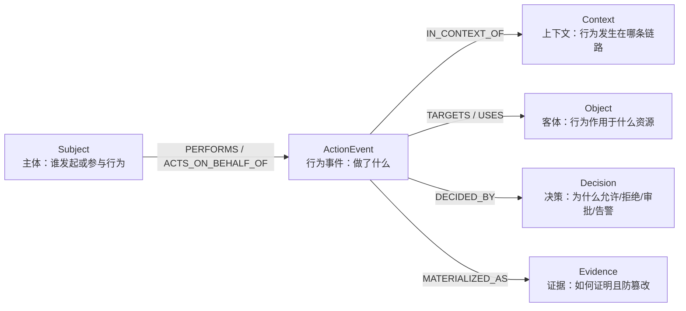
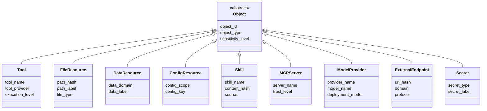
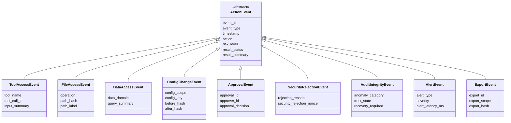
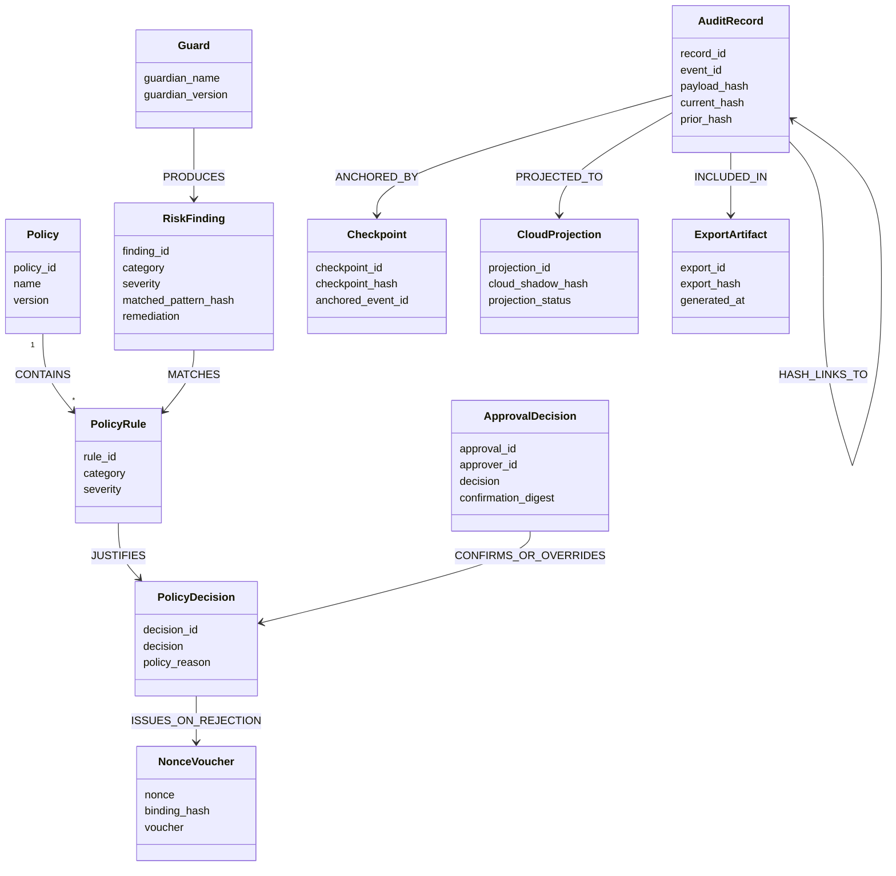
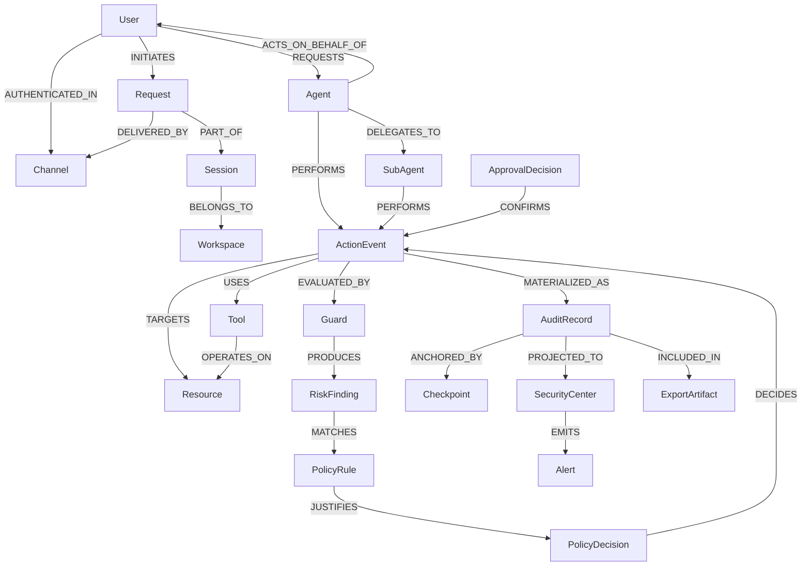
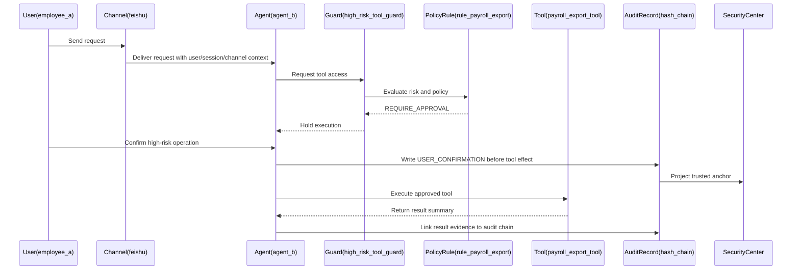
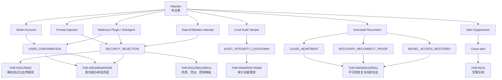

# 审计日志本体模型

本文档给出面向 QwenPaw 企业级日志审计目标的本体模型草案。模型以“可追责行为”为中心，而不是以日志字段为中心，用于支撑事后追责、实时告警和合规证明。

## 设计目标

- 能回答“谁在什么上下文中，对什么资源做了什么，系统为什么允许或拒绝，结果如何，证据是否可信”。
- 将用户、Agent、工具、资源、策略、证据统一建模，避免审计日志退化为不可关联的扁平字段。
- 支撑当前已有的高风险工具审计、哈希链、Security Center 投影，并为文件访问、配置变更、合规导出扩展预留语义基础。

## 顶层本体

## 核心实体

## 客体与资源

## 行为事件模型

行为应建模为事件节点，而不是简单边。原因是审计事件必须承载时间、上下文、策略决策、风险等级、结果、哈希和投影状态。

## 决策与证据模型

## 统一审计关系图

## 高风险工具访问示例

## 当前已定义事件的本体映射

下表基于当前工程已经实际定义或落盘的审计事件推导。边缘侧事件来自 `src/qwenpaw/security/audit_foundation.py`，云侧投影来自 `deploy/api` 的 Security Center store，事件字段说明参考 `design/audit_design/audit-event.md`。

| 当前事件 | 层级 | 本体事件类型 | 主体 Subject | 上下文 Context | 客体 Object | 决策 Decision | 证据 Evidence | 当前含义 |
| --- | --- | --- | --- | --- | --- | --- | --- | --- |
| `USER_CONFIRMATION` | 边缘侧 | `ApprovalEvent` | `User`、`Agent` | `Session`、`Channel`、`Trace` | `Tool` | `ApprovalDecision` | `AuditRecord`、`Checkpoint`、`HashAnchor` | 记录高风险工具执行前的人类确认，证明“先确认、后放行、再生效”。 |
| `SECURITY_REJECTION` | 边缘侧 | `SecurityRejectionEvent` | `User`、`Agent` | `Session`、`Channel`、`Trace` | `Tool` | `PolicyDecision`、`RiskFinding` | `AuditRecord`、`NonceVoucher`、`HashAnchor` | 记录高风险工具守卫拒绝，携带 `Security_Rejection_Nonce` 和守卫规则依据。 |
| `AUDIT_INTEGRITY_LOCKDOWN` | 边缘侧 | `AuditIntegrityEvent` | `User`、`Agent`、`SystemService` | `Session`、`Runtime`、`Trace` | `AuditRecord`、`Checkpoint`、`Tool` | `PolicyDecision` | `AuditRecord`、`Checkpoint`、`CloudProjection` | 记录审计链连续性失信，进入 `UNTRUSTED` 并阻止继续执行敏感工具。 |
| `LEASE_HEARTBEAT` | 边缘侧 | `RuntimeTrustEvent` | `SystemService` | `Runtime`、`Workspace`、`Session` | `Runtime` | `PolicyDecision` | `AuditRecord`、`CloudProjection` | 记录运行时租约心跳，用于 Security Center 判断边缘运行时是否仍可信在线。 |
| `MODEL_ACCESS_RESTORED` | 边缘侧 | `RuntimeTrustEvent` | `SystemService`、`User` | `Runtime`、`Session`、`Trace` | `ModelProvider`、`Runtime` | `PolicyDecision` | `AuditRecord`、`CloudProjection` | 记录恢复流程后模型访问重新放行，证明信任状态已恢复。 |
| `RECOVERY_RECONNECT_PROOF` | 边缘侧 | `AuditIntegrityEvent` | `SystemService`、`User` | `Runtime`、`Session`、`Trace` | `AuditRecord`、`Checkpoint` | `PolicyDecision` | `AuditRecord`、`HashAnchor`、`CloudProjection` | 记录重连后的缺口证明，用于证明断连期间审计链未被破坏或已完成恢复验证。 |
| 云侧 `SECURITY_REJECTION` 投影 | 云侧 | `CloudProjection` | `SystemService` | `Runtime`、`Trace` | `SecurityCenter`、`NonceVoucher` | `PolicyDecision` | `CloudProjection`、`Alert`、`NonceVoucher` | Security Center 接收边缘拒绝事件，生成可核验 Voucher 和实时告警。 |
| 云侧 `AUDIT_LOCKDOWN` 投影 | 云侧 | `CloudProjection` | `SystemService` | `Runtime`、`Trace` | `SecurityCenter`、`AuditRecord` | `PolicyDecision` | `CloudProjection`、`Alert`、`HashAnchor` | Security Center 接收锁定事件，形成本地哈希与云侧影子哈希的分叉时间线。 |
| 云侧 `alert` | 云侧 | `AlertEvent` | `SystemService` | `Runtime`、`Trace` | `SecurityCenter`、`Operator` | `PolicyDecision` | `Alert`、`CloudProjection` | 面向 Web/SSE 的实时告警记录，用于将拒绝、锁定、信任状态变化推送给管理员。 |

### 映射结论

- 当前工程的已实现事件集中在高风险工具确认、工具拒绝、审计完整性、运行时租约和 Security Center 投影上。
- 当前尚未形成独立的 `ToolAccessEvent` 通用事件；普通工具调用只有在触发高风险确认、拒绝或锁定时才进入规范化审计链。
- 当前尚未形成独立的 `FileAccessEvent` 通用事件；文件防护已有 `FilePathToolGuardian`，但文件访问本身尚未作为标准审计事件落盘。
- 当前尚未形成独立的 `ConfigChangeEvent`；安全配置 API 已存在，但配置变更尚未进入哈希链审计事件。
- 当前 `RuntimeTrustEvent` 是由本体推导出的归类名称，用于承载 `LEASE_HEARTBEAT` 和 `MODEL_ACCESS_RESTORED` 这类运行时信任状态事件；如果后续实现类型系统，可以将其作为 `ActionEvent` 的子类补入模型。

## 最小落地子集

第一阶段建议优先落地以下本体元素：

- `Subject`：`User`、`Agent`、`SystemService`
- `Context`：`Workspace`、`Channel`、`Session`、`Trace`
- `Object`：`Tool`、`FileResource`、`ConfigResource`、`ExternalEndpoint`
- `ActionEvent`：`ToolAccessEvent`、`FileAccessEvent`、`ConfigChangeEvent`、`SecurityRejectionEvent`、`ApprovalEvent`、`AuditIntegrityEvent`
- `Decision`：`PolicyDecision`、`RiskFinding`、`ApprovalDecision`
- `Evidence`：`AuditRecord`、`Checkpoint`、`NonceVoucher`、`CloudProjection`、`Alert`

## 建模原则

- `ActionEvent` 是中心节点。不要把 `Agent -> Tool` 直接当作完整审计事实，因为边无法承载决策、结果和证据完整性。
- 默认不保存原文。优先保存摘要、哈希、资源标识、风险标签和策略依据，避免审计日志本身成为敏感数据池。
- 人类责任与系统行为必须分离。`User` 是请求和确认主体，`Agent` 是执行主体，`SystemService` 是后台安全行为主体。
- 所有高风险动作必须能链接到 `PolicyDecision` 和 `AuditRecord`，否则无法支撑追责和合规证明。
- 完整性证据应至少包含 `prior_hash`、`current_hash`、`payload_hash` 和 `Checkpoint`，并允许投影到 Security Center 形成外部可观测点。

## 主要威胁检测规则

本节基于当前已定义事件推导威胁检测规则，关注攻击者行为，而不是运维健康状态。检测目标是发现：攻击者通过 Prompt Injection、恶意插件、被盗账号、被控 Agent 或本地文件篡改来绕过审批、破坏审计链、恢复不可信运行时、隐藏攻击痕迹或外传数据。

### 威胁检测输入范围

第一阶段规则只依赖当前已经定义或可投影的事件：

- 边缘侧：`USER_CONFIRMATION`、`SECURITY_REJECTION`、`AUDIT_INTEGRITY_LOCKDOWN`、`LEASE_HEARTBEAT`、`MODEL_ACCESS_RESTORED`、`RECOVERY_RECONNECT_PROOF`
- 云侧：`SECURITY_REJECTION` 投影、`AUDIT_LOCKDOWN` 投影、`alert`

重点检测维度：

- 攻击主体：`user_id`、`request_user_id`、`agent_id`、`delegated_agent_name`、`third_party_plugin_name`
- 攻击上下文：`session_id`、`channel`、`run_id/trace_id`、`event_sequence`、`runtime_client_id`
- 攻击目标：`tool_name`、`high_risk_tool_name`、`AuditRecord`、`Checkpoint`、`ModelProvider`
- 攻击证据：`rejection_reason`、`guard_rule_id`、`guard_category`、`Security_Rejection_Nonce`、`prior_hash`、`current_hash`、`payload_hash`、`checkpoint_missing`、`hash_divergence_curve`
- 信任状态：`trust_state`、`lock_mode`、`recovery_required`、`gap_status`、`recovery_gate_status`

### 威胁规则表

| 规则 ID      | 威胁类型                    | 攻击意图                                                        | 关联本体                                                                          | 依赖事件                                                                                                                                          | 检测逻辑              | 严重级别                                                                          | 响应动作 |
| ---------- | ----------------------- | ----------------------------------------------------------- | ----------------------------------------------------------------------------- | --------------------------------------------------------------------------------------------------------------------------------------------- | ----------------- | ----------------------------------------------------------------------------- | --- |
| `THR-R001` | Prompt Injection 绕过审批 | 诱导 Agent 忽略审批、测试模式、维护模式或伪造已授权状态 | `User/ExternalActor -> Agent -> Tool`、`RiskFinding` | `SECURITY_REJECTION` | `rejection_reason`、`guard_category` 或 `guard_rule_id` 命中审批绕过、prompt injection、test mode、maintenance mode、missing confirmation 等语义。 | `HIGH` | 阻断工具调用，投影 `Security_Rejection_Nonce`，将 `session_id + agent_id` 标记为高风险会话。 |
| `THR-R002` | 重复探测高风险工具边界 | 枚举哪些工具能被绕过或触发审批 | `Subject -> SecurityRejectionEvent -> Tool` | `SECURITY_REJECTION` | 同一 `user_id`、`agent_id` 或 `session_id` 在时间窗口内多次触发不同 `tool_name` 或不同 `guard_rule_id` 的拒绝。 | `HIGH` | 提升该主体后续审批级别；若命中多个高危工具，暂停该会话的高风险工具访问。 |
| `THR-R003` | 恶意插件/子 Agent 越权委托 | 第三方插件或子 Agent 试图代替用户调用高风险工具 | `Agent -> SubAgent/Skill -> ToolAccessEvent` | `USER_CONFIRMATION`、`SECURITY_REJECTION` | `chain` 中 `employee -> agent -> plugin -> tool` 缺失，或 `third_party_plugin_name`、`delegated_agent_name`、`agent_id` 与确认上下文不一致。 | `HIGH` | 拒绝本次委托链；记录插件或子 Agent 风险；要求重新生成完整确认链。 |
| `THR-R004` | 被盗账号发起异常审批 | 攻击者控制用户身份后批准敏感工具 | `User -> ApprovalEvent -> Tool` | `USER_CONFIRMATION` | `request_user_id` 与 `user_id/context_user_id` 不一致，或同一用户在异常渠道、异常会话中确认高风险工具；如果缺少明确授权上下文则命中。 | `HIGH` | 要求二次确认或管理员复核；将确认记录标记为高风险证据。 |
| `THR-R005` | 事后伪造审批记录 | 攻击者在工具效果发生后补写或伪造确认 | `ApprovalEvent -> AuditRecord -> ToolAccessEvent` | `USER_CONFIRMATION` | `tool_effect_at < confirmed_at`、`released_at < confirmed_at`，或确认记录的 `current_hash/payload_hash` 不能复核。 | `CRITICAL` | 判定不可否认证据失效；进入 `UNTRUSTED`；阻断敏感工具。 |
| `THR-R006` | 本地审计记录删除 | 删除 trace 或 checkpoint 以掩盖行为 | `AuditRecord -> Checkpoint` | `AUDIT_INTEGRITY_LOCKDOWN` | `checkpoint_missing=true`、`checkpoint_loss_detected=true`，或已有 trace 但 checkpoint 缺失。 | `CRITICAL` | 进入 `UNTRUSTED`，上报 Security Center，要求恢复握手和缺口证明。 |
| `THR-R007` | 本地审计记录篡改/重排 | 修改、替换或重排审计事件 | `AuditRecord -> HashAnchor -> CloudProjection` | `AUDIT_INTEGRITY_LOCKDOWN`、云侧 `AUDIT_LOCKDOWN` 投影 | `prior_hash/current_hash/payload_hash` 连续性失效，或 `hash_divergence_curve` 指示本地链头与云侧影子哈希分叉。 | `CRITICAL` | 锁定运行时，展示 fork point，导出本地与云侧证据供人工取证。 |
| `THR-R008` | 拒绝凭证伪造 | 伪造拒绝记录或 Security Center Voucher | `SecurityRejectionEvent -> NonceVoucher` | `SECURITY_REJECTION`、云侧 `SECURITY_REJECTION` 投影 | `Security_Rejection_Nonce` 缺失，或 `security_rejection_nonce_binding_hash` 无法绑定 `run_id + session_id + user_id + tool_name + current_hash`。 | `HIGH` | 不信任该事件的展示态；以边缘审计链和云侧原始记录重新核验。 |
| `THR-R009` | 租约失联后的不可信重连 | 让运行时离线、篡改本地状态后再重连 | `Runtime -> RuntimeTrustEvent -> ModelProvider` | `LEASE_HEARTBEAT`、`RECOVERY_RECONNECT_PROOF`、`MODEL_ACCESS_RESTORED` | 同一 `runtime_client_id` 心跳过期后恢复访问，但没有被接受的 `RECOVERY_RECONNECT_PROOF`，或 `gap_status` 未达到 `VALIDATED/CLEAR`。 | `CRITICAL` | 拒绝模型访问恢复；保持 recovery gate 打开；要求完整缺口证明。 |
| `THR-R010` | 恢复流程被滥用 | 反复触发恢复以覆盖或扰乱分叉证据 | `Runtime -> AuditIntegrityEvent -> CloudProjection` | `AUDIT_INTEGRITY_LOCKDOWN`、`RECOVERY_RECONNECT_PROOF`、`MODEL_ACCESS_RESTORED` | 同一运行时短窗口内反复出现锁定、缺口证明、恢复、再次锁定，或出现多个连续变化的 `fork_point_event_id`。 | `HIGH` | 关闭自动恢复，进入人工恢复模式；要求管理员保全审计链。 |
| `THR-R011` | 锁定态下继续攻击 | 在 `UNTRUSTED` 状态下继续尝试高风险工具或模型访问 | `AuditIntegrityEvent -> ToolAccessEvent/ModelProvider` | `AUDIT_INTEGRITY_LOCKDOWN`、`SECURITY_REJECTION`、`MODEL_ACCESS_RESTORED` | 已存在 `trust_state=UNTRUSTED` 或 `recovery_required=true`，随后仍出现同一运行时的高风险工具拒绝、恢复访问尝试或敏感工具请求。 | `HIGH` | 保持阻断，升级为入侵进行中告警，记录后续尝试作为攻击链证据。 |
| `THR-R012` | 数据外泄工具调用企图 | 诱导 Agent 使用外部 API、浏览器、文件发送或命令工具外传数据 | `Agent -> Tool -> ExternalEndpoint/FileResource` | `SECURITY_REJECTION` | `tool_name/high_risk_tool_name` 属于外联、文件发送、命令执行、浏览器或 MCP 高风险工具，且拒绝原因命中 data exfiltration、credential exposure、network abuse 或未知高风险上下文。 | `HIGH` | 阻断并标记潜在外泄；关联同一会话内后续工具拒绝和确认事件。 |
| `THR-R013` | 凭证/敏感文件访问企图 | 读取密钥目录、凭证文件或敏感配置 | `Agent -> Tool -> Secret/FileResource` | `SECURITY_REJECTION` | 拒绝事件中的 `tool_name` 为文件读写/命令类工具，`guard_rule_id` 或 `guard_category` 指向 sensitive file access、credential exposure、path traversal。 | `CRITICAL` | 阻断；提升会话风险；建议管理员轮换相关凭证。 |
| `THR-R014` | 安全控制降级企图 | 关闭工具守卫、文件守卫、技能扫描或降低审批级别 | `User/Agent -> ConfigResource` | 当前需由未来 `ConfigChangeEvent` 完整承载 | 检测安全配置被修改为更宽松状态，且修改前后出现高风险工具拒绝、锁定或恢复事件。 | `CRITICAL` | 要求安全配置变更进入哈希链；未具备链式证据前，不允许自动放行降级配置。 |
| `THR-R015` | 告警通道压制/遮蔽 | 让边缘事件不投影或让操作员看不到告警 | `AuditRecord -> CloudProjection -> Alert` | 云侧投影、`alert`、边缘 `SECURITY_REJECTION` / `AUDIT_INTEGRITY_LOCKDOWN` | 边缘出现拒绝或锁定事件，但云侧长时间无同一 `trace_id` 投影；或云侧有告警但前端可见性字段持续缺失。 | `HIGH` | 以边缘审计链为准发起本地告警；标记 Security Center 投影链路可能被干扰。 |

### 威胁规则关系图

### 威胁分层

- **入侵与绕过**：`THR-R001`、`THR-R002`、`THR-R003`、`THR-R004`、`THR-R005`，关注攻击者如何让 Agent 执行本不该执行的高风险动作。
- **篡改与隐蔽**：`THR-R006`、`THR-R007`、`THR-R008`、`THR-R015`，关注攻击者如何破坏审计证据或压制告警。
- **持久化与恢复规避**：`THR-R009`、`THR-R010`、`THR-R011`，关注不可信运行时如何重新接入系统。
- **数据外泄与安全降级**：`THR-R012`、`THR-R013`、`THR-R014`，关注敏感数据、凭证和安全控制被攻击者利用。

### 后续必须补齐的事件

当前规则已经可以覆盖高风险拒绝、确认、审计篡改、恢复和告警压制，但要完整检测入侵链，还需要补齐以下事件：

- `ToolAccessEvent`：记录所有高权限工具调用企图，包括成功、失败、拒绝和审批后执行。
- `FileAccessEvent`：记录敏感路径、凭证文件、工作区外路径、附件和导出文件的访问企图。
- `ConfigChangeEvent`：记录工具守卫、文件守卫、技能扫描、模型 Provider、渠道、Agent 权限等安全配置变更。
- `ExternalCallEvent`：记录外联域名、URL hash、MCP server、Webhook 和 API 调用。
- `SkillLifecycleEvent`：记录 Skill 安装、启用、禁用、扫描结果、白名单变更和内容哈希。
- `ExportEvent`：记录审计日志导出范围、导出人、导出哈希和导出时间窗口。
