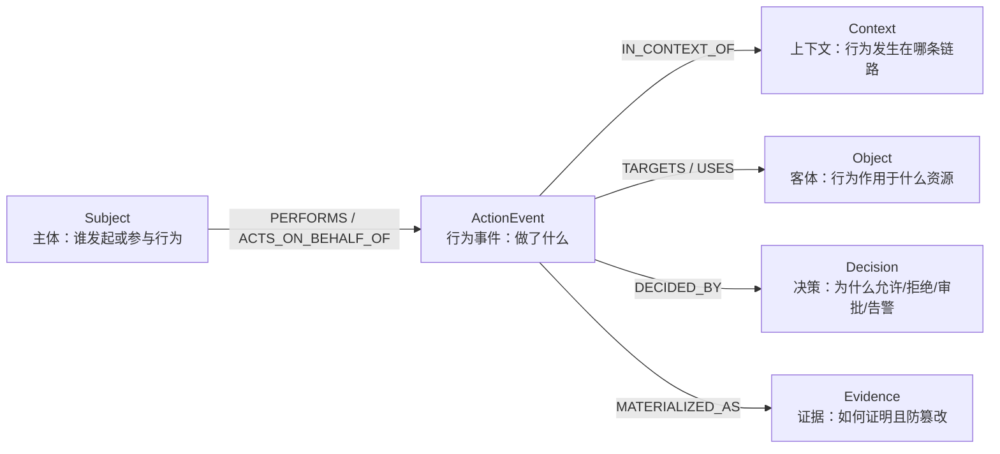
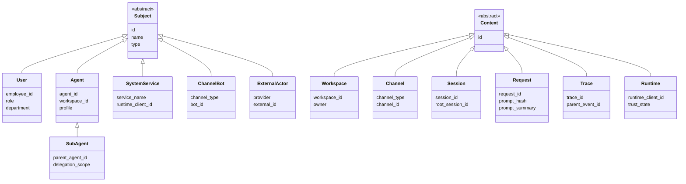
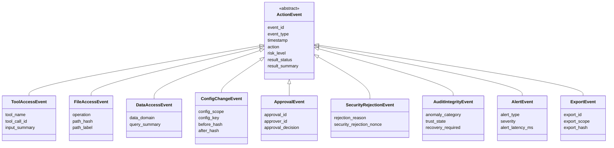
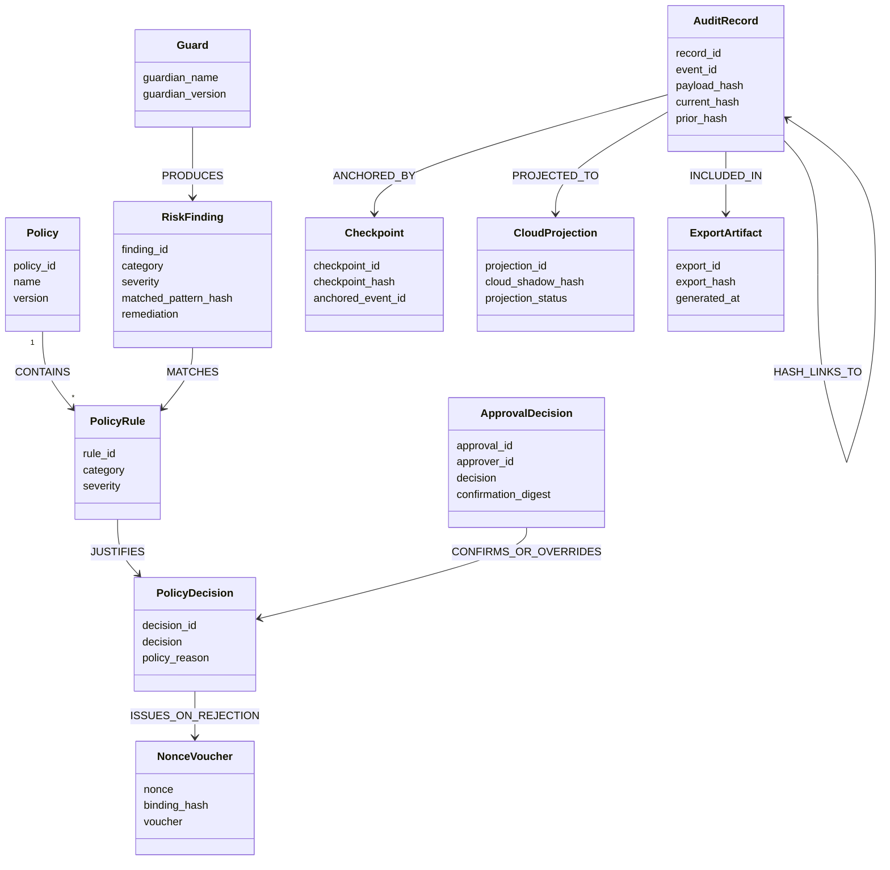
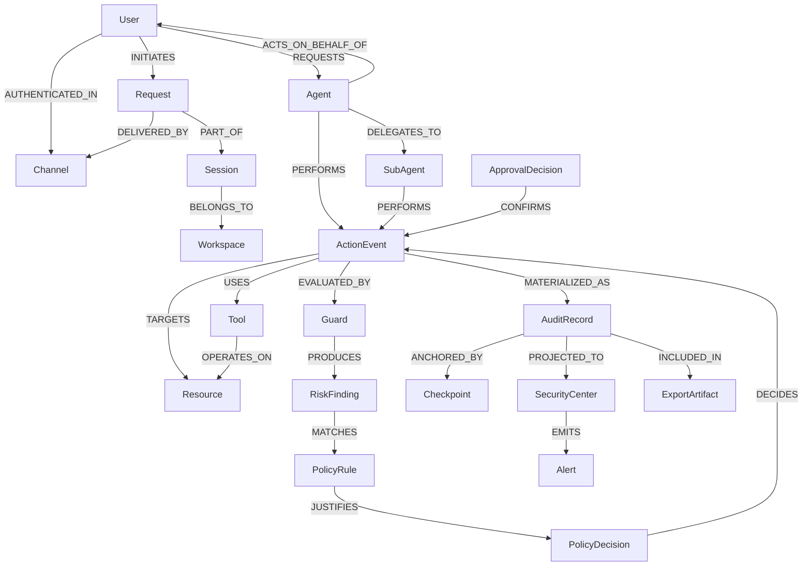
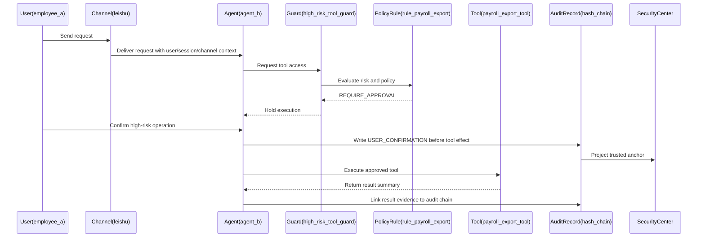

# 审计日志本体模型

本文档给出面向 QwenPaw 企业级日志审计目标的本体模型草案。模型以“可追责行为”为中心，而不是以日志字段为中心，用于支撑事后追责、实时告警和合规证明。

## 设计目标

- 能回答“谁在什么上下文中，对什么资源做了什么，系统为什么允许或拒绝，结果如何，证据是否可信”。
- 将用户、Agent、工具、资源、策略、证据统一建模，避免审计日志退化为不可关联的扁平字段。
- 支撑当前已有的高风险工具审计、哈希链、Security Center 投影，并为文件访问、配置变更、合规导出扩展预留语义基础。

## 顶层本体

## 核心实体

## 客体与资源

## 行为事件模型

行为应建模为事件节点，而不是简单边。原因是审计事件必须承载时间、上下文、策略决策、风险等级、结果、哈希和投影状态。

## 决策与证据模型

## 统一审计关系图

## 高风险工具访问示例

## 当前已定义事件的本体映射

下表基于当前工程已经实际定义或落盘的审计事件推导。边缘侧事件来自 `src/qwenpaw/security/audit_foundation.py`，云侧投影来自 `deploy/api` 的 Security Center store，事件字段说明参考 `design/audit_design/audit-event.md`。

| 当前事件 | 层级 | 本体事件类型 | 主体 Subject | 上下文 Context | 客体 Object | 决策 Decision | 证据 Evidence | 当前含义 |
| --- | --- | --- | --- | --- | --- | --- | --- | --- |
| `USER_CONFIRMATION` | 边缘侧 | `ApprovalEvent` | `User`、`Agent` | `Session`、`Channel`、`Trace` | `Tool` | `ApprovalDecision` | `AuditRecord`、`Checkpoint`、`HashAnchor` | 记录高风险工具执行前的人类确认，证明“先确认、后放行、再生效”。 |
| `SECURITY_REJECTION` | 边缘侧 | `SecurityRejectionEvent` | `User`、`Agent` | `Session`、`Channel`、`Trace` | `Tool` | `PolicyDecision`、`RiskFinding` | `AuditRecord`、`NonceVoucher`、`HashAnchor` | 记录高风险工具守卫拒绝，携带 `Security_Rejection_Nonce` 和守卫规则依据。 |
| `AUDIT_INTEGRITY_LOCKDOWN` | 边缘侧 | `AuditIntegrityEvent` | `User`、`Agent`、`SystemService` | `Session`、`Runtime`、`Trace` | `AuditRecord`、`Checkpoint`、`Tool` | `PolicyDecision` | `AuditRecord`、`Checkpoint`、`CloudProjection` | 记录审计链连续性失信，进入 `UNTRUSTED` 并阻止继续执行敏感工具。 |
| `LEASE_HEARTBEAT` | 边缘侧 | `RuntimeTrustEvent` | `SystemService` | `Runtime`、`Workspace`、`Session` | `Runtime` | `PolicyDecision` | `AuditRecord`、`CloudProjection` | 记录运行时租约心跳，用于 Security Center 判断边缘运行时是否仍可信在线。 |
| `MODEL_ACCESS_RESTORED` | 边缘侧 | `RuntimeTrustEvent` | `SystemService`、`User` | `Runtime`、`Session`、`Trace` | `ModelProvider`、`Runtime` | `PolicyDecision` | `AuditRecord`、`CloudProjection` | 记录恢复流程后模型访问重新放行，证明信任状态已恢复。 |
| `RECOVERY_RECONNECT_PROOF` | 边缘侧 | `AuditIntegrityEvent` | `SystemService`、`User` | `Runtime`、`Session`、`Trace` | `AuditRecord`、`Checkpoint` | `PolicyDecision` | `AuditRecord`、`HashAnchor`、`CloudProjection` | 记录重连后的缺口证明，用于证明断连期间审计链未被破坏或已完成恢复验证。 |
| 云侧 `SECURITY_REJECTION` 投影 | 云侧 | `CloudProjection` | `SystemService` | `Runtime`、`Trace` | `SecurityCenter`、`NonceVoucher` | `PolicyDecision` | `CloudProjection`、`Alert`、`NonceVoucher` | Security Center 接收边缘拒绝事件，生成可核验 Voucher 和实时告警。 |
| 云侧 `AUDIT_LOCKDOWN` 投影 | 云侧 | `CloudProjection` | `SystemService` | `Runtime`、`Trace` | `SecurityCenter`、`AuditRecord` | `PolicyDecision` | `CloudProjection`、`Alert`、`HashAnchor` | Security Center 接收锁定事件，形成本地哈希与云侧影子哈希的分叉时间线。 |
| 云侧 `alert` | 云侧 | `AlertEvent` | `SystemService` | `Runtime`、`Trace` | `SecurityCenter`、`Operator` | `PolicyDecision` | `Alert`、`CloudProjection` | 面向 Web/SSE 的实时告警记录，用于将拒绝、锁定、信任状态变化推送给管理员。 |

### 映射结论

- 当前工程的已实现事件集中在高风险工具确认、工具拒绝、审计完整性、运行时租约和 Security Center 投影上。
- 当前尚未形成独立的 `ToolAccessEvent` 通用事件；普通工具调用只有在触发高风险确认、拒绝或锁定时才进入规范化审计链。
- 当前尚未形成独立的 `FileAccessEvent` 通用事件；文件防护已有 `FilePathToolGuardian`，但文件访问本身尚未作为标准审计事件落盘。
- 当前尚未形成独立的 `ConfigChangeEvent`；安全配置 API 已存在，但配置变更尚未进入哈希链审计事件。
- 当前 `RuntimeTrustEvent` 是由本体推导出的归类名称，用于承载 `LEASE_HEARTBEAT` 和 `MODEL_ACCESS_RESTORED` 这类运行时信任状态事件；如果后续实现类型系统，可以将其作为 `ActionEvent` 的子类补入模型。

## 最小落地子集

第一阶段建议优先落地以下本体元素：

- `Subject`：`User`、`Agent`、`SystemService`
- `Context`：`Workspace`、`Channel`、`Session`、`Trace`
- `Object`：`Tool`、`FileResource`、`ConfigResource`、`ExternalEndpoint`
- `ActionEvent`：`ToolAccessEvent`、`FileAccessEvent`、`ConfigChangeEvent`、`SecurityRejectionEvent`、`ApprovalEvent`、`AuditIntegrityEvent`
- `Decision`：`PolicyDecision`、`RiskFinding`、`ApprovalDecision`
- `Evidence`：`AuditRecord`、`Checkpoint`、`NonceVoucher`、`CloudProjection`、`Alert`

## 建模原则

- `ActionEvent` 是中心节点。不要把 `Agent -> Tool` 直接当作完整审计事实，因为边无法承载决策、结果和证据完整性。
- 默认不保存原文。优先保存摘要、哈希、资源标识、风险标签和策略依据，避免审计日志本身成为敏感数据池。
- 人类责任与系统行为必须分离。`User` 是请求和确认主体，`Agent` 是执行主体，`SystemService` 是后台安全行为主体。
- 所有高风险动作必须能链接到 `PolicyDecision` 和 `AuditRecord`，否则无法支撑追责和合规证明。
- 完整性证据应至少包含 `prior_hash`、`current_hash`、`payload_hash` 和 `Checkpoint`，并允许投影到 Security Center 形成外部可观测点。
