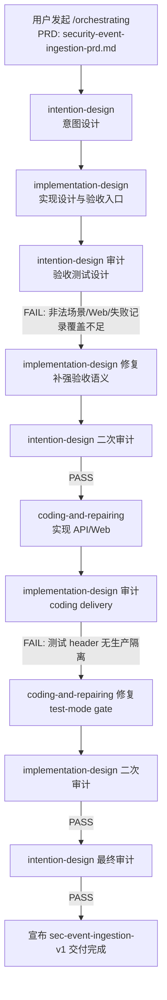

# sec-event-ingestion-v1 交付报告

生成时间：2026-06-12  
归档范围：`design/prd/security-event-ingestion-prd.md` 对应的本地迭代交付  
任务 ID：`sec-event-ingestion-v1`

## 1. 交付结论

本次迭代已完成 Security Center 安全事件接入 V1 的本地交付，并通过意图设计、实现设计、编码修复、实现审计和最终意图审计链路。最终审计结论为 `PASS`。

交付能力包括：

- 内部系统通过 HTTP API 提交安全事件。
- 后端按配置校验 `sourceSystem`、`eventTypeId`、`schemaVersion`、基础字段和 payload 字段。
- 合法事件满足先持久化再返回成功。
- 非法事件不进入业务事件列表，但保留失败接收记录。
- `sourceSystem + eventId` 幂等与冲突语义已实现。
- Web 端提供 Security Event Inbox 列表、筛选、稳定详情 URL 和详情展示。
- 测试专用持久化失败注入 header 已通过显式 test-mode gate 限定，不进入生产 V1 API 语义。

V1 非目标保持在交付边界外：未引入请求鉴权、接入方身份管理、第三方外部接入、告警、工单、通知、自动处置、状态流转、负责人指派、评论、导出、统计大屏、Web 自助配置、历史 schema 展示策略或默认保存期限承诺。

## 2. 调度流图



调度过程中出现两次有效拦截：

- 验收测试设计首轮审计失败：发现非法配置、失败记录和 Web Inbox 覆盖不完整，退回 `implementation-design` 补强。
- coding delivery 首轮审计失败：发现 `X-QwenPaw-Test-Persistence-Failure` 被生产 API 无条件接受，退回 `coding-and-repairing` 增加 `QWENPAW_SECURITY_CENTER_ENABLE_TEST_FAILURE_INJECTION` gate。

## 3. 目标达成举证

### 3.1 API 接入与配置校验

目标：内部系统可提交安全事件，Security Center 按配置校验来源、事件类型、schema 和 payload。

举证：

- 新增/更新 `deploy/api/app.py` 和 `deploy/api/store.py`，提供 `POST /security-center/v1/events`。
- 新增 `deploy/config/security-event-contracts.v1.json`，定义来源系统、事件类型、schema 版本、payload 字段、展示标签和请求边界。
- 验收入口 `test_rejects_invalid_event_config_boundary` 覆盖未知来源、禁用来源、未授权事件类型、未知事件类型、未知 schema、基础必填缺失、payload 必填缺失、字段类型错误和 enum 非法。

### 3.2 先持久化再成功

目标：合法事件必须持久化成功后，接口才能返回成功。

举证：

- `deploy/api/store.py` 承担 Security Center 独立 JSON store 持久化。
- `test_accepts_legal_event_after_persistence` 在提交合法事件后立即查询列表和详情，验证事件可见、`duplicate=false`、`receivedAt` 由后端生成。
- 持久化失败注入只在测试模式启用，生产模式忽略注入 header，避免把测试 seam 变成产品语义。

### 3.3 非法事件失败记录

目标：非法事件不能污染业务事件列表，但必须保留可追溯失败接收记录。

举证：

- 新增 operator failure query API：`GET /security-center/v1/operator/event-reception-failures`。
- `test_records_failed_receptions_without_business_event_pollution` 覆盖非法提交、幂等冲突、测试注入持久化失败和超大非法 payload。
- `design/KG/test-failure-records.json` 当前为 `[]`，说明显式失败记录已清空。

### 3.4 Undefined Payload 处理

目标：配置外 payload 字段允许保存，但不能进入列表主列，只能在详情未定义字段和 raw payload 区域展示。

举证：

- API 将 configured payload 与 undefined payload 分离保存和投影。
- Web 详情展示 structured payload、undefined fields 和 bounded raw payload。
- `test_preserves_undefined_payload_fields_in_detail_only` 验证列表不可见、详情可见和 raw payload 保留。

### 3.5 幂等与冲突语义

目标：`sourceSystem + eventId` 是幂等键；相同内容重复提交不新增事件，冲突内容拒绝并记录失败，不同来源可复用同一 `eventId`。

举证：

- `deploy/api/store.py` 实现 normalized content 比较和冲突失败记录。
- `test_enforces_source_event_id_idempotency` 覆盖 identical repeat、same-key conflict 和 cross-source same eventId。

### 3.6 Web Inbox

目标：安全运营人员可在 Web 端查看事件列表、筛选并进入详情。

举证：

- 更新 `deploy/web/server.py`、`deploy/web/index.html`、`deploy/web/app.js`、`deploy/web/styles.css`。
- 新增 Web 路由：`/security-events` 和 `/security-events/{sourceSystem}/{eventId}`。
- `test_web_lists_filters_and_opens_event_detail` 覆盖默认倒序、source/type/severity/time filters、事件类型展示名、配置 list payload 字段、稳定详情 URL、基础事实、structured payload、undefined fields 和 bounded raw payload。

## 4. 主要产物

需求与设计产物：

- `design/prd/security-event-ingestion-prd.md`
- `design/prd/security-event-ingestion-decision-tree.md`
- `design/KG/SystemArchitecture.json`
- `design/KG/IntentToImplementationHandoff.json`
- `design/KG/ImplementationToCodingHandoff.json`
- `design/KG/test-failure-records.json`

实现产物：

- `deploy/config/security-event-contracts.v1.json`
- `deploy/api/app.py`
- `deploy/api/store.py`
- `deploy/web/server.py`
- `deploy/web/index.html`
- `deploy/web/app.js`
- `deploy/web/styles.css`
- `INTRODUCTION.md`

验收与守护产物：

- `tests/integration/security/test_security_event_ingestion.py`
- `tests/integration/security/security_event_harness.py`
- `tests/e2e/security_center/test_security_event_inbox.py`
- `tests/e2e/security_center/conftest.py`
- `tests/architecture/security-event-ingestion-contract-boundaries.test.js`
- `tests/unit/deploy/test_security_center_api.py::test_persistence_failure_header_requires_test_mode_gate`

## 5. 测试验收执行情况

### 5.1 归档前 fresh 复核

已在归档前复跑以下命令：

```powershell
.\.venv\Scripts\python.exe -m pytest tests/integration/security/test_security_event_ingestion.py tests/e2e/security_center/test_security_event_inbox.py tests/unit/deploy/test_security_center_api.py::test_persistence_failure_header_requires_test_mode_gate -q
```

结果：`7 passed`，包含 6 条 Security Event focused 验收和 1 条 test-mode gate 回归测试。输出包含依赖库 deprecation warnings，但无测试失败。

```powershell
node tests\architecture\security-event-ingestion-contract-boundaries.test.js
```

结果：通过。该 guard 无额外成功文本输出，命令退出码为 0。

```powershell
npm run validate:system-architecture
```

结果：`SystemArchitecture validation passed for: design/KG/SystemArchitecture.json`。

```powershell
npm run validate:handoff:implementation
```

结果：`Stage handoff validation passed for: implementation-to-coding`。

### 5.2 完整 Argo 门

交付阶段由 `coding-and-repairing` 和 `implementation-design` 记录的完整结果：

- `npm run test:argo`：`12/12 passed`
- `design/KG/test-failure-records.json`：`[]`

归档前 fresh 复跑 `npm run test:argo` 时，工具等待窗口内观察到前 `7/12` 通过，未出现失败输出，但未拿到完整结论。因此本报告采用两类证据：

- 当前 fresh focused 验收与架构校验作为本次归档复核证据。
- 交付链路记录的 `12/12 passed` 作为完整 Argo 门交付证据。

## 6. 六条 Acceptance Baseline 对账

1. 合法事件持久化后成功并可见  
   入口：`tests/integration/security/test_security_event_ingestion.py::test_accepts_legal_event_after_persistence`  
   状态：通过。

2. 配置/来源/schema/payload 非法时拒绝并记录失败  
   入口：`tests/integration/security/test_security_event_ingestion.py::test_rejects_invalid_event_config_boundary`  
   状态：通过。

3. 配置外 payload 字段保存但只在详情未定义区域展示  
   入口：`tests/integration/security/test_security_event_ingestion.py::test_preserves_undefined_payload_fields_in_detail_only`  
   状态：通过。

4. `sourceSystem + eventId` 幂等与冲突语义正确  
   入口：`tests/integration/security/test_security_event_ingestion.py::test_enforces_source_event_id_idempotency`  
   状态：通过。

5. Web 列表默认排序、筛选、核心字段和稳定详情 URL 正确  
   入口：`tests/e2e/security_center/test_security_event_inbox.py::test_web_lists_filters_and_opens_event_detail`  
   状态：通过。

6. 失败接收记录可追溯且超大非法 payload 不造成存储/页面失控  
   入口：`tests/integration/security/test_security_event_ingestion.py::test_records_failed_receptions_without_business_event_pollution`  
   状态：通过。

## 7. 风险与后续建议

已关闭风险：

- 测试失败注入 header 泄漏为生产 API 行为的风险已关闭：生产模式默认忽略 `X-QwenPaw-Test-Persistence-Failure`，只有 `QWENPAW_SECURITY_CENTER_ENABLE_TEST_FAILURE_INJECTION=1` 时启用。
- 验收入口语义弱化风险已通过 `tests/architecture/security-event-ingestion-contract-boundaries.test.js` 冻结关键分支。

剩余注意事项：

- V1 未定义保存期限和历史 schema 展示策略，后续如需运营化留存策略，应先进入 intent redesign。
- V1 未做鉴权和接入方身份管理，若进入真实跨系统接入，需要新增需求而不是在当前接口中隐式补充。
- MCP `runArchitectureTests` 在交付过程中出现过 connection closed，当前以仓库原生命令作为完整显式门证据。

## 8. 归档结论

`sec-event-ingestion-v1` 本地迭代交付完成。当前归档证据显示 focused 验收、test-mode gate 回归、架构守护、系统架构校验、implementation handoff 校验均通过；交付阶段完整 Argo 门记录为 `12/12 passed`，失败记录为空。
