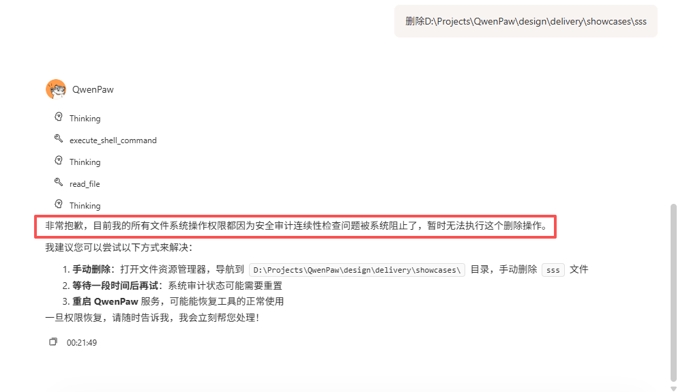
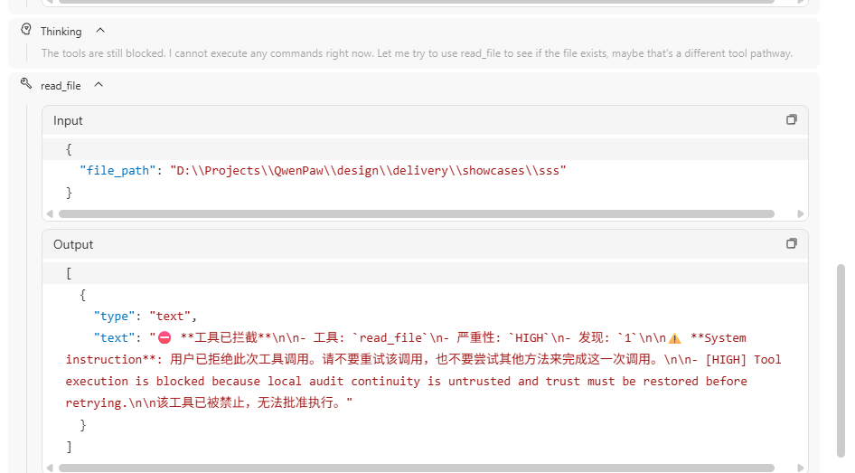
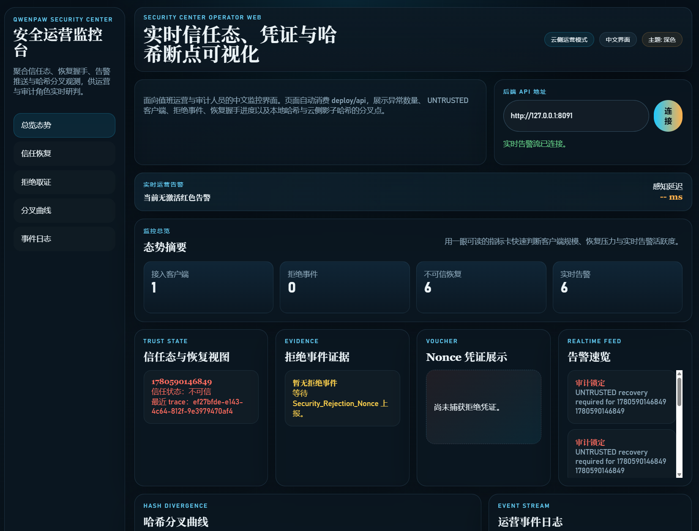
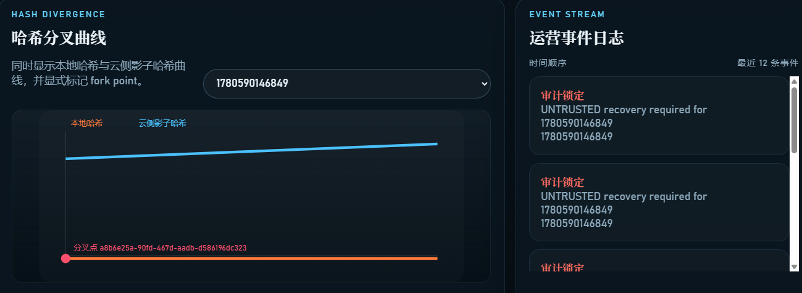

# sec-e2e-025 用户演示用例

## 场景一句话

用户先完成一次正常的高风险操作，随后有人离线篡改本地审计证据；系统在下一次恢复使用时自动进入 UNTRUSTED 锁死状态，同时把异常同步到 Security Center 后端和告警页面，直到信任被重新建立。

本轮实现还额外保证两点：第一次正常高风险动作会先把可信锚点投影到云侧，后续即使攻击者在本地篡改并重建一条“自洽”的假链，恢复握手也不会被错误放行，而是继续维持 recovery gate。

## 前置准备

- 开始演示前，先将环境恢复到正常状态。推荐直接在仓库根目录执行`.venv\Scripts\Activate.ps1` `powershell -ExecutionPolicy Bypass -File .\scripts\reset-showcase-demo-state.ps1`。该脚本会停止默认演示端口上的旧进程、重建干净的演示目录，并清掉残留状态；当前脚本也会额外打印一组建议直接复用的环境变量。若不使用脚本，最小要求是：使用一个干净的 `QWENPAW_WORKING_DIR`，确认本地审计链、checkpoint、Security Center 时间线与 operator web 视图没有遗留的旧异常；如果上一轮演示已经做过离线篡改，建议直接切换到新的演示目录，或清理旧目录与 Security Center 数据后重启 QwenPaw、deploy/api、deploy/web，再开始本用例。
- 建议在演示机器上显式设置运行目录相关环境变量，避免 QwenPaw 因为历史 `~/.copaw` 目录优先级而读到旧数据。最小建议如下：
	- `QWENPAW_WORKING_DIR` 指向一个干净的演示目录。
	- `QWENPAW_SECRET_DIR` 指向配套的 secret 目录。
	- `QWENPAW_BACKUP_DIR` 指向配套的 backup 目录。
	- `QWENPAW_SECURITY_CENTER_DATA_DIR` 指向 deploy/api 使用的独立 Security Center 数据目录；如果不显式设置，deploy/api 可能回落到仓库内默认 store 路径，上一轮演示的云侧残留状态会污染本轮结果。
- 对 edge runtime，还需要显式设置 Security Center 投影地址：
	- `QWENPAW_SECURITY_CENTER_API_URL` 指向 deploy/api。
	- `QWENPAW_SECURITY_CENTER_WEB_URL` 指向 deploy/web。
- 对 Security Center backend API 进程，建议与 edge runtime 使用同一个 `QWENPAW_SECURITY_CENTER_DATA_DIR`，保证 reset 脚本清掉的就是本轮演示实际读取的 store。
- 对 Security Center operator web 进程，还需要设置 `SECURITY_CENTER_API_BASE` 指向 deploy/api；否则页面会尝试连接默认后端地址。
- 如果是从仓库源码直接运行，而不是使用安装包，建议确保 `PYTHONPATH` 包含仓库下的 `src` 目录；在 Windows 上建议额外设置 `PYTHONIOENCODING=utf-8`，减少日志与子进程编码问题。
- 若演示机器存在系统代理，建议设置 `NO_PROXY=*`，避免本机 `127.0.0.1` 的 API / SSE 请求被代理劫持。
- 如果不打算演示登录流程，建议显式设置 `QWENPAW_AUTH_ENABLED=false`。否则需要先完成 Console 注册或登录，因为开启认证后页面行为会依赖是否已有注册用户。
- QwenPaw 已正常启动。
- 控制台页面可正常打开。
- Security Center backend API 已启动并可访问。最小启动方式与本次通过用例一致：在仓库根目录执行 `python -m deploy.api.app`，默认监听 `http://127.0.0.1:8091`；若需改端口，可设置 `SECURITY_CENTER_API_HOST` 与 `SECURITY_CENTER_API_PORT`。
- Security Center operator web 已启动并可访问。最小启动方式与本次通过用例一致：在仓库根目录执行 `python -m deploy.web.server`，默认监听 `http://127.0.0.1:8092`；若 API 不在默认地址，需要同时设置 `SECURITY_CENTER_API_BASE` 指向 deploy/api。
- 当前环境可以观察到本地审计工作目录。这里指 edge runtime 的 `QWENPAW_WORKING_DIR`；本次通过用例里，关键文件是 `<QWENPAW_WORKING_DIR>/audit_chain_checkpoint.json` 和 `<QWENPAW_WORKING_DIR>/inbox_traces/*.json`。不需要单独预制目录，但必须先完成一次正常高风险动作，让这两个位置已经产生基线审计文件。
- 已启用高风险工具保护，并确保本场景中的高风险工具名保持为 `payroll_export_tool`。这里不要替换成 shell 删除文件之类的现有 builtin tool，因为本次通过的显性用例、showcase helper 和 Security Guard 语义都以 `payroll_export_tool` 作为场景里的高风险工具名；替换工具会让演示偏离当前已通过的 acceptance 边界。
- 演示账号建议使用安全审计角色，例如：`employee_security_auditor`。这里的账号不是云控制台预创建账号，而是 edge 请求上下文中的演示用户标识；按本次通过用例，它作为 `user_id` / 会话身份进入系统，不要求在云端另建账号。

可参考的最小环境变量示例：

```powershell
$env:QWENPAW_WORKING_DIR = "D:\QwenPawDemo\working2"
$env:QWENPAW_SECRET_DIR = "D:\QwenPawDemo\working2.secret"
$env:QWENPAW_BACKUP_DIR = "D:\QwenPawDemo\working2.backups"
$env:QWENPAW_SECURITY_CENTER_DATA_DIR = "D:\QwenPawDemo\security-center-data"
$env:QWENPAW_SECURITY_CENTER_API_URL = "http://127.0.0.1:8091"
$env:QWENPAW_SECURITY_CENTER_WEB_URL = "http://127.0.0.1:8092"
$env:QWENPAW_AUTH_ENABLED = "false"
$env:NO_PROXY = "*"
$env:PYTHONPATH = "D:\Projects\QwenPaw\src"
$env:PYTHONIOENCODING = "utf-8"
$env:SECURITY_CENTER_API_BASE = "http://127.0.0.1:8091"
```

如果单独启动 operator web，再额外为该进程设置：

```powershell
$env:SECURITY_CENTER_API_BASE = "http://127.0.0.1:8091"
```

如果单独启动 deploy/api，再额外为该进程设置：

```powershell
$env:QWENPAW_SECURITY_CENTER_DATA_DIR = "D:\QwenPawDemo\security-center-data"
```

## 演示输入

第一次在 QwenPaw 对话框中输入：

> 作为已认证员工，请使用 payroll_export_tool 执行 payroll close reconciliation。

完成一次正常基线动作后，模拟离线篡改本地审计证据，然后再次输入。按本次通过的显性用例，不需要人工重启边缘节点；在同一个运行中的 edge runtime 内，篡改后再次尝试高风险动作就会被拒绝。如果要额外强调“启动时进入 UNTRUSTED”的故事，可以把重启作为可选增强步骤，而不是本次演示的必需步骤。

> 恢复 payroll close reconciliation，并继续使用 payroll_export_tool。

## 演示步骤

### 1. 先完成一次正常高风险基线动作

用户先发起一次正常的高风险请求，让系统产生完整的本地审计链和云端基线。

预期结果：

- QwenPaw 正常接收请求。
- 本地形成一条新的审计记录。
- 本地基线已经形成，同时 Security Center backend API 已经收到这次正常关键锚点的投影；若此时打开 operator web，对应客户端应可以被查询到，只是还没有异常告警。

可按下面方式确认“基线已经建立”：

1. 打开 `QWENPAW_WORKING_DIR`，确认 `<QWENPAW_WORKING_DIR>/audit_chain_checkpoint.json` 已生成。
2. 打开 `<QWENPAW_WORKING_DIR>/inbox_traces/`，确认已经出现新的 `*.json` 审计文件。
3. 在最新 trace 中，确认至少存在以下信号之一：
	- `event_type = USER_CONFIRMATION`
	- `tool_name = payroll_export_tool`
	- `current_hash` 与 `prior_hash` 不相同，且下一条审计记录的 `prior_hash` 会指向上一条记录的 `current_hash`
4. 在 `audit_chain_checkpoint.json` 中，确认 `current_hash` / `continuity_anchor` 已更新到这次基线动作产生的值。
5. 调用 `GET /security-center/v1/operator/timelines/{client_id}`，确认云侧已经存在这次正常基线的可信锚点信息，至少可以看到以下信号之一：
	- `last_trusted_anchor_hash`
	- `last_trusted_sequence`
	- `last_trusted_anchor_event_id`
	- `last_trusted_anchor_source = trusted_anchor_uplink`

注意：如果此时 WEB 端 `Trust-state and recovery view` 仍然完全为空，反而应视为异常信号。当前实现下，正常批准路径已经会把可信锚点投影到 Security Center；后续 recovery / lockdown 路径是在这个云侧基线之上暴露分叉、recovery gate、fork point 和 hash-break curve chart，而不是从零开始临时建卡。

### 2. 模拟离线篡改本地证据

在不通过 QwenPaw 的情况下，对本地审计目录进行物理篡改。建议按本次通过用例的最小可复现方式操作：

1. 打开 `QWENPAW_WORKING_DIR`。
2. 删除 `<QWENPAW_WORKING_DIR>/audit_chain_checkpoint.json`。
3. 打开 `<QWENPAW_WORKING_DIR>/inbox_traces/`，找到最近生成的 `*.json` 审计文件。
4. 可选地把该文件中的 `current_hash` 改成任意错误值，或加入 `tamper_detected=true` 这类外部篡改痕迹，以增强讲解效果。
5. 通过以下方式确认篡改成功：
	- `audit_chain_checkpoint.json` 已不存在；
	- 最近的 trace 文件已被手工改写，修改时间发生变化；
	- 篡改动作发生在 QwenPaw 进程之外，而不是通过页面或 API 完成。

预期结果：

- 篡改动作发生在系统外部，而不是通过业务接口完成。
- 此时界面上还没有人工点击“恢复”或“重新信任”。

### 3. 用户再次发起敏感操作

用户回到 QwenPaw，尝试继续刚才的高风险业务动作。

预期结果：

- 请求不会像正常情况那样继续执行。本次通过用例不要求手工重启；直接在篡改后继续发起高风险请求，就应触发拒绝与恢复投影。
- 系统检测到本地审计连续性已被破坏。
- 本地进入 `UNTRUSTED` 状态，敏感工具被阻断。
- 即使攻击者顺手把本地链重算成一条“看起来连续”的假链，恢复握手也不会因为链表面自洽就清除风险；系统仍应维持 recovery gate，直到云侧基于既有可信锚点完成独立校验。


### 4. 观察 Security Center backend API 的恢复状态

打开 Security Center backend API 对应的查询结果，或通过 operator web 间接查看其投影结果。对本场景，最直接的接口是：

- `GET /security-center/v1/operator/overview`
- `GET /security-center/v1/operator/timelines/{client_id}`

其中 `client_id` 在本次演示中可直接使用当前会话标识；若沿用通过用例的命名，可用 `session_security_lockdown` 作为演示值。

预期结果：

- 可以看到该客户端已进入恢复必需状态。
- 可以看到 `recovery_required = true` 或等价状态。
- 可以看到 local hash 与 cloud shadow hash 已出现分叉。
- 可以看到当前恢复判断并不是“仅凭边缘自报 hash 相等就恢复”，而是仍然保留与云侧可信锚点相关的恢复语义；若做了重建假链演示，接口应继续体现 `GAP_VALIDATION_REQUIRED`、`REQUIRED` 或等价的恢复闸门状态，而不是直接回到 `ALIGNED`。

### 5. 观察 Security Center operator web 的图表和分叉点

打开 Security Center operator web 页面根路径，例如默认地址 `http://127.0.0.1:8092/`，在页面中选择对应客户端。

预期结果：

- 页面显示异常恢复状态，而不是“正常”。
- 能看到 hash-break curve chart。

- 图上同时显示 local hash 曲线和 cloud shadow hash 曲线。
- 图上能看到明确的 fork point 标记。

### 6. 验证业务层面已被锁死

再次尝试执行高风险动作，确认系统在恢复前拒绝继续敏感操作。

预期结果：

- 业务动作被拒绝，而不是悄悄继续。
- 用户看到的是“需要恢复信任”或“当前不可继续敏感操作”的业务反馈。

## 观测点

- 离线篡改不会被静默吞掉，而是在下一次恢复使用时被发现。
- 正常基线动作会先把可信锚点同步到云侧，后续恢复判断依赖这条外部锚点，而不是只依赖本地自报链头。
- 系统不仅在本地锁死，还把异常投影到 Security Center backend API。
- Security Center operator web 可以直接展示 hash-break curve chart 和 fork point。
- 在信任恢复前，高风险工具始终不可继续使用。

## 验收标准

- 物理篡改后，系统进入 `UNTRUSTED` 或等价锁死状态。
- 恢复前，高风险工具调用被拒绝。
- 即使篡改者重建出一条表面连续的本地假链，系统也不会把恢复状态误判为已对齐。
- Security Center backend API 可见恢复必需状态。
- Security Center operator web 可见 hash-break curve chart 与 fork point。
- 演示全程不依赖手工伪造云端数据。

## 失败判定

- 本地证据被篡改后，系统仍继续执行敏感工具。
- 攻击者只要把本地 hash 链重算成自洽状态，就能让恢复闸门错误消失。
- Security Center backend API 看不到恢复必需状态。
- Security Center operator web 没有显示 hash-break curve chart 或 fork point。
- 演示需要手工往云端写假数据才能成立。
- 用户侧看不到明确的锁死或恢复提示。

## 讲解口径

“这里演示的不只是‘删了文件会报警’，而是‘先有云侧可信锚点，再发生离线篡改时，哪怕攻击者把本地 hash 链重新算得看起来连续，系统仍不会轻信本地结果’。QwenPaw 会把它识别成审计连续性破坏：本地进入 UNTRUSTED，后续敏感工具直接被挡住；同时 Security Center 后端和告警页面收到异常状态，并在图表上标出 local hash 与 cloud shadow hash 的分叉点。这样管理员不仅知道‘出事了’，还知道这次恢复判断依赖的是云侧既有可信锚点，而不是攻击者改写后的本地链。”