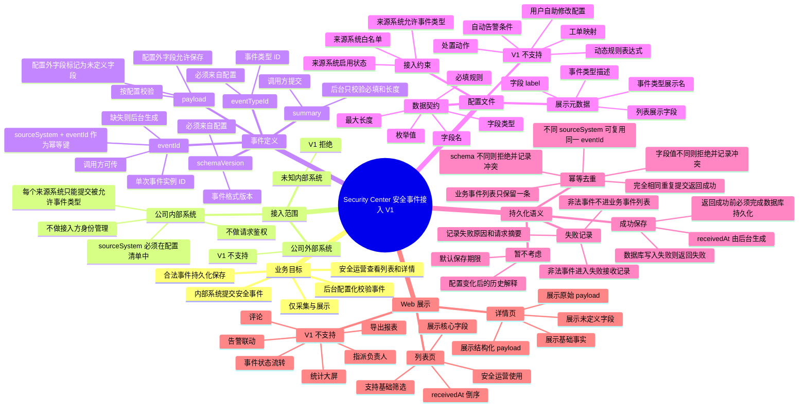

# Security Center 安全事件接入决策树

## 1. 决策树总览

## 2. 第一层拆解方法

本决策树按安全事件业务闭环拆解为五个互斥且完整的分支：

1. **接入范围**：回答“谁可以提交事件”。
2. **事件定义**：回答“提交的安全事件是什么”。
3. **配置文件**：回答“系统如何判断事件是否合法、如何展示事件”。
4. **持久化语义**：回答“事件被接收后如何保存、去重、追溯”。
5. **Web 展示**：回答“安全运营如何消费事件”。

这五个维度覆盖从内部系统提交到安全运营查看的完整链路；每个维度关注不同业务问题，避免重复。

## 3. 已冻结决策

### 3.1 业务目标

Security Center 提供一个仅面向公司内部系统的安全事件提交 API。后台按配置校验来源系统、事件类型、schema 版本和 payload 字段格式。合法事件必须先持久化保存，再供安全运营人员在 Web 端查看列表和详情。

V1 只做采集与展示，不做处置闭环。

### 3.2 接入范围

| 决策点 | 决策结果 | 决策理由 |
| --- | --- | --- |
| 外部服务类型 | 公司内部系统 | 当前需求来自内部服务接入，不覆盖第三方合作方 |
| 接入方身份管理 | V1 不做 | 降低第一版范围 |
| 请求鉴权 | V1 不做 | 当前限定在内部系统和内网边界 |
| 来源系统约束 | 必须做 | 即使不鉴权，也不能允许任意来源污染事件数据 |
| 事件类型授权 | 必须做 | 每个来源系统只能提交明确允许的事件类型 |

### 3.3 事件定义

| 字段 | 业务含义 | V1 规则 |
| --- | --- | --- |
| `eventId` | 单次事件实例 ID | 调用方可传；缺失则后台生成 |
| `sourceSystem` | 来源系统 | 必填，必须在配置清单中 |
| `eventTypeId` | 事件类型 ID | 必填，必须在配置中存在 |
| `schemaVersion` | 事件格式版本 | 必填，必须属于对应事件类型 |
| `severity` | 严重级别 | 必填或使用配置默认值 |
| `occurredAt` | 事件发生时间 | 调用方提交 |
| `receivedAt` | 后台接收时间 | 后台生成，不信任调用方传入值 |
| `summary` | 列表摘要 | 调用方提交，后台校验必填和长度 |
| `payload` | 事件结构化内容 | 按配置校验 |
| `rawPayload` | 原始请求内容 | 后台保存，用于追溯 |

### 3.4 配置文件

配置文件只定义事件契约，不定义业务逻辑。

V1 支持：

1. 来源系统白名单。
2. 来源系统允许提交的事件类型。
3. 来源系统和事件类型启用状态。
4. `eventTypeId`、`schemaVersion`、展示名和描述。
5. payload 字段名、类型、必填、枚举、最大长度。
6. 字段 label 和是否在列表展示。

V1 不支持：

1. 鉴权密钥。
2. 动态规则表达式。
3. 自动告警条件。
4. 工单映射。
5. 处置动作。
6. 跨字段复杂校验。
7. 外部系统回调。
8. Web 上自助修改配置。

### 3.5 payload 配置外字段

payload 中出现配置外字段时，V1 允许保存，但必须标记为未定义字段。

决策理由：

1. 安全事件可能携带临时上下文，完全拒绝会降低接入成功率。
2. 未定义字段不进入结构化主展示，避免安全运营误认为它是正式字段。
3. 详情页单独展示未定义字段，保留排查价值。

### 3.6 幂等规则

幂等键为 `sourceSystem + eventId`。

| 场景 | V1 行为 |
| --- | --- |
| 同一来源、同一 `eventId`、规范化后内容相同 | 返回成功，不新增业务事件 |
| 同一来源、同一 `eventId`，但 `eventTypeId` 或 `schemaVersion` 不同 | 拒绝，记录幂等冲突 |
| 同一来源、同一 `eventId`，schema 相同但字段值不同 | 拒绝，记录幂等冲突 |
| 不同来源使用相同 `eventId` | 允许保存为不同事件 |
| 调用方希望表示新事件 | 必须使用新的 `eventId` |

核心原则：同一个事件实例 ID 不能指向两个不同事件事实。

### 3.7 暂不纳入 V1 的持久化问题

1. 暂不考虑配置变化后的历史 schema 展示策略。
2. 暂不设置合法事件和失败记录的默认保存期限。

这些问题不应在 V1 中被隐式实现，也不应通过代码默认值偷偷承诺。

### 3.8 Web 范围

Web 端面向安全运营人员，定位是“安全事件收件箱”，不是数据库浏览器。

列表页必须支持：

1. 默认按 `receivedAt` 倒序展示。
2. 展示接收时间、发生时间、来源系统、事件类型展示名、严重级别、摘要、事件 ID。
3. 支持按时间范围、来源系统、事件类型、严重级别筛选。

详情页必须支持：

1. 展示事件基础事实。
2. 按配置 label 展示结构化 payload。
3. 单独展示未定义字段。
4. 展示原始 payload。

V1 不支持：

1. 事件状态流转。
2. 指派负责人。
3. 评论。
4. 告警联动。
5. 工单流转。
6. 导出报表。
7. 统计大屏。
8. 多租户权限。
9. Web 上编辑事件类型配置。

## 4. 验收控制点摘要

| 分支 | 控制点 | 观测点 |
| --- | --- | --- |
| API 提交 | 已配置内部系统提交合法事件 | API 成功，事件被保存，Web 列表可见 |
| 来源约束 | 未知 `sourceSystem` 提交事件 | API 拒绝，业务列表不可见，失败记录可查 |
| 事件类型约束 | 来源系统提交未授权事件类型 | API 拒绝，失败原因明确 |
| schema 校验 | 缺少必填字段或字段类型错误 | API 拒绝并指出字段问题 |
| 配置外字段 | payload 包含未定义字段 | 事件保存，详情页在未定义字段区域展示 |
| 持久化 | 合法事件提交后立即查询 | 事件可见，不存在成功但未保存状态 |
| 幂等 | 完全相同事件重复提交 | 返回成功，列表只出现一条 |
| 幂等冲突 | 同一幂等键字段值不同 | 第二次拒绝，记录冲突 |
| Web 列表 | 安全运营打开列表 | 按接收时间倒序展示核心字段 |
| Web 详情 | 打开某事件详情 | 可见基础事实、结构化 payload、未定义字段和原始 payload |

