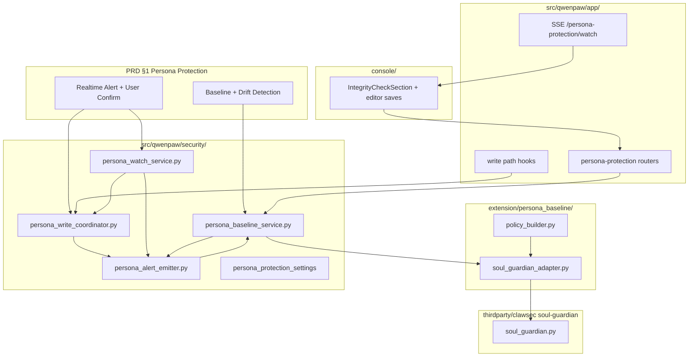
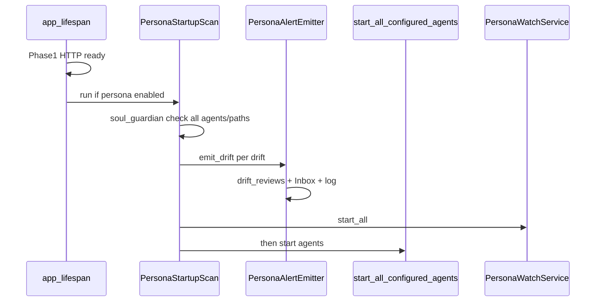
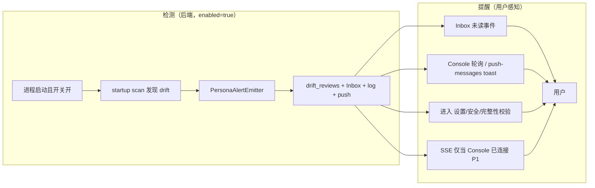
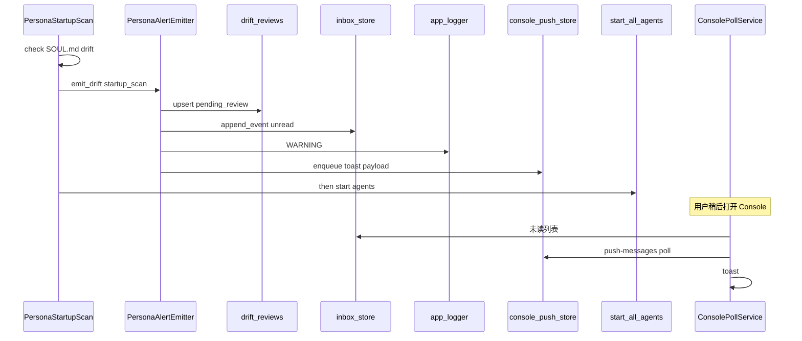
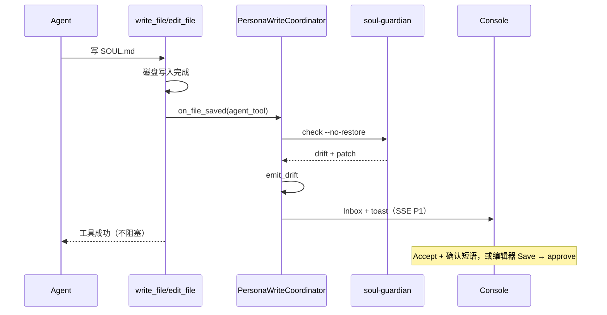
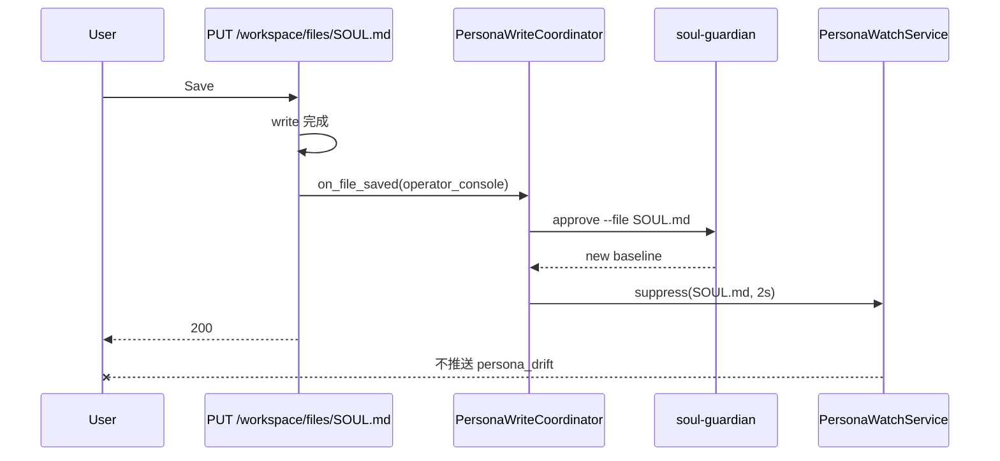
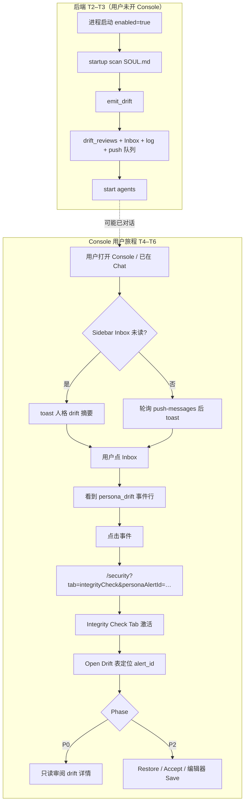
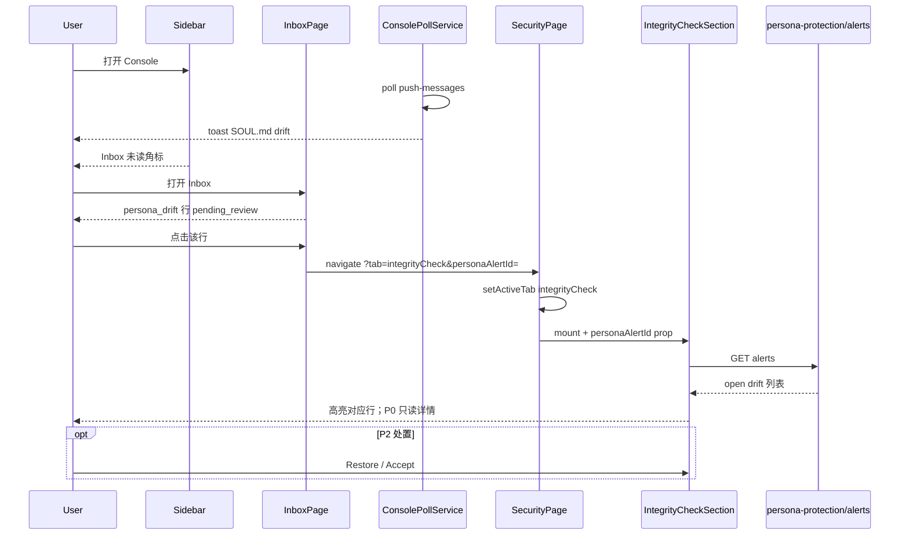

# Persona Baseline Guardian Design

> **Slice ID:** `intent-persona-baseline-guardian`  
> **PRD 来源:** `extension/Intergrity  Protection PRD.txt` → 一、人格完整性保护  
> **父设计:** `extension/Intergrity  Protection Design.md`（Integrity Protection 总交付切片）  
> **版本:** 0.6.7  
> **变更（0.6）：** 明确 Out of Scope：read-time verification；强化 §5.5 启动扫描（scan-before-agents）与统一告警管道 `PersonaAlertEmitter`（Inbox + 日志 + push toast）。  
> **变更（0.6.1）：** 复核并统一 **Enable Gate**：本文档全部运行时规格 **仅在 `settings.enabled=true` 时生效**（含启动全量扫描、告警、hook、watch）。  
> **变更（0.6.2）：** 明确 **Disable 时保留 `protected_targets` 保护文件清单**；再次 Enable 时沿用同一列表，无需用户重新添加路径。  
> **变更（0.6.3）：** 定稿 **Disable 删基线状态**（`delete_with_confirm`）+ **Re-enable 确认建新基线**；消除 §7/§9/§12/§14/§19/§20 内部冲突。  
> **变更（0.6.4）：** 区分 **首次 Enable** 与 **Disable 后 Re-enable** 确认；统一 `run_startup_scan` 内含 watch；P0 Integrity 页只读 vs P2 Restore/Accept；补全 §14.2 开关交互分支。  
> **变更（0.6.5）：** 重写 **§18 场景化测试设计**——按运维/对话/离线篡改等真实使用路径组织 GIVEN/WHEN/THEN，替代纯 API 名驱动的用例表。  
> **变更（0.6.6）：** 补 **§18.8 PB-S20 用户旅程**（Inbox → deep-link → Integrity）；补 **§18.9 Harness Observation 契约**（用户可感知字段 + 场景断言方法）。  
> **变更（0.6.7）：** **定稿试点测试约定**：场景测试以 **`SOUL.md` 为唯一默认受保护文件**；**Restore/Accept 仅 P2**（`test_persona_drift_alert_restore_accept` 标 P2，不再纳入 P0 门禁）。

---

## 1. 目的与范围

### 1.1 要解决的问题

防止 agent 工作区中 **人格/认知基线文件**（如 `AGENTS.md`、`SOUL.md`、`PROFILE.md`）被静默篡改，导致 prompt 层投毒，使 agent「自愿」绕过安全策略。

### 1.2 PRD 覆盖范围（本设计）

| PRD 条目 | 内容 | 本设计 |
|---------|------|--------|
| 一.1 | 复用 soul-guardian 建基线、漂移检测 | ✅ 核心 |
| 一.2 | 实时提醒、Restore/Accept | ✅ 核心 |
| 一.3 | 动态扩展保护路径 | ✅ 配置口 |
| 一.4 | 启动全量扫描 | ✅ 挂载点（**仅 `enabled=true` 时**） |
| 一.5 | 开关默认关闭 | ✅ |
| 一.6 / 四 | Console 界面 | ✅ UI 契约 |

**不在本切片内：** 来源可信校验、健康体检、规则完整性（见总设计其他章节）。

### 1.3 Out of Scope（v0.6 明确）

以下能力 **不在** Persona Baseline Guardian 试点与 P0 实施范围内：

| 项 | 说明 |
|----|------|
| **读取时 baseline 校验** | 不 hook `PromptBuilder` / `read_file` / `GET /workspace/files/*` |
| **system prompt fail-closed** | drift 时 **不** 自动用 approved 快照替换读路径 |
| **`persona_integrity` 读 API 字段** | operator 读文件响应不附加 drift 元数据（除非后续单独立项） |
| **`PersonaReadCoordinator`** | 不实现 |

离线/停机篡改的 **唯一可靠检测入口** 为 **startup scan**（§5.5，**前提：`enabled=true`**）；运行中依赖 write hook + watch（同样 **仅开关开启时**）。

### 1.4 与当前代码的关系

| 现状 | 本设计态度 |
|------|-----------|
| `PersonaBaselineGuardian`（自研 SHA256） | **废弃/替换**，改为 soul-guardian 适配层 |
| `integrity_protection.py` 内 persona 类 | 保留模块边界，内部委托新 service |
| 集成测试 `test_persona_drift_alert_restore_accept` | **P2**；保留 testcase 名；试点 **`SOUL.md` only**；场景 **PB-S42 + PB-S44**（Restore/Accept + 确认短语）；**不**纳入 P0 CI 门禁 |

---

## 2. 设计原则

1. **复用不复制**：调用 `thirdparty/clawsec-main/.../soul-guardian`，不重写 policy/audit/quarantine/diff 逻辑。
2. **低侵入**：适配层放 `extension/`，运行时语义放 `src/qwenpaw/security/`，HTTP 放 `src/qwenpaw/app/`，Console 放 `console/`。
3. **默认关闭 / 开关门控（Enable Gate）**：`enabled=false` 时零 **运行时** 副作用：不 watch、**不 startup scan**、不写 audit、write hook **no-op**、不调用 soul-guardian、不 emit drift 告警。**配置**（`protected_targets` 清单）仍保留（§14.3.1）。**本文档 §5–§14 描述的全部检测、扫描、告警、Restore/Accept、隐式 Accept 行为，均仅在 `settings.enabled=true` 时生效**。
4. **QwenPaw 交互模型**：soul-guardian 默认对 `SOUL.md`/`AGENTS.md` 使用 `restore`（自动恢复）；QwenPaw **统一使用 `alert` 模式**，禁止自动 restore（用户须显式 Restore 或 Accept / 编辑器保存）。
5. **按 agent 工作区隔离**：每个 agent workspace 独立 state；不做跨 agent 合并基线。
6. **fail-closed on symlinks**：继承 soul-guardian 的 symlink 拒绝策略。
7. **保存瞬间决策**：开关开启时，protected 文件变更在 **写入完成瞬间** 判定 drift 或升基线，不依赖延迟轮询 alone。
8. **统一告警管道**：开关开启时，startup scan、write hook、watch 共用 `PersonaAlertEmitter.emit_drift()`，保证 Inbox / 日志 / push / SSE 行为一致。

---

## 3. 架构分层



### 3.1 职责划分

| 层 | 路径 | 职责 |
|----|------|------|
| Extension adapter | `extension/persona_baseline/` | 构造 policy、定位 soul-guardian 脚本、subprocess 封装、路径规范化 |
| Security service | `src/qwenpaw/security/persona_baseline_service.py` | enable/disable、init、check、settings 持久化；**`is_persona_protection_enabled()` 为全局门控** |
| Write coordinator | `src/qwenpaw/security/persona_write_coordinator.py` | **enabled 时** 保存瞬间：隐式 Accept / drift 告警 / suppress token |
| Alert emitter | `src/qwenpaw/security/persona_alert_emitter.py` | **enabled 时** `emit_drift()` + `emit_baseline_updated()`：drift_reviews + Inbox + 日志 + push/SSE |
| Watch service | `src/qwenpaw/security/persona_watch_service.py` | **enabled 时** watchfiles 兜底外部写入 |
| App | `src/qwenpaw/app/routers/...` | HTTP/SSE、写入路径 hook |
| Console | `console/.../IntegrityCheckSection.tsx` | 开关、告警、Restore/Accept、确认短语 |
| ClawSec | `thirdparty/.../soul-guardian/scripts/soul_guardian.py` | init / check / approve / restore / verify-audit |

---

## 4. Soul-Guardian 复用策略

### 4.1 调用方式（Phase 1：subprocess）

```text
python3 <repo>/thirdparty/clawsec-main/clawsec-main/skills/soul-guardian/scripts/soul_guardian.py \
  --state-dir <WORKING_DIR>/integrity-protection/persona/<agent_id> \
  --workspace-root <agent_workspace> \
  <subcommand> ...
```

Phase 2（可选）：将 `init_cmd` / `check_cmd` / `approve_cmd` 作为库 import，需处理 `WORKSPACE_ROOT = Path.cwd()` 约束。

### 4.2 使用的子命令

| 子命令 | 用途 | 备注 |
|--------|------|------|
| `init` | enable / Re-enable 建 baseline | 首次 Enable 直接 init；Disable 后 Re-enable（`baseline_cleared_at != null`）须用户确认短语（§14.3.2），再以当前磁盘建新基线 |
| `check --no-restore --output-format json` | 漂移检测 | 仅检测+告警 |
| `approve --file <path>` | Accept / 编辑器隐式允许 | 当前内容升为新 baseline |
| `restore --file <path>` | Restore | 还原到旧 baseline |
| `status` | 列出 protected paths 与 drift 状态 | Console 展示 |
| `verify-audit` | 运维自检 | 非 P0 |
| `watch` | **不直接使用** | QwenPaw 用 watchfiles + hook |

### 4.3 QwenPaw policy（动态 targets，非写死三文件）

adapter 根据 **当前生效的 protected 路径列表**（§5.4）生成 `policy.json`；每项统一 `{path, mode: "alert"}`。

示例（试点仅护 `SOUL.md` 时）：

```json
{
  "version": 1,
  "workspaceRoot": "<agent_workspace_abs>",
  "targets": [
    {"path": "SOUL.md", "mode": "alert"}
  ]
}
```

示例（用户后续追加 `AGENTS.md` 与 skill 时）：

```json
{
  "targets": [
    {"path": "SOUL.md", "mode": "alert"},
    {"path": "AGENTS.md", "mode": "alert"},
    {"path": "skills/custom/SKILL.md", "mode": "alert"}
  ]
}
```

**禁止**在 policy 中使用 `restore` 模式（与 PRD 用户确认模型冲突）。

---

## 5. 状态与路径模型

### 5.1 目录布局

```text
<WORKING_DIR>/
  integrity-protection/
    persona/
      settings.json
      drift_reviews.json
      <agent_id>/
        policy.json
        baselines.json
        audit.jsonl
        approved/
        patches/
        quarantine/
```

### 5.2 Workspace 根目录

```text
agent_workspace = <WORKING_DIR>/workspaces/<agent_id>/
```

protected 文件路径均 **相对于 agent workspace root**（不是仅 coding 子目录）。

Coding Mode 的 `project_dir` 若与 workspace 不同，protected 仍在 workspace 根；skill 等通过 `protected_targets` 动态添加。

### 5.3 Settings 结构

```json
{
  "enabled": false,
  "pilot_mode": true,
  "protected_targets": ["SOUL.md"],
  "baseline_established": false,
  "baseline_cleared_at": null,
  "agents": {
    "<agent_id>": {
      "protected_targets": null,
      "last_init_at": "2026-06-11T12:00:00Z",
      "last_check_at": "2026-06-11T12:05:00Z"
    }
  }
}
```

| 字段 | 说明 |
|------|------|
| `protected_targets` | **全局**受保护相对路径列表（相对 agent workspace root）；policy / watch / hook 均读此列表。**关闭开关时不删除**；再次打开开关时仍保护这些路径（§14.3.1） |
| `agents.<id>.protected_targets` | 可选 per-agent 覆盖；`null` 表示继承全局列表。**关闭开关时同样保留** |
| `pilot_mode` | 元数据标记「当前仍为试点阶段」；不影响运行时逻辑，供 UI 展示说明 |
| `baseline_established` | 是否曾成功建立 soul-guardian 基线；**首次 Enable 成功后** 置 `true` |
| `baseline_cleared_at` | Disable 删除基线状态时写入 ISO 时间；**非 null** 表示下次 Enable 须 Re-establish 确认（§14.3.2）；Enable 成功后置 `null` |

### 5.4 试点策略与动态保护范围

#### 5.4.1 分阶段策略

| 阶段 | 保护范围 | 目的 |
|------|----------|------|
| **试点（v1 实现）** | **仅 1 个**低频文件 | 验证 soul-guardian 适配、开关、watch、Accept/Restore、编辑器隐式 Accept，减少告警噪音 |
| **扩展（v1+ / 用户配置）** | 用户在 Console **动态增删**路径 | 满足 PRD 一.3；逐步纳入 AGENTS.md、PROFILE.md、skill 等 |

不在代码里写死「必须护三个文件」；**唯一硬编码的是试点默认值**（见下），其余全靠 `protected_targets` 配置。

#### 5.4.2 试点默认文件：`SOUL.md`

**推荐试点选 `SOUL.md` 的理由：**

| 候选 | 变更频率（相对） | 试点适合度 |
|------|------------------|------------|
| **SOUL.md** | 低 — 人格设定，用户/agent 日常较少改 | ✅ **首选** |
| AGENTS.md | 中 — 行为准则，agent 可能被引导改「安全段」 | 第二阶段 |
| PROFILE.md | 中高 — agent 常被要求更新用户资料 | 第二阶段 |
| HEARTBEAT.md | 中 — 启用 heartbeat 时会改 | 可选扩展 |
| MEMORY.md / `memory/*.md` | 高 | 不建议默认纳入 |

`SOUL.md` 仍在 `system_prompt_files` 默认三件套内，投毒面真实存在，但合法 drift 少，适合先把链路跑通。

**测试约定（定稿）：** 所有人格保护场景测试的默认受保护文件为 **`SOUL.md`**；`AGENTS.md` / `PROFILE.md` / skill 路径 **仅**在 **PB-S18**（扩展清单）或 **PB-S31**（扩展后 agent 写入）等显式场景中启用，**不得**作为 P0/P2 默认可用例的主 path。

#### 5.4.3 生效路径计算

```text
effective_protected_paths(agent_id) =
  agents[agent_id].protected_targets
  IF NOT NULL
  ELSE settings.protected_targets
```

约束：

- 路径为相对路径，POSIX `/` 分隔；禁止 `..` 逃逸。
- 支持精确文件路径（`SOUL.md`、`skills/foo/SKILL.md`）。
- **v1 可选**支持 glob（如 `skills/*/SKILL.md`）；若未实现 glob，Console 仅允许逐条添加精确路径。
- 列表为空时：**不允许** `enabled=true`（开启开关前至少 1 条路径，见 §14.5）。

#### 5.4.4 预设快捷项（非默认启用）

Console「添加保护路径」下拉 **预设**，用户点击才加入 `protected_targets`，**不**自动全开：

| 预设 label | 路径 |
|------------|------|
| 人格准则 | `SOUL.md` |
| 行为指南 | `AGENTS.md` |
| 用户画像 | `PROFILE.md` |
| 心跳任务 | `HEARTBEAT.md` |
| 自定义… | 用户输入相对路径 |

PRD 长期目标（三文件 + skill）通过用户从预设追加达成，而非一次性默认全开。

#### 5.4.5 动态变更与 init

| 操作 | 行为 |
|------|------|
| 用户 **新增** 路径 | 写入 `protected_targets` → 对该 path 执行 soul-guardian init（仅新 path）→ check |
| 用户 **移除** 路径 | 从列表删除 → 停止 watch/check 该 path；**不**删已有 baseline 文件（可选 GC 留作 Phase 2） |
| 用户 **修改** 列表后 | 重写 `policy.json` → 对已启用 agent 触发增量 init |

路径变更 **不要求** 关闭再打开总开关；但变更期间应 `loading` 防止并发编辑。

### 5.5 离线篡改：检测时机与用户提醒时机

> **Enable Gate：** 本节全部流程 **仅在 `settings.enabled=true` 时执行**。`enabled=false` 时：不 startup scan、不 emit_drift、不写入 persona Inbox/toast；agent 与 Console 读写文件行为与未安装本功能相同。

QwenPaw **未运行**时（进程退出、服务未启动、仅改磁盘）没有 watch、没有 hook，**无法在篡改发生的瞬间检测**（且若重启时开关仍为关，则 **仍不检测**）。  
方案必须区分两件事：

| 概念 | 含义 |
|------|------|
| **检测** | 后端发现「当前文件 ≠ approved baseline」 |
| **提醒** | 用户在其使用的 UI 里**看到** drift 并知道该去处理 |

#### 5.5.1 检测时机与检测矩阵

**检测矩阵（唯一入口；均要求 `enabled=true`）**

| 场景 | 检测机制 | 开关关时 |
|------|----------|----------|
| QwenPaw **未运行**时被改 | **下次启动且 `enabled=true` 时** startup scan | 不 scan、不告警 |
| 运行中 agent 写入 | write hook（`PersonaWriteCoordinator`） | hook no-op |
| 运行中外部改盘 | `PersonaWatchService` | 无 watch |
| 读取文件 | **不检测**（Out of Scope，§1.3） | — |

**主路径：服务启动后全量扫描（PRD 一.4，前提 `enabled=true`）**

```text
app lifespan（persona_protection.enabled=true）:
  Phase 1: HTTP 快速就绪（listen，不阻塞）
  Phase 2: _background_startup() 内，在 start_all_configured_agents() 之前:
    PersonaStartupScan.run()
      FOR each agent with effective_protected_paths:
        soul_guardian check --no-restore
        IF drift → PersonaAlertEmitter.emit_drift(provenance=startup_scan)
      PersonaWatchService.start_all()
    await multi_agent_manager.start_all_configured_agents()
```

挂载点：[`src/qwenpaw/app/_app.py`](../src/qwenpaw/app/_app.py) 的 `_background_startup()`，在现有 `await asyncio.sleep(background_delay)` 之后、`await multi_agent_manager.start_all_configured_agents()` **之前**插入：

```python
# 仅当 persona_protection_enabled 为 True 时进入；否则跳过，agent 立即按原逻辑启动
if persona_protection_enabled:
    await persona_baseline_service.run_startup_scan()  # 内含 check + emit_drift；结束后调用 Watch.start_all()
await multi_agent_manager.start_all_configured_agents()
```

`run_startup_scan()` **内部顺序**：全 agent/path `check` → `emit_drift` → `PersonaWatchService.start_all()`（与 §11.3 一致）。



| 项 | 约定 |
|----|------|
| 执行时刻 | QwenPaw 后端进程启动后、**agent 启动前**（persona enabled 时） |
| 前置条件 | `settings.enabled=true` 且 `protected_targets` 非空 |
| `enabled=false` | **不** scan、不 delay agent，行为与 today 一致 |
| 与 enable 扫描 | 与「用户打开开关」触发的 check **同一套逻辑**，复用 `PersonaBaselineService.run_check_all()` |
| scan 失败 | fail-open：记录 error + 可选 Inbox 运维事件；**仍启动 agent**（试点） |
| 暴露状态 | `enabled=true` 时：`scan_status`、`last_scan_at`、`last_scan_drift_count`；`enabled=false` 时均为 `null` / `idle`，**不**显示 `scanning` |
| 幂等 | 同一 `agent_id + path + current_sha256` 已 `pending_review` 时不重复刷 Inbox |

**辅路径（兜底）：**

| 触发 | 场景 |
|------|------|
| 用户打开开关 | enable 流程内 check（进程已在跑） |
| `GET /persona-protection/alerts` | 前端进 Integrity Check 页时拉取（**仅 meaningful 当 `enabled=true`**）；scan 进行中则 `scanning: true` |
| Watch 首包 | 启动 scan 完成后 watch 才负责**之后**的新变更；**不**替代 startup scan |

**不在 QwenPaw 运行时的篡改**，其「检测时刻」= **下一次进程启动且 `settings.enabled=true` 时完成 startup scan**（或用户 **打开开关** 触发 enable check 的时刻）。

**边界：** 若停机期间文件被改，但重启前或重启时开关为 **关**，则 **不会** startup scan，也 **不会** 产生 drift 告警，直至用户再次 **打开开关**（enable 流程内 check 才会发现）。

#### 5.5.2 告警管道与用户提醒（PersonaAlertEmitter）

> **Enable Gate：** `PersonaAlertEmitter` **仅在 `enabled=true` 时被调用**。实现上 `emit_drift` 首行应断言/检查 `is_persona_protection_enabled()`；开关关闭后不得写入 Inbox、push 队列或 persona SSE。

scan、write hook、watch **共用** `PersonaAlertEmitter.emit_drift()`，避免 startup 与在线两套逻辑。

```text
emit_drift(...) -> alert_id

  IF NOT is_persona_protection_enabled():
    RETURN  # 开关关时不得调用；防御性 no-op

  1. 幂等 upsert drift_reviews.json（pending_review）
  2. inbox_store.append_event（若同 agent+path+current_sha 尚无 open 事件）
  3. logger.warning 结构化日志（运维 / CLI 用户）
  4. console_push_store 入队（供 ConsolePollService toast）
  5. 可选：persona SSE broadcast（已有 Console 连接时）
  6. soul-guardian check 已写 audit / patch — 不重复
```

参数：`agent_id`, `path`, `approved_sha`, `current_sha`, `provenance`（`startup_scan` \| `agent_tool` \| `external_watch`）, `patch_path`, …

**startup scan 路径**：每发现一条 drift 即调用 `emit_drift(provenance=startup_scan)`，**在** `start_all_configured_agents()` **之前**完成全部 emit。

**告警分层（试点 P0）**

| 层级 | 触发时刻 | 机制 | 试点 |
|------|----------|------|------|
| **L0 持久化** | scan 完成瞬间 | `drift_reviews.json` | 必做 |
| **L1 Inbox** | 同上 | `append_event`：`event_type=persona_drift`，`severity=high`，`status=pending_review` | 必做 |
| **L2 应用日志** | 同上 | `WARNING`：`Persona drift detected at startup: agent=… path=…` | 必做 — CLI/仅渠道用户即时信号 |
| **L3 Console toast** | 用户打开 Console 且轮询 | 扩展 `GET /console/push-messages`（**仅 `enabled=true` 时**返回 persona 字段） | 必做 |
| **L4 Integrity 页** | 用户进入 Security → Integrity Check | **P0：** `GET alerts` 只读 drift 列表 + 顶栏 Alert（**无** Restore/Accept 按钮）；**P2：** 操作按钮 + 确认短语 | 必做（P0 只读；P2 操作） |
| **L5 SSE** | Console 已订阅 persona watch | `type: persona_drift`（与在线 drift 相同 payload） | P1 |
| **L6 Security Tab 角标** | 有 open alerts | `open_alert_count` Badge | P2 |

**试点 P0 闭环：L0 + L1 + L2 + L3 + L4**。

检测完成后，用户未必开着 Console。提醒分 **多层、取最早触点**：



**Inbox 事件契约（startup 与在线共用）**

```python
await append_event(
    agent_id=agent_id,
    source_type="persona_protection",
    source_id=alert_id,
    event_type="persona_drift",
    status="pending_review",
    severity="high",
    title="人格文件已变更（启动扫描）",  # 或 i18n key
    body=f"{path} 与基线不一致。请在 设置 → 安全 → 完整性校验 中 Restore 或 Accept。",
    payload={
        "alert_id": alert_id,
        "path": path,
        "agent_id": agent_id,
        "provenance": "startup_scan",
        "approved_sha256": "...",
        "current_sha256": "...",
        "patch_path": "...",
    },
)
```

用户从 Inbox 点击可 deep-link 到 Security `integrityCheck` Tab。路由与 UI 契约见 **§18.8**。

#### 5.5.3 典型时序：关机期间 SOUL.md 被改

```text
T0  QwenPaw 停止
T1  外部进程 / 手工编辑 SOUL.md（QwenPaw 无感知）
T2  用户启动 QwenPaw；HTTP 就绪
T3  startup scan（agent 尚未启动）→ emit_drift → drift_reviews + Inbox + log + push 队列
T3' start_all_configured_agents() — agent 可用，但磁盘仍为篡改内容
T4  用户打开 Console（可能先去 Chat）
T5  Inbox 未读 + push toast → 「SOUL.md 人格文件已变更，请到完整性校验处理」
T6  用户进入 Integrity Check → **P0** 看到 drift 详情（只读）；**P2** Restore 或 Accept

**测试场景：** PB-S20（Console 用户）、PB-S21（迟开 Console）。
```

**时间窗说明：**

- **T3 之前**（scan 未完成）：agent **尚未启动**，不会对话。
- **T3 之后、用户 Restore 之前**：agent 可能用**篡改后**的 SOUL.md 构建 prompt — 依赖 Inbox / toast / Integrity 页提醒用户处理（alert 模式，不自动 Restore）。

若 T4 用户**从未**打开 Console（仅 CLI/渠道跑 agent）：

- drift **仍已检测并持久化**（T3）
- **L2 日志** 为唯一即时信号；agent 会继续用被篡改后的 SOUL.md
- 提醒推迟到**首次**打开 Console（L1 + L3 + L4）
- Phase 2 可选：CLI `qwenpaw start` stderr 摘要 — 不纳入试点 P0

#### 5.5.4 与「在线篡改」的对比

| 场景 | 检测 | 用户提醒 |
|------|------|----------|
| QwenPaw 运行中，agent 改文件 | 写入 hook 瞬间 | `emit_drift` → Inbox + toast + Integrity 页（P0）；SSE（P1） |
| QwenPaw 运行中，外部改文件 | watch 瞬间 | 同上 |
| **QwenPaw 未运行，磁盘被改** | **下次启动且 `enabled=true` 时** startup scan | **下次打开 Console 且开关仍为/已开**（Inbox + toast + Integrity 页）+ **启动日志** |

#### 5.5.5 设计约束

1. **startup scan 不能省略（在 enabled 时）** — 开关开启后，离线篡改唯此可靠检测入口（watch 只在进程存活且 enabled 时有效）。
2. **persona enabled 时 agent 启动阻塞于 scan+告警完成** — HTTP 不阻塞；**仅 `enabled=true` 时**检测与 L0–L2 告警在 `start_all_configured_agents()` 之前完成；`enabled=false` 时 **不** scan、**不** delay agent。
3. **Inbox + toast 为离线场景主通道** — 不假设 SSE 常连。
4. **不在未提醒前自动 Restore** — 与 `alert` 模式一致；用户必须 Restore / Accept / 编辑器 Save。
5. **试点 SOUL.md** — 离线改动的用户文案应点名文件路径与 agent。
6. **统一 emit_drift** — startup / write / watch 不各自写 Inbox。

#### 5.5.6 启动扫描告警时序（后端）



---

## 6. 写入来源（Write Provenance）

> **Enable Gate：** 以下表格与 §7 流水线 **仅在 `settings.enabled=true` 时生效**。开关关闭时，所有来源均按普通文件写入处理，无 approve / check / drift。

同一份 protected 文件，**谁在什么路径写入**，决定保存瞬间的行为：

| 来源 ID | 典型入口 | 保存瞬间行为 |
|---------|----------|--------------|
| `operator_console` | `PUT /workspace/files/{md}`（Agent 工作区 MD 编辑器） | **隐式 Accept** → 同步升基线，不产生 drift 告警 |
| `operator_console` | `PUT /workspace/code-files/{path}`（Coding TabbedEditor） | 同上 |
| `agent_tool` | `write_file` / `edit_file`（`file_io.py`） | **视为修改** → 保存瞬间 check → 产生 drift 告警 |
| `system_maintenance` | init、语言切换、`copy_workspace_md_files`、Restore API | suppress / 专用流程，不误报告警 |
| `external_untrusted` | shell、外部进程、未 hook 的写入 | watch 在写入瞬间 check → 产生 drift 告警 |

### 6.1 三种「允许 / 升基线」方式

| 方式 | 触发 | 确认 | 基线更新时机 |
|------|------|------|-------------|
| **A. 编辑器保存** | Operator 在 Console 保存 | 无（主动编辑即信任） | 保存成功同步 `approve` |
| **B. Accept 按钮** | Security → Integrity Check | Health Check 式**确认短语** | API 同步 `approve` |
| **C. 编辑器保存 agent 改过的文件** | 用户打开 drift 文件审阅后 Save | 无 | 保存瞬间 `approve`（内容可为 agent 版） |

**Restore** 仅 Security 页（+ 确认短语）：还原到**旧**基线，不升基线。

---

## 7. 保存瞬间处理流水线

统一入口：`PersonaWriteCoordinator.on_file_saved`

```text
on_file_saved(agent_id, rel_path, provenance, *, suppress_watch_sec=2):

  IF persona_protection NOT enabled:
    RETURN

  IF provenance == system_maintenance:
    RETURN (或仅写 audit)

  IF provenance == operator_console:
    1. soul_guardian approve --file <rel_path>
    2. 清除该 path 的 pending drift alert（若有）
    3. 注册 watch suppress(agent_id, path, current_sha256, ttl=2s)
    4. audit: event=operator_implicit_accept, actor=console
    5. PersonaAlertEmitter.emit_baseline_updated(path, ...)  # SSE persona_baseline_updated
    RETURN

  IF provenance IN (agent_tool, external_untrusted):
    1. soul_guardian check --no-restore
    2. IF drift:
         PersonaAlertEmitter.emit_drift(provenance=agent_tool|external_watch, ...)
    3. 不改基线
    RETURN
```

**Hook 优先于 watch**：已知来源的写入在 HTTP/工具返回前完成 approve 或 check。

### 7.1 写入路径挂载点

| API / 模块 | 文件 | provenance |
|------------|------|------------|
| `PUT /workspace/files/{md_name}` | `workspace.py` → `write_working_file` | `operator_console` |
| `PUT /workspace/code-files/{path}` | `workspace.py` → `write_code_file` | `operator_console` |
| `write_file` / `edit_file` | `agents/tools/file_io.py` | `agent_tool` |
| enable / init / restore | persona service | `system_maintenance` |
| 外部磁盘写入 | PersonaWatchService | `external_untrusted` |

实现：`PersonaWriteContext(provenance=...)` 上下文变量；系统路径显式设置。

### 7.2 Agent 写入时序



### 7.3 Operator 编辑器保存时序



---

## 8. 实时文件变更感知（Watch 兜底）

> **Enable Gate：** 本章 **仅在 `settings.enabled=true` 时** 启动 watcher 与 persona SSE；关闭开关后立即 stop，且不处理积压事件。

### 8.1 PersonaWatchService

| 项 | 说明 |
|----|------|
| 位置 | `src/qwenpaw/security/persona_watch_service.py` |
| 启动 | **`enabled=true` 时**；在 **startup scan 完成之后、agent 启动之前** 调用 `start_all()`（§5.5.1、§11.3） |
| 范围 | 每个 enabled agent 的 `workspaces/<agent_id>/` |
| 实现 | `watchfiles.awatch`（与 `workspace.py` 同源） |
| 过滤 | 仅 protected_paths 命中才处理 |
| 防抖 | 同 path 500ms 内合并 |
| 禁用 | `enabled=false` 时关闭 watcher |

**不扩展** `/workspace/watch`（Coding Mode 专用）；另建 SSE：

```text
GET /config/security/persona-protection/watch
```

SSE payload 示例：

```json
{
  "type": "persona_drift",
  "alert_id": "uuid",
  "agent_id": "QwenPaw_QA_Agent_0.2",
  "path": "AGENTS.md",
  "approved_sha256": "...",
  "current_sha256": "...",
  "patch_path": ".../patches/AGENTS.md....patch",
  "detected_at": "2026-06-11T12:00:00Z"
}
```

基线更新事件：

```json
{
  "type": "persona_baseline_updated",
  "agent_id": "...",
  "path": "AGENTS.md",
  "new_sha256": "..."
}
```

### 8.2 Watch 与 Hook 协作

| 规则 | 说明 |
|------|------|
| Hook 先行 | 有 provenance 的写入在 hook 内处理完毕 |
| Suppress token | operator approve / Accept / Restore 后注册 `(sha256, expires_at)` |
| Watch 见 suppress | 同 sha 的 modified 事件忽略 |
| 去重 | 已有 `pending_review` 且 sha 未变 → 不重复 Inbox/SSE；经 `PersonaAlertEmitter` 幂等 |
| 启动 scan | **§5.5 startup scan**（**仅 `enabled=true` 时**；进程启动 scan-before-agents）+ enable 时 check；完成后 watch 负责后续在线变更 |

---

## 9. 用户确认流程（复用 QwenPaw 现有模式）

### 9.1 不复用 ApprovalService

`ApprovalService` 面向 **工具执行阻塞审批**（session Future、Tool Guard）。人格漂移是 **Settings/Security 运维操作**，不阻塞 agent tool call，**不**塞入 `PendingApproval`。

### 9.2 复用的现有流程

#### A. Health Check 确认短语（Restore / Accept）

与 `run_confirmed_health_fix` 同模式：

| 操作 | 确认短语（i18n key） |
|------|---------------------|
| Restore | `security.personaProtection.confirmRestorePhrase` |
| Accept | `security.personaProtection.confirmAcceptPhrase` |

请求体含 `confirmation_phrase`；不匹配则 `confirmed: false`，不调用 soul-guardian。

#### B. Inbox 事件（持久通知）

**唯一写入路径：** `PersonaAlertEmitter.emit_drift()` 内调用 `inbox_store.append_event`（§5.5.2）。scan / write hook / watch **不得**各自重复 append。

`emit_drift` 内示例：

```python
await append_event(
    agent_id=agent_id,
    source_type="persona_protection",
    source_id=alert_id,
    event_type="persona_drift",
    status="pending_review",
    severity="high",
    title="Persona file drift detected",
    body=f"{path} changed; review in Settings → Security → Integrity Check",
    payload={"alert_id": alert_id, "path": path, "patch_path": patch_path},
)
```

restore/accept 成功后 `status=resolved`。

**Inbox 点击跳转（P0）：** `payload.alert_id` + `payload.path` + `payload.agent_id` → Console 路由 `/security?tab=integrityCheck&personaAlertId={alert_id}`（§18.8.3）。

#### C. SSE + 前端订阅

新增 `usePersonaDriftWatch.ts`（模式同 `useWorkspaceWatch.ts`）；`IntegrityCheckSection` 收到 drift 后展示 Alert 与 open alerts 表。

`console_push_store` 气泡 toast：**P0 必做**，见 §5.5.2 L3（经 `PersonaAlertEmitter` 入队）。

### 9.3 Accept / Restore 后同步

```text
approve/restore 成功之后：
  1. 清除 PersonaDriftStore pending alert
  2. PersonaWatchService.clear_debounce(agent_id, path)
  3. 注册 suppress token
  4. 可选 verify check：确认 drift=0
  5. SSE persona_baseline_updated 或 alert_resolved
  6. Inbox event → resolved
  7. API 同步返回（approve/restore 完成后才 200）
```

---

## 10. Drift 状态与事件结构

### 10.1 PersonaDriftStore（`drift_reviews.json`）

```json
{
  "alerts": [
    {
      "alert_id": "...",
      "agent_id": "...",
      "path": "AGENTS.md",
      "status": "pending_review",
      "detected_at": "...",
      "approved_sha256": "...",
      "current_sha256": "...",
      "patch_path": "...",
      "provenance": "agent_tool"
    }
  ]
}
```

### 10.2 PersonaDriftEvent（API/SSE）

```python
@dataclass(frozen=True)
class PersonaDriftEvent:
    alert_id: str
    agent_id: str
    path: str
    mode: str                      # "alert"
    approved_sha256: str
    current_sha256: str
    detected_at: str
    patch_path: str | None
    diff_available: bool
    provenance: str                # startup_scan | agent_tool | external_untrusted
```

---

## 11. 核心流程摘要

### 11.1 Enable（由 Console 开关触发，见 §14）

```text
settings.enabled: false → true（用户在 Integrity Check 打开开关）
  IF baseline_cleared_at IS NOT NULL（上次 Disable 已删基线，§14.3.1）:
    要求 confirmReestablishBaselinePhrase（§14.3.2）；取消则保持 enabled=false
  ELSE IF baseline_established == false（从未成功建过基线）:
    **不要** Re-establish 短语；直接 init（首次 Enable）
FOR each configured agent:
  build_policy(protected_targets, mode=alert)
  soul_guardian init（以当前磁盘内容建新基线；Disable 后无旧 approved 可继承）
  soul_guardian check --no-restore
  emit_drift（若有 drift）
  start PersonaWatchService for agent
  （write path hook 在 workspace/file_io 常驻挂载；`enabled=false` 时 coordinator 首行 return，见 §14.4）
```

### 11.2 Disable（由 Console 开关触发，见 §14）

```text
settings.enabled: true → false（用户关闭开关）
  IF 存在 open drift alerts → UI 二次确认（§14.3.2）
  stop PersonaWatchService（所有 agent）
  PersonaWriteCoordinator → no-op
  PersonaStartupScan → 不再调度（下次 lifespan 也不执行）
  PersonaAlertEmitter → no-op
  关闭 persona SSE 订阅端
  **保留** settings.json 中 protected_targets / agents.*.protected_targets
  **删除** soul-guardian 运行时状态（§14.3.1）
  设置 baseline_cleared_at = now()；baseline_established 保持 true（表示「曾建立过，现被清除」）
  持久化 settings.enabled = false
```

### 11.3 进程启动（lifespan，仅 `enabled=true`）

```text
_background_startup():
  load settings.json → is_persona_protection_enabled()
  IF enabled=false:
    跳过 PersonaStartupScan；不 delay agent；不 emit_drift
    （与未安装 persona 保护时行为一致）
  IF enabled=true:
    await run_startup_scan()
    # run_startup_scan 内部已含 Watch.start_all()，此处不再重复调用
    await start_all_configured_agents()
```

**与 §11.1 Enable 的区别：** Enable 在用户打开开关时同步 init+check+start watch；lifespan 启动 scan 在 **每次进程启动** 且 **持久化 `enabled=true`** 时执行，二者共用 `run_check_all()` / `emit_drift`，但 **不** 在 `enabled=false` 时触发任一条。

---

## 12. Backend API 契约

> **Enable Gate：** 除 `GET .../settings`（可读 `enabled=false` 状态）外，下列 **有副作用或监控语义** 的 API 在 `enabled=false` 时应 **403 或 409**（或返回空集 + `enabled: false`），**不得**触发 soul-guardian、scan 或 emit_drift。

| Method | Path | 说明 | `enabled=false` |
|--------|------|------|-----------------|
| GET | `/config/security/persona-protection/settings` | 读 `enabled`、`protected_targets`、effective `protected_paths` | ✅ 允许（返回 `enabled: false`） |
| PUT | `/config/security/persona-protection/settings` | 改 `enabled` / `protected_targets`；**开关与路径主入口** | **`enabled=false` 时仅允许改 `enabled`（及 Re-enable 确认字段）；若变更 `protected_targets` → 409** |
| POST | `/config/security/persona-protection/enable` | 可选：显式 enable 并返回 init 进度 | 仅用于 enable |
| POST | `/config/security/persona-protection/disable` | 可选：显式 disable 并等待 watcher 停止 | ✅ 允许 |
| POST | `/config/security/persona-protection/init` | 指定 agent init+check（enable 内部调用） | ❌ 403 |
| POST | `/config/security/persona-protection/check` | 手动 scan | ❌ 403 |
| GET | `/config/security/persona-protection/alerts` | open drift 列表 | **空列表** + `enabled: false`（Disable 已删 drift 记录，不触发 scan） |
| POST | `/config/security/persona-protection/restore` | 需 `confirmation_phrase` | ❌ 403 |
| POST | `/config/security/persona-protection/accept` | 需 `confirmation_phrase` | ❌ 403 |
| GET | `/config/security/persona-protection/watch` | **SSE** drift / baseline_updated | disabled 事件后结束 |
| GET | `/config/security/persona-protection/alerts/{id}/diff` | 可选，返回 patch 文本 | ❌ 或只读 |

---

## 13. Console UI 契约

`IntegrityCheckSection`（Settings → Security → Integrity Check）：

| UI 元素 | 行为 |
|---------|------|
| 人格保护 Switch | **可交互**；见 §14 |
| 受保护路径列表 | `enabled=true` 时可 **增删**；`enabled=false` 时 **只读展示** 已保存清单（§14.5）；再次打开开关时沿用同一列表 |
| Open Drift Alerts 表 | `enabled=true` 时 `GET alerts` + SSE（P1）；**关开关后清空**（Disable 删除 drift 记录，§14.3.1）；支持 `highlightAlertId` prop（来自 deep-link，§18.8.3） |
| Restore / Accept | **P2：** 仅 `enabled=true` 且存在 open alert 时可点；**P0** 页内只读展示 drift |
| Diff 预览 | patch_path 或 diff API |
| **Inbox → 本页 deep-link** | Inbox `persona_drift` 点击 → `/security?tab=integrityCheck&personaAlertId={id}`；Security 页读 query 切换 Tab 并传入 `highlightAlertId`（§18.8） |
| **Toast → 本页** | `push-messages` persona 项 `deep_link` 同上；点击 toast 同等跳转 |

i18n（`en.json` / `zh.json`）：

- `security.personaProtection.confirmRestorePhrase`
- `security.personaProtection.confirmAcceptPhrase`
- `security.personaProtection.driftAlertTitle`
- `security.personaProtection.driftAlertBody`
- `security.personaProtection.restoreAction`
- `security.personaProtection.acceptAction`
- `security.personaProtection.enableSuccess` / `enableFailed`
- `security.personaProtection.disableSuccess` / `disableFailed`
- `security.personaProtection.enabling`（init 进行中）
- `security.personaProtection.confirmReestablishBaselinePhrase`（Re-enable 建新基线，§14.3.2）
- `security.personaProtection.disableWithOpenDriftsWarning`（Disable 时有未处理 drift）

**编辑器保存无需额外 UI**（隐式 Accept）；但仅在 `enabled=true` 时生效。

---

## 14. 人格完整性保护开关（Console Enable Gate）

> **PRD：** 一.5「本功能在前台界面支持开关，且开关默认关闭」；四.1.1「部署人格完整性保护功能开关，开关开启时罗列被保护的文件路径」。

### 14.0 总述：开关是唯一运行时门控

| 状态 | 行为摘要 |
|------|----------|
| **`enabled=false`（默认）** | 零 **运行时** 副作用：无 scan/watch/hook 副作用、无 soul-guardian、无 drift 告警；**配置保留**（`protected_targets` 清单、只读展示） |
| **`enabled=true`** | 本文档 §5–§13 全部运行时规格生效 |

**实现约定：** 所有入口（lifespan、HTTP hook、watch 回调、`emit_drift`、push-messages 扩展）**必须先**调用 `is_persona_protection_enabled()`；禁止在开关关闭时「顺便 scan 一次」。

### 14.1 界面位置与语义

| 项 | 约定 |
|----|------|
| 导航 | 设置 → 安全 → **完整性校验**（Integrity Check）子 Tab |
| 控件 | 「人格完整性保护」`Switch`（与来源可信校验开关同级，同 `integrityGrid` 风格） |
| 绑定字段 | `persona_protection_enabled`（与后端 `settings.enabled` 一一对应） |
| 默认值 | **关**（`false`）；首次安装、无 `settings.json` 时均为关 |
| 打开 | 功能**使能**：hook、watch、check、隐式 Accept、drift 告警全流程生效 |
| 关闭 | 功能**不使能**：零运行时副作用；**删除**基线/drift 状态（§14.3.1）；**保留**保护文件清单 |

**注意：** 来源可信校验、健康体检、规则完整性有各自逻辑；本开关**仅**控制人格基线保护，不联动其它 Integrity Protection 子功能。

### 14.2 前端交互（对齐 File Guard 模式）

参考 `FileGuardSection` 的即时切换 + API 持久化：

```text
onSwitchChange(checked):
  IF checked == true:
    1. GET settings（或读本地缓存 baseline_cleared_at）
    2. IF baseline_cleared_at IS NOT NULL:
         弹出 Modal：说明「将用当前工作区文件建新基线」
         用户输入 confirmReestablishBaselinePhrase
         取消 → 不调用 PUT，Switch 保持关
    3. IF baseline_established == false（首次 Enable）:
         **不**弹 Re-establish 短语 Modal
  IF checked == false:
    1. IF open_alert_count > 0:
         弹出 Modal：disableWithOpenDriftsWarning
         取消 → 不调用 PUT，Switch 保持开
  2. 乐观更新 UI：setPersonaEnabled(checked)
  3. setSwitchLoading(true)
  4. PUT /config/security/persona-protection/settings {
       enabled: checked,
       confirmation_phrase: "..."   // 仅 Re-enable 且 baseline_cleared_at 非 null 时携带
     }
  5. 成功：
       - checked=true  → toast enableSuccess；刷新 protected_paths、alerts；连接 persona SSE
       - checked=false → toast disableSuccess；断开 persona SSE；**清空** Open Drift 区（Disable 已删 drift 记录）
  6. 失败：回滚 Switch 到 !checked；toast enableFailed/disableFailed
  7. setSwitchLoading(false)
```

实现要求：

- 移除当前 `disabled` 属性，Switch **必须可操作**。
- 切换过程中 Switch 显示 `loading`（或整块 Card `loading`），防止重复点击。
- 页面 `useEffect` 初次加载 `GET settings`，以服务端 `enabled` 为准（不假设默认）。

### 14.3 后端：PUT settings 与运行时门控

**持久化：** `<WORKING_DIR>/integrity-protection/persona/settings.json` 的 `enabled` 字段。

**单例运行时：** `PersonaProtectionRuntime`（或 `persona_baseline_service` 模块级状态）：

```python
def is_persona_protection_enabled() -> bool:
    """所有 hook / watch / coordinator / SSE 入口的第一道判断。"""

def set_persona_protection_enabled(enabled: bool) -> None:
    """仅由 PUT settings / lifespan 启动加载调用。"""
```

**PUT `/config/security/persona-protection/settings` 请求体：**

```json
{
  "enabled": true,
  "protected_targets": ["SOUL.md"],
  "confirmation_phrase": "..."
}
```

`confirmation_phrase`：**仅当 `baseline_cleared_at IS NOT NULL`**（Disable 已删基线，§14.3.1）时 Re-enable **必填**（§14.3.2 `confirmReestablishBaselinePhrase`）。**首次 Enable**（`baseline_established=false` 且 `baseline_cleared_at=null`）**不要**求。仅改 `protected_targets` 且 `enabled=true` 时不要求。

`enabled=false` 的 PUT body **仅允许** `{ "enabled": false }`（或不含 `protected_targets` 字段）；变更清单 → **409**。

**响应体（扩展）：**

```json
{
  "enabled": true,
  "pilot_mode": true,
  "protected_targets": ["SOUL.md"],
  "baseline_established": true,
  "baseline_cleared_at": null,
  "protected_paths": ["SOUL.md"],
  "agents": [
    {
      "agent_id": "default",
      "protected_targets": null,
      "workspace_rel": "workspaces/default",
      "init_status": "ready",
      "last_init_at": "2026-06-11T12:00:00Z"
    }
  ],
  "open_alert_count": 0,
  "scan_status": "completed",
  "last_scan_at": "2026-06-11T12:00:05Z",
  "last_startup_scan": {
    "at": "2026-06-11T12:00:05Z",
    "drift_count": 0
  }
}
```

`protected_paths` 为当前请求上下文下 **effective** 列表（便于 Console 展示）；与 `protected_targets` 一致当无 per-agent 覆盖时。

#### 打开（`enabled: false → true`）服务端顺序

```text
1. IF protected_targets 为空 → 试点注入 ["SOUL.md"] 或拒绝 enable
2. IF baseline_cleared_at IS NOT NULL（Disable 后 Re-enable）:
     a. 校验 confirmation_phrase == confirmReestablishBaselinePhrase
     b. 不匹配 → 409，保持 enabled=false
   ELSE（首次 Enable，baseline_established=false）:
     **跳过** confirmation_phrase 校验
3. 持久化 settings.enabled = true
4. PersonaProtectionRuntime.set_enabled(true)
5. FOR each known agent:
     a. 写入 policy.json（protected_targets）
     b. soul_guardian init（当前磁盘 → 新基线）
     c. soul_guardian check --no-restore
     d. PersonaAlertEmitter.emit_drift（若有）
6. PersonaWatchService.start_all()
7. 设置 baseline_established = true；baseline_cleared_at = null
8. 返回 settings + protected_paths
```

任一步骤失败：**回滚** `enabled=false`、停止 watcher、**不**部分保留新 init 的 baseline（或回滚已写 state），返回 4xx/5xx；前端回滚 Switch。

#### 关闭（`enabled: true → false`）服务端顺序

```text
1. IF open_alert_count > 0 → 前端须已展示二次确认（§14.3.2）；否则仍可服务端记录 warning 日志
2. PersonaWatchService.stop_all()
3. PersonaProtectionRuntime.set_enabled(false)
4. 删除 soul-guardian 运行时状态（§14.3.1 delete_with_confirm）
5. 设置 baseline_cleared_at = now()（baseline_established 保持 true）
6. 持久化 settings.enabled = false（protected_targets **不变**）
7. 返回 settings（含 protected_paths 只读展示）
```

#### 14.3.1 关闭开关时的持久化策略（`delete_with_confirm`）

关闭开关 = **停止监控与告警** + **清除基线快照**；**不等于**忘记保护文件清单。

| 类别 | Disable 时 | 再次 Enable 时 |
|------|------------|----------------|
| **`protected_targets`** | **保留** | 直接沿用；policy / watch / init 针对 **同一批路径** |
| **`agents.<id>.protected_targets`** | **保留** | 同上 |
| **`enabled`** | `false` | 用户打开开关 → `true`（**仅** `baseline_cleared_at != null` 时须 §14.3.2 确认建新基线） |
| **`<agent_id>/baselines.json`、`approved/`、`patches/`、`quarantine/`** | **删除** | `init` 以 **当前磁盘** 建新基线 |
| **`drift_reviews.json`** | **删除** | 新 check 产生的新 drift（若有） |
| **`audit.jsonl`**（各 agent） | **删除**（试点） | 新 audit 自 Enable 起重新记录 |
| **`policy.json`** | **删除** 或留空占位 | Enable 时重写 |

**Console 行为：**

- 关开关后：清单 **只读展示**；Open Drift 区 **清空**（记录已删）。
- 开开关后：若需建新基线 → 确认弹窗 + 短语；恢复清单编辑。

**PUT settings 约束：** `enabled: false` 时不得清空 `protected_targets`；Re-enable 见 §14.3.2。

#### 14.3.2 Re-enable / Disable 用户确认

| 场景 | 确认 |
|------|------|
| **首次 Enable**（`baseline_established=false`，`baseline_cleared_at=null`） | **不要** Re-establish 短语；直接 init |
| **Re-enable 且 `baseline_cleared_at IS NOT NULL`** | 必填 `confirmReestablishBaselinePhrase`；文案说明「将用 **当前工作区文件** 建立新基线；关闭期间对文件的修改 **不会被追溯**」 |
| **Disable 且存在 open drift** | UI 二次确认：「仍有 N 条未处理告警，关闭将 **清除基线与告警记录**；保护文件清单 **保留**」 |
| **用户取消** | 不变更 `enabled`；不删 state |

Restore / Accept **仅**在 `enabled=true` 且存在 drift 时适用；关开关 **不涉及** 用户确认处理 drift（监控已停，记录已删）。

### 14.4 关闭时的「零副作用」清单

| 组件 | `enabled=false` 行为 |
|------|---------------------|
| `PersonaStartupScan` / lifespan 启动 scan | **不执行**；**不**因 persona 延迟 agent 启动 |
| `PersonaAlertEmitter.emit_drift` | **不调用**；不写 Inbox / push / persona 日志告警 |
| `PersonaWriteCoordinator.on_file_saved` | 立即 return，不 approve / 不 check |
| `PersonaWatchService` | 无后台 watch 任务 |
| `GET .../persona-protection/watch` SSE | 返回 `{"type":"disabled"}` 后结束，或 403 |
| `GET /console/push-messages` persona 字段 | **不返回** persona drift 摘要 |
| Agent `write_file` / Console 保存 | 正常写盘，**无人格** approve 或 drift |
| 启动 lifespan | 读 settings；**仅 `enabled=true`** 时 `run_startup_scan()`（内含 Watch.start_all()） |
| soul-guardian subprocess | **不调用** |
| **`settings.protected_targets`** | **保留**；Disable **不**清空保护文件清单 |
| **`settings.agents.*.protected_targets`** | **保留** |
| **soul-guardian 基线 / drift / audit** | **删除**（§14.3.1） |
| **write path hook** | **常驻**；`enabled=false` 时 coordinator **no-op**（不 uninstall hook） |

再次打开开关：沿用 `protected_targets` → 用户确认建新基线（若状态已删）→ init / check / watch。

### 14.5 受保护路径（动态配置，PRD 一.3 / 四.1.1）

`enabled=true` 时，Switch 下方展示 **当前生效** 的 `protected_paths` 列表，并提供 **动态编辑**（对齐 File Guard 路径列表 UX）。

`enabled=false` 时：Switch 下方 **仍展示** 同一 `protected_paths` 列表，**只读**（不可增删）；说明文案示例：「以下文件将在再次开启保护时继续受监控」。

```text
人格完整性保护  [Switch OFF]

以下文件已配置，再次开启后将恢复监控：
  • SOUL.md
  • AGENTS.md                            （只读，无删除按钮）

[Switch 打开后可编辑列表]
```

`enabled=true` 时可编辑：

```text
人格完整性保护  [Switch ON]

试点说明：当前默认监控 SOUL.md。可通过下方列表添加更多文件。

受保护文件：
  • SOUL.md                              [删除]
  [ + 从预设添加 ▼ ]  [ + 自定义路径 ]

预设：SOUL.md | AGENTS.md | PROFILE.md | HEARTBEAT.md
```

交互：

| 操作 | API |
|------|-----|
| 添加路径 | `PUT settings` `{ protected_targets: [...] }` 或 `POST .../protected-targets` |
| 删除路径 | 同上；至少保留 0 条时若仍 enabled 则拒绝并提示 |
| 开启开关 | 若 `protected_targets` 为空，**拒绝 enable** 或试点自动注入 `["SOUL.md"]`（§14.5 试点默认）；**非空时直接沿用已有清单**，不重置为默认 |

`enabled=false` 时：**展示**只读清单（见上），**不**隐藏路径列表。

**试点默认：** 用户**第一次**打开开关且 `protected_targets` 为空 → 后端写入 `["SOUL.md"]` 并继续 enable 流程（避免空列表死锁，同时符合「先试点一个文件」）。

### 14.6 与全局 Integrity Protection settings 的关系

现有 `GET /config/security/integrity-protection/settings` 返回聚合字段 `persona_protection_enabled`。

- **读：** 聚合 API 的 `persona_protection_enabled` **必须**与 `persona-protection/settings.enabled` 一致（读同一 `settings.json`）。
- **写：** Console **只**调用 `PUT /config/security/persona-protection/settings` 改开关；避免两个写入口漂移。

迁移：废弃只读占位；实现后 `persona_protection_enabled` 反映真实持久化状态。

### 14.7 时序图

```mermaid
sequenceDiagram
  participant User
  participant UI as IntegrityCheckSection
  participant API as PUT persona-protection/settings
  participant RT as PersonaProtectionRuntime
  participant SG as soul-guardian
  participant Watch as PersonaWatchService

  User->>UI: 打开 Switch
  alt baseline_cleared_at 非 null（Re-enable）
    UI->>User: Modal + confirmReestablishBaselinePhrase
    User->>UI: 确认短语
  else 首次 Enable
    Note over UI: 无 Re-establish Modal
  end
  UI->>API: { enabled: true, confirmation_phrase? }
  API->>API: persist settings.json
  API->>RT: set_enabled(true)
  loop each agent
    API->>SG: init + check
  end
  API->>Watch: start_all()
  API->>API: baseline_established=true; baseline_cleared_at=null
  API-->>UI: settings + protected_paths
  UI->>UI: 展示路径列表；连接 SSE

  User->>UI: 关闭 Switch
  alt open_alert_count > 0
    UI->>User: disableWithOpenDriftsWarning
    User->>UI: 确认关闭
  end
  UI->>API: { enabled: false }
  API->>Watch: stop_all()
  API->>RT: set_enabled(false)
  API->>SG: delete_with_confirm（baselines/drift/audit）
  API->>API: baseline_cleared_at=now(); enabled=false
  API-->>UI: settings + protected_paths（只读）
  UI->>UI: 断开 SSE；清单只读；清空 Open Drift
```

### 14.8 测试补充

开关专项场景见 **§18.3 分组 B**（`PB-S10`–`PB-S18`）。本节不再重复 API 级用例表。

### 14.9 验收（开关专项）

对应 **§18.3 分组 B**；摘要如下：

1. **PB-S01**：默认 Switch 关；无 startup scan 副作用。
2. **PB-S10**：打开 Switch → 清单展示；hook/watch/scan 生效。
3. **PB-S15**：开关开/关对比——agent 改 `SOUL.md` 仅开时产生 drift。
4. **PB-S11–S12**：关闭保留清单、删 baselines/drift；Re-enable 确认建新基线。
5. **PB-S17**：切换失败 UI 回滚。
6. **PB-S02**：`enabled=false` 重启不 scan、不 delay agent。
7. **PB-S14**：Disable 后 GET alerts 空列表（非历史只读）。

---

## 15. Audit

| 事件 | soul-guardian audit | QwenPaw 补充 |
|------|---------------------|--------------|
| operator 编辑器 Save | `approve`, actor=console | `implicit_accept_on_save=true` |
| Accept 按钮 | `approve`, actor=console | `confirmation_phrase_matched=true` |
| agent 写入 drift | `check` drift | `provenance=agent_tool` |
| Restore | `restore` | `confirmation_phrase_matched=true` |

不强制写入 high-risk `USER_CONFIRMATION` audit-foundation 链（Tool Guard 专用）；Security Center 统一展示可作为 Phase 2。

---

## 16. 安全与边界

1. **symlink**：继承 soul-guardian 拒绝策略。
2. **agent 写入不阻断工具**：告警 + Restore 补救；保存瞬间即检测。
3. **operator 保存不告警**：同步 approve，watch suppress 防重复。
4. **多 agent 隔离**：state / watch / alerts 按 `agent_id` 分隔。
5. **disabled 零副作用**：无 subprocess、无 watcher、**write path hook 常驻但 coordinator no-op**、**无 startup scan**、无 drift 告警。

---

## 17. 迁移

| 现有 | 动作 |
|------|------|
| `PersonaBaselineGuardian` | deprecated → `persona_baseline_service` + adapter |
| `integrity_protection.py` persona 类 | 迁出或 re-export |
| `integrity_harness` | 按 **§18** 场景 ID 扩展 Scenario/Observation；字段契约 **§18.9** |
| `/workspace/watch` | 不合并；persona 专用 SSE |

---

## 18. 场景化测试设计

> **原则：** 用例从 **用户/运维在 QwenPaw 里的真实路径** 出发，而不是从内部函数名出发。每条场景用 **故事 → GIVEN/WHEN/THEN → 观测点** 描述；pytest 函数名与 harness 方法只是实现映射，可在 Coding 阶段再定，但 **不得改写场景语义**。

### 18.1 参与角色与典型环境

| 角色 | 在测试中的含义 |
|------|----------------|
| **运维（Operator）** | 使用 Console：Settings → Security → Integrity Check；可开/关保护、读 Inbox、进编辑器 Save |
| **对话用户** | 与 agent 聊天，间接触发 `write_file` / `edit_file` |
| **Agent** | 内置工具写工作区文件；写入 **不阻塞** 工具返回 |
| **外部进程** | shell、IDE、rsync 等绕过 QwenPaw API 改盘（P1 watch 场景） |
| **攻击者（叙事）** | 在 QwenPaw 停机或保护关闭时篡改 `SOUL.md`，模拟 prompt 投毒 |

**默认试点环境：** 单 agent `default`，工作区含 `SOUL.md`；保护默认 **关**；首次开启后清单含 **`SOUL.md`**。

**Harness 约定：** 每个场景对应 `PersonaBaseline*Scenario` dataclass + `verify_*` → **`Persona*Observation`** + `render_*_failure_report`（见 `tests/integration/security/integrity_harness.py`）。Observation 分层与字段见 **§18.9**；PB-S20 分步旅程见 **§18.8.5**。

### 18.2 场景分组总览

| 分组 | 用户故事域 | Phase | 场景 ID |
|------|-----------|-------|---------|
| **A. 初次接触与默认安全** | 新装/默认不打扰 | P0 | PB-S01, PB-S02 |
| **B. 开关与配置生命周期** | 开、关、再开、改清单 | P0 | PB-S10–PB-S18 |
| **C. 离线/停机篡改** | QwenPaw 不在时改盘 | P0 | PB-S20–PB-S24 |
| **D. 对话中 agent 改人格** | 运行中 prompt 投毒 | P1 | PB-S30–PB-S33 |
| **E. 运维审阅与处置** | 编辑器 Save / Restore / Accept | P1/P2 | PB-S40–PB-S45 |
| **F. 外部改盘与实时通道** | watch、SSE、toast | P1 | PB-S50–PB-S52 |
| **G. 多 agent 与边界** | 隔离、symlink、Coding Tab | P1/P2 | PB-S60–PB-S62 |

### 18.3 场景明细

#### 分组 A — 初次接触与默认安全

**PB-S01 新用户首次打开完整性校验页**

| 项 | 内容 |
|----|------|
| **故事** | 管理员刚部署 QwenPaw，进入 Settings → Security 查看完整性能力。 |
| **GIVEN** | 全新 `WORKING_DIR`；`persona/settings.json` 不存在或 `enabled=false`。 |
| **WHEN** | 打开 Integrity Check 子 Tab。 |
| **THEN** | Switch **关**；**无** drift 区；**无** persona startup Inbox；agent 不因 persona 延迟启动。 |
| **观测点** | `GET settings.enabled=false`；日志无 `Persona drift detected at startup`。 |
| **映射** | `test_integrity_security_menu_default_off` |

**PB-S02 保护关闭时的日常重启**

| 项 | 内容 |
|----|------|
| **故事** | 团队暂不上线人格保护，每天重启 QwenPaw。 |
| **GIVEN** | `enabled=false` 持久化；工作区有 `SOUL.md`。 |
| **WHEN** | 停进程 → 改 `SOUL.md` → 再启动。 |
| **THEN** | 不 scan、不 Inbox、不 delay agent；篡改不被发现。 |
| **映射** | `test_persona_disabled_no_startup_scan` / `test_offline_tamper_not_detected_when_disabled` |

#### 分组 B — 开关与配置生命周期

**PB-S10 运维首次开启保护（试点 SOUL.md）**

| 项 | 内容 |
|----|------|
| **故事** | 运维第一次打开人格保护，期望只监控 `SOUL.md`。 |
| **GIVEN** | `enabled=false`；`baseline_established=false`；`baseline_cleared_at=null`；清单空。 |
| **WHEN** | 打开 Switch（**不**输入 Re-establish 短语）。 |
| **THEN** | 清单含 `SOUL.md`；init 成功；无 Re-establish Modal。 |
| **映射** | `test_persona_switch_enable_lists_paths` + `test_persona_first_enable_no_reestablish_phrase` |

**PB-S11 关闭后清单仍可见（只读）**

| 项 | 内容 |
|----|------|
| **故事** | 临时关保护做维护，希望路径配置保留。 |
| **GIVEN** | 曾开启，清单含 `SOUL.md`。 |
| **WHEN** | 关闭 Switch。 |
| **THEN** | `protected_targets` 不变；UI 只读；drift 记录删除；`baseline_cleared_at` 写入。 |
| **映射** | `test_persona_disable_preserves_protected_targets` + `test_persona_disable_deletes_baseline_state` |

**PB-S12 再次开启：沿用清单且须确认建新基线**

| 项 | 内容 |
|----|------|
| **故事** | 维护结束重新开启；关闭期间文件可能已被改。 |
| **GIVEN** | PB-S11 后；`baseline_cleared_at != null`。 |
| **WHEN** | 打开 Switch + 正确 Re-establish 短语。 |
| **THEN** | 以当前磁盘建新基线；watch 启动；关闭期间篡改不追溯。 |
| **映射** | `test_persona_reenable_requires_baseline_confirmation` + `test_persona_reenable_uses_saved_targets` |

**PB-S13 关闭期间改文件后再开：不追溯旧篡改**

| 项 | 内容 |
|----|------|
| **故事** | 保护关着时 `SOUL.md` 被改；运维 Re-enable 并确认。 |
| **GIVEN** | `enabled=false`；磁盘已篡改。 |
| **WHEN** | Re-enable + 确认短语。 |
| **THEN** | 无 open drift（新基线=当前内容）；Modal 须说明此为已知取舍。 |
| **映射** | `test_persona_reenable_baseline_from_tampered_disk_no_retroactive_drift`（新增） |

**PB-S14 有未处理 drift 时关保护须二次确认**

| 项 | 内容 |
|----|------|
| **故事** | 收到 drift 尚未处置就想关保护。 |
| **GIVEN** | `enabled=true`；≥1 open drift。 |
| **WHEN** | 关 Switch。 |
| **THEN** | `disableWithOpenDriftsWarning` Modal；取消则保持开。 |
| **映射** | `test_persona_disable_warns_on_open_drift` |

**PB-S15 保护关时 agent 改 SOUL.md：静默**

| 项 | 内容 |
|----|------|
| **故事** | 保护已关，agent 在对话中改人设。 |
| **GIVEN** | `enabled=false`。 |
| **WHEN** | Agent `write_file` 改 `SOUL.md`。 |
| **THEN** | 无 drift / Inbox / toast；coordinator no-op。 |
| **映射** | `test_persona_switch_disable_stops_watch`（含 agent 写入） |

**PB-S16 保护关时改清单：409**

| 项 | 内容 |
|----|------|
| **故事** | 关保护时想增删监控路径。 |
| **WHEN** | PUT 变更 `protected_targets`。 |
| **THEN** | 409；清单不变。 |
| **映射** | `test_persona_put_rejects_target_change_when_disabled` |

**PB-S17 Enable 失败 Switch 回滚**

| 项 | 内容 |
|----|------|
| **故事** | init 失败时不应「假开」。 |
| **WHEN** | 打开 Switch 且 init 失败。 |
| **THEN** | `enabled=false`；UI 回滚；无部分 baseline。 |
| **映射** | `test_persona_switch_enable_failure_rolls_back` |

**PB-S18 运行中追加 AGENTS.md**

| 项 | 内容 |
|----|------|
| **故事** | 试点后扩展监控 `AGENTS.md`。 |
| **GIVEN** | `enabled=true`；仅 `SOUL.md`。 |
| **WHEN** | UI 添加 `AGENTS.md`。 |
| **THEN** | 仅新 path 增量 init；`SOUL.md` 基线不重置。 |
| **映射** | `test_persona_dynamic_add_protected_path` |

#### 分组 C — 离线/停机篡改（P0 核心）

**PB-S20 停机篡改 + 保护仍开着（Console 用户）** — 对应 §5.5.3 T0–T6

| 项 | 内容 |
|----|------|
| **故事** | 关机时攻击者改 `SOUL.md`；次日开机开 Console。 |
| **GIVEN** | `enabled=true` 持久化；干净 approved 基线。 |
| **WHEN** | 停进程 → 改盘 → 启进程 → 开 Console/Inbox。 |
| **THEN** | scan **先于** agent；Inbox + WARNING 日志 + toast；Integrity **只读** drift（P0）。用户旅程见 **§18.8**。 |
| **观测点** | §18.9 `OfflineTamperStartupObservation` |
| **映射** | `test_offline_tamper_detected_on_startup` + `test_startup_scan_emits_inbox_and_log_on_drift` + `test_persona_startup_scan_before_agents` |

**PB-S21 停机篡改 + 仅 CLI 用户、迟开 Console**

| 项 | 内容 |
|----|------|
| **故事** | 很少开 Console，先跑 agent 再处理告警。 |
| **WHEN** | 启进程后先对话，后开 Console。 |
| **THEN** | T3 已持久化 drift + 日志；首次开 Console 见 Inbox + toast。 |
| **映射** | `test_persona_push_messages_toast_on_drift` |

**PB-S22 重复启动 Inbox 不刷屏**

| 项 | 内容 |
|----|------|
| **GIVEN** | 未处理 drift，sha 未变。 |
| **WHEN** | 连续两次 startup scan。 |
| **THEN** | 同 path+sha 不 duplicate Inbox。 |
| **映射** | `test_startup_scan_alert_idempotent` |

**PB-S23 / PB-S24** — 保护关时的停机篡改与后续 Enable：同 PB-S02、PB-S10/S13。

#### 分组 D — 对话中 agent 改人格（P1）

| ID | 故事摘要 | GIVEN/WHEN/THEN 要点 | 映射 |
|----|----------|---------------------|------|
| **PB-S30** | 用户让 agent 更新人设 | enabled=true → `write_file` SOUL.md → 即时 drift；**工具仍成功** | `test_agent_write_triggers_immediate_drift_alert` |
| **PB-S31** | 清单含 AGENTS.md 后被 agent 改 | 仅 AGENTS.md 告警 | 扩展 drift 场景 |
| **PB-S32** | agent 写 MEMORY.md | 非保护路径 → 无告警 | harness 负例 |
| **PB-S33** | agent 重复写同一 drift 内容 | sha 不变 → 不刷 Inbox | 幂等同 PB-S22 |

#### 分组 E — 运维审阅与处置（P1/P2）

| ID | 故事摘要 | GIVEN/WHEN/THEN 要点 | 映射 |
|----|----------|---------------------|------|
| **PB-S40** | 运维主动润色 SOUL.md 并 Save | 隐式 Accept；无 drift | `test_operator_editor_save_updates_baseline_without_alert` |
| **PB-S41** | 审阅 agent drift 后 Save 接受 | open drift → Save → 告警清除 | `test_editor_save_after_agent_change_clears_alert` |
| **PB-S42** | Integrity 页 Restore **SOUL.md** | 正确短语 → 回滚 approved | `test_persona_drift_alert_restore_accept`（**P2**） |
| **PB-S43** | Restore 短语错误 | 磁盘不变 | 同上（**P2**） |
| **PB-S44** | Accept 升基线 **SOUL.md** | 正确短语 → 新 baseline | 同上 Accept 分支（**P2**） |
| **PB-S45** | 保护关时调 restore/accept | 403；UI 无按钮 | `test_persona_disabled_no_subprocess` |

#### 分组 F — 外部改盘与实时通道（P1/P2）

| ID | 故事摘要 | 要点 | 映射 |
|----|----------|------|------|
| **PB-S50** | 外部编辑器/script 改 SOUL.md | watch → drift | `test_persona_watch_triggers_check_on_modify` |
| **PB-S51** | 开着 Integrity 页时 drift | SSE `persona_drift` | `console_realtime_alert_ready` |
| **PB-S52** | Chat 页也应看到未处理数 | Security Tab Badge N | P2 专项 |

#### 分组 G — 多 agent 与边界

| ID | 故事摘要 | 要点 |
|----|----------|------|
| **PB-S60** | 仅 agent A 的 SOUL.md drift | 告警带 agent_id=A；B 无 drift |
| **PB-S61** | SOUL.md 为 symlink | 继承 soul-guardian fail-closed |
| **PB-S62** | Coding Tab 保存 SOUL.md | 同 PB-S40 隐式 Accept |

### 18.4 场景 → pytest / harness 映射表

| 场景 ID | Phase | 建议 pytest 名 | harness 方法 |
|---------|-------|---------------|--------------|
| PB-S01 | P0 | `test_integrity_security_menu_default_off` | `verify_security_menu_default_off` |
| PB-S02 | P0 | `test_persona_disabled_no_startup_scan` | `verify_persona_disabled_no_runtime` |
| PB-S10 | P0 | `test_persona_first_enable_pilot_soul` | `verify_persona_first_enable` |
| PB-S11–S13 | P0 | `test_persona_disable_reenable_lifecycle` | `verify_persona_disable_reenable` |
| PB-S14–S17 | P0 | 见 §18.3 各条 | 对应 `verify_*` |
| PB-S18 | P0/P1 | `test_persona_dynamic_add_protected_path` | `verify_persona_add_protected_path` |
| PB-S20–S22 | P0 | `test_offline_tamper_startup_scan_*` | `verify_offline_tamper_at_startup` |
| PB-S30–S33 | P1 | `test_agent_write_persona_*` | `verify_agent_write_persona_drift` |
| PB-S40–S45 | P1/P2 | `test_operator_persona_review_*` | `verify_operator_persona_review` |
| PB-S50–S52 | P1/P2 | `test_external_watch_persona_*` | `verify_external_persona_drift` |

**合并原则：** 同一故事链可在单个 pytest 内串联。**Restore/Accept** 链仅 **P2**：`test_persona_drift_alert_restore_accept`（PB-S42+S44，**SOUL.md**）。P0 pytest **不得**断言 Restore/Accept 按钮或 API。docstring **须列出场景 ID**。

### 18.5 Phase 覆盖矩阵

| Phase | 必须覆盖的场景 ID | 用户可感知交付 |
|-------|------------------|----------------|
| **P0** | S01, S02, S10–S18, S20–S24 | 默认关、开关生命周期、离线篡改、Inbox/日志/toast、Integrity **只读** drift |
| **P1** | S30–S33, S40–S41, S50–S51, S18, S62 | agent 改文件、编辑器隐式 Accept、watch、SSE |
| **P2** | S42–S45, S52 | Restore/Accept 短语、Security 角标 |

### 18.6 与 §5.5.3 时序的对应

| 时序步骤 | 场景 |
|----------|------|
| T0–T3 startup scan | PB-S20, PB-S21, PB-S22 |
| T4–T6 用户开 Console | PB-S21, PB-S20 |
| T6 Restore/Accept | PB-S42, PB-S44（P2） |
| 在线 agent 写入 | PB-S30 |
| Operator Save | PB-S40, PB-S41 |

### 18.8 PB-S20 用户旅程详述（Inbox → deep-link → Integrity）

> **场景：** 关机期间 `SOUL.md` 被改；次日 `enabled=true` 启动；运维通过 Console 发现并进入 Integrity Check 审阅（P0 只读）。

#### 18.8.1 旅程阶段与用户感知

| 阶段 | 时刻 | 用户在哪 | 用户看到什么 | 后端状态 |
|------|------|----------|--------------|----------|
| **J0 停机** | T0–T1 | 不在线 | — | 进程停止；基线仍在磁盘 state |
| **J1 启动（无 UI）** | T2–T3 | 未开 Console | —（CLI 用户见日志 WARNING） | startup scan 完成；`emit_drift` 已写 drift_reviews + Inbox + push 队列 |
| **J2 进入 Console** | T4 | 任意页（常 Chat） | Sidebar **Inbox** 未读角标；轮询后 **toast**：「SOUL.md 人格文件已变更…」 | `GET /inbox/events` 含 `persona_drift`；`GET /console/push-messages` 含 persona 摘要 |
| **J3 打开 Inbox** | T5a | `/inbox` → Push 或 Events Tab | 一条 **high** 未读：`persona_drift`；标题/正文含 **path + agent**；可点击 | `status=pending_review`；`payload.alert_id` 存在 |
| **J4 点击事件** | T5b | 跳转 Security | 进入 **Settings → Security → Integrity Check** 子 Tab；Open Drift 表 **高亮/滚动** 到对应 `alert_id` | 路由带 query；Integrity 拉 `GET alerts` |
| **J5 审阅 drift** | T6 | Integrity Check | Switch **开**；清单含 `SOUL.md`；drift 行展示 path、agent、时间、provenance=`startup_scan`；**P0 无** Restore/Accept 按钮；可选 diff/patch 预览（P2） | `open_alert_count≥1` |
| **J6 处置（P2）** | T7 | 同上或编辑器 | Restore / Accept + 确认短语，或进编辑器 Save | `approve` / `restore`；Inbox resolved |

**PB-S21 差异：** J2 推迟到「先对话后开 Console」；J1 仍须完成 scan+持久化；J2 感知与 PB-S20 相同。

#### 18.8.2 用户旅程图（Console 路径）



#### 18.8.3 Deep-link 路由契约（Console 实现规格）

| 项 | 约定 |
|----|------|
| **Inbox 点击目标** | `navigate('/security?tab=integrityCheck&personaAlertId={alert_id}')` |
| **Query `tab`** | 与 Security 页 Integrity Protection 内层 Tab 的 `key` 一致：`integrityCheck` |
| **Query `personaAlertId`** | 对应 `drift_reviews` / Inbox `payload.alert_id`；Optional，缺失时仅打开 Tab 不滚动 |
| **Security 页挂载** | `useSearchParams` 读 `tab` → `setActiveTab`；读 `personaAlertId` → 传给 `IntegrityCheckSection` |
| **IntegrityCheckSection** | 加载 `GET alerts` 后 `scrollIntoView` / 行 `highlight` 匹配 `personaAlertId`；加载完可 `replaceState` 清 query（避免刷新重复滚动） |
| **Inbox event 必填 payload** | `alert_id`, `path`, `agent_id`, `provenance`（`startup_scan`） |
| **i18n 点击文案** | body 含「设置 → 安全 → 完整性校验」；英文等价 |

**Sidebar Inbox 角标：** 现有 `GET /inbox/events` 未读计数 **包含** `event_type=persona_drift`（与 cron/heartbeat 事件并列，不单独 Badge）。

**Toast 契约（L3）：** `GET /console/push-messages` 返回项示例：

```json
{
  "kind": "persona_drift",
  "alert_id": "…",
  "agent_id": "default",
  "path": "SOUL.md",
  "title_key": "security.personaProtection.driftAlertTitle",
  "body_key": "security.personaProtection.driftAlertBody",
  "deep_link": "/security?tab=integrityCheck&personaAlertId=…"
}
```

Toast 点击行为与 Inbox 行点击 **相同 deep-link**。

#### 18.8.4 UI 序列图（Inbox → Integrity）



#### 18.8.5 PB-S20 旅程断言清单（测试用）

实现期 harness 在 **模拟用户逐步操作** 后断言（见 §18.9.3 `user_journey` 层）：

1. startup scan 在 agent start **之前**完成  
2. Inbox 存在 **1** 条未读 `persona_drift`，`payload.path=SOUL.md`  
3. `push-messages` 含 persona drift 且 `deep_link` 可解析  
4. 模拟点击 deep-link → Security `activeTab=integrityCheck`  
5. Open Drift 表含 `alert_id`，**P0** 无 Restore/Accept 按钮  
6. **不** auto-restore 磁盘内容  

---

### 18.9 Harness Observation 字段契约

> **目标：** Observation 字段描述 **「用户/运维此时应看到或不应看到什么」** 与 **「后端状态是否支撑该感知」**，使失败报告可读（「用户本应看到 Inbox 未读，但没有」）。

#### 18.9.1 三层 Observation 模型

```text
Persona*Observation
├── backend: PersonaBackendObservation      # 进程内状态、API、日志
├── user_surface: PersonaUserSurfaceObservation  # Console / Inbox / toast 可感知
└── failure_reasons: tuple[str, ...]       # 人类可读，写入 render_*_failure_report
```

**规则：**

- `verify_*` 方法填充三层；**场景契约** 由 `satisfies_pb_sXX_contract()` 组合断言。  
- 字段名用 **「是否满足用户预期」** 语气（`*_ready` / `*_visible` / `*_absent`），避免裸 API 名。  
- P0/P1/P2：同一 Observation 类可含 P2 字段；P0 测试的 `satisfies_*` **忽略** P2 字段或要求其为 `False`。

#### 18.9.2 共享 dataclass 定义（设计目标，Coding 期写入 harness）

**PersonaBackendObservation**

| 字段 | 类型 | 含义 |
|------|------|------|
| `persona_protection_enabled` | bool | settings.enabled |
| `startup_scan_completed_before_agents` | bool | agent start 时 scan 已结束 |
| `startup_scan_drift_count` | int | 本次 scan 检出数 |
| `drift_review_pending` | bool | drift_reviews 有 pending |
| `alert_id` | str \| None | 当前场景主 alert |
| `drift_path` | str \| None | 如 SOUL.md |
| `drift_agent_id` | str \| None | |
| `drift_provenance` | str \| None | startup_scan / agent_tool / external_watch |
| `inbox_persona_event_count` | int | 当前 open persona_drift 事件数（幂等检测） |
| `log_warning_contains_path` | bool | L2 日志含 path |
| `push_queue_has_persona_drift` | bool | console_push_store 有未取 persona 项 |
| `no_soul_guardian_when_disabled` | bool | enabled=false 时无 subprocess |
| `no_auto_restore_on_drift` | bool | 磁盘仍为 current 内容，未 silent restore |

**PersonaUserSurfaceObservation**

| 字段 | 类型 | 含义 |
|------|------|------|
| `integrity_check_tab_reachable` | bool | Security 可进入 Integrity Check |
| `persona_switch_matches_backend` | bool | Switch 与 enabled 一致 |
| `protected_paths_lists_soul_md` | bool | 试点清单展示 SOUL.md |
| `inbox_has_unread_persona_drift` | bool | Inbox 有未读 persona 事件 |
| `inbox_event_shows_path_and_agent` | bool | 标题/body/payload 可识别 path+agent |
| `inbox_click_navigates_to_integrity_tab` | bool | deep-link 解析正确 |
| `toast_shown_on_console_open` | bool | push-messages → toast |
| `toast_deep_link_matches_alert` | bool | toast deep_link alert_id 一致 |
| `integrity_open_drift_row_visible` | bool | Open Drift 表有对应行 |
| `integrity_highlights_alert_id` | bool | deep-link 后高亮目标行 |
| `integrity_restore_button_visible` | bool | **P2**；P0 期望 False |
| `integrity_accept_button_visible` | bool | **P2**；P0 期望 False |
| `integrity_diff_preview_available` | bool | 可选；P0 可 False |
| `security_tab_badge_count` | int \| None | **P2** L6；P0 可为 None |

**组合 Observation 示例（现有类演进）**

```python
@dataclass(frozen=True)
class OfflineTamperStartupObservation:
    scenario_id: str  # "PB-S20" | "PB-S21"
    backend: PersonaBackendObservation
    user_surface: PersonaUserSurfaceObservation
    failure_reasons: tuple[str, ...]

    def satisfies_pb_s20_console_journey(self) -> bool:
        """用户开 Console 并完成 Inbox → Integrity 只读审阅。"""
        b, u = self.backend, self.user_surface
        return all((
            b.persona_protection_enabled,
            b.startup_scan_completed_before_agents,
            b.drift_review_pending,
            b.drift_provenance == "startup_scan",
            b.inbox_persona_event_count == 1,
            b.log_warning_contains_path,
            b.no_auto_restore_on_drift,
            u.inbox_has_unread_persona_drift,
            u.inbox_event_shows_path_and_agent,
            u.toast_shown_on_console_open,
            u.inbox_click_navigates_to_integrity_tab,
            u.integrity_open_drift_row_visible,
            u.integrity_highlights_alert_id,
            not u.integrity_restore_button_visible,  # P0
            not u.integrity_accept_button_visible,
            not self.failure_reasons,
        ))

    def satisfies_pb_s21_late_console(self) -> bool:
        """先 agent 对话，后开 Console；感知层与 S20 相同，backend 仍须 T3 已持久化。"""
        return self.satisfies_pb_s20_console_journey()  # 共享 user_surface 断言
```

#### 18.9.3 场景 ID → Observation 契约映射

| 场景 ID | Observation 类型 | `satisfies_*` 方法 | 关键 user_surface 字段 |
|---------|------------------|-------------------|------------------------|
| PB-S01 | `PersonaDefaultOffObservation` | `satisfies_pb_s01_default_off` | Switch 关；无 inbox persona |
| PB-S02 | `PersonaDisabledRuntimeObservation` | `satisfies_pb_s02_no_runtime` | 无 scan delay；无 inbox |
| PB-S10 | `PersonaFirstEnableObservation` | `satisfies_pb_s10_first_enable` | Switch 开；清单 SOUL.md；无 Re-establish Modal |
| PB-S11–S13 | `PersonaDisableReenableObservation` | `satisfies_pb_s11` … `satisfies_pb_s13` | 只读清单；Re-enable Modal |
| PB-S20 | `OfflineTamperStartupObservation` | `satisfies_pb_s20_console_journey` | **§18.8.5 全清单** |
| PB-S21 | 同上 | `satisfies_pb_s21_late_console` | 同 S20；额外记录「对话先于 Console」步骤 |
| PB-S22 | `OfflineTamperStartupObservation` | `satisfies_pb_s22_inbox_idempotent` | `inbox_persona_event_count==1`  after 2 scans |
| PB-S30 | `AgentWriteDriftObservation` | `satisfies_pb_s30_agent_write` | toast+inbox；工具成功 |
| PB-S40 | `OperatorSaveObservation` | `satisfies_pb_s40_implicit_accept` | 无 drift；基线更新 |
| PB-S42–S44 | `PersonaRestoreAcceptObservation` | `satisfies_pb_s42_restore` 等 | P2 按钮可见；短语门控 |
| PB-S50 | `ExternalWatchDriftObservation` | `satisfies_pb_s50_external` | provenance=external_watch |

#### 18.9.4 Scenario dataclass 扩展（与 Observation 配对）

| Scenario 类 | 新增/保留字段 | 用途 |
|-------------|--------------|------|
| `OfflineTamperStartupScenario` | `scenario_id`, `tampered_path`, `tamper_content_label`, `open_console_before_chat: bool` | 区分 PB-S20 vs PB-S21 |
| `PersonaDisableReenableScenario` | `expect_reestablish_modal: bool`, `tamper_while_disabled: bool` | PB-S10–S13 |
| `PersonaUserJourneyStep` | `step: Literal["open_console","open_inbox","click_inbox_row","land_integrity"]` | harness 分步模拟 |

#### 18.9.5 失败报告格式

`render_offline_tamper_failure_report(scenario, observation)` **必须**按用户旅程顺序输出：

```text
[PB-S20] Offline tamper at startup — failure report
  Story: …
  Backend:
    - startup_scan_completed_before_agents: expected true, got false
  User surface:
    - inbox_has_unread_persona_drift: expected true, got false
    - toast_shown_on_console_open: expected true, got false
  Journey step failed at: J3 打开 Inbox
```

#### 18.9.6 与现有 `PersonaBaselineDriftObservation` 的关系

| 现有字段 | 映射到新模型 |
|----------|-------------|
| `startup_scan_ready` | `backend.startup_scan_completed_before_agents` |
| `console_realtime_alert_ready` | `user_surface.toast_shown` + inbox +（P1 SSE） |
| `alert_identifies_changed_path` | `user_surface.inbox_event_shows_path_and_agent` |
| `restore_returns_prior_approved_content` | PB-S42 专用 Observation |
| `no_auto_restore_or_accept_when_disabled` | `backend.no_soul_guardian_when_disabled` + user_surface 无按钮 |

**迁移策略：** 保留 `test_persona_drift_alert_restore_accept` 名称；**P2** + **`SOUL.md` only**；内部改为 `PersonaRestoreAcceptObservation`；docstring 标注 `PB-S42`, `PB-S44`。

### 18.11 试点与 Phase 测试约定（定稿）

| 约定 | 说明 |
|------|------|
| **默认受保护文件** | 场景测试 GIVEN 阶段 **`protected_targets = ["SOUL.md"]`**，篡改/审阅 path **`SOUL.md`** |
| **P0** | 检测 + Inbox/toast + Integrity **只读** drift；**不含** Restore/Accept UI/API |
| **P2** | Restore/Accept + 确认短语；`test_persona_drift_alert_restore_accept` 标 **`@pytest.mark.p2`** |
| **扩展 path** | `AGENTS.md` 等 **仅** PB-S18 / PB-S31 专用 pytest，不与 P0/P2 主链混用 |
| **现有用例** | `ip-e2e-002-persona-drift-alert-restore-accept` → Phase **P2**；control path **SOUL.md** |

### 18.10 非目标（场景层明确不测）

- read-time verification / PromptBuilder hook（§1.3）
- 自动 Restore（alert 模式）
- CLI `qwenpaw start` stderr 摘要（可选，不纳入 P0）

---

## 19. 实施阶段

| Phase | 内容 |
|-------|------|
| **P0** | adapter + service + Switch + `PersonaAlertEmitter`（L0–L4）+ startup scan + Inbox + toast + Integrity alerts + **Disable 删状态 / Re-enable 确认** + **protected_targets 保留** |
| **P1** | `PersonaWriteCoordinator` + write hooks + `PersonaWatchService` + persona SSE（L5） |
| **P2** | Restore/Accept 确认短语 + Security Tab 角标（L6） |

**P0 不包含：** 在线 write hook drift、watch 外部改盘、Restore/Accept UI（属 P1/P2）；**场景覆盖见 §18.5**。

**不进入任何 Phase：** `PersonaReadCoordinator`、read-time verification（§1.3 Out of Scope）。

<details>
<summary>原 Phase 字母对照（供拆分 PR 参考）</summary>

| 原 Phase | 映射 |
|----------|------|
| A | P0 adapter |
| B | P0 service + settings |
| C | P1 write coordinator |
| D | P1 watch + SSE |
| E | P0 Switch + UI alerts；P2 Restore/Accept |
| F | P0 startup scan（合并入 P0，不再独立后置） |

</details>

---

## 20. 验收标准

> 验收以 **§18 场景 ID** 为准；下列条目为 Phase 摘要，详细 GIVEN/WHEN/THEN 见各场景。

### 20.1 P0 试点验收

1. **PB-S01, S02**：开关默认关；关闭状态下重启/篡改 **零** persona 副作用（§14.0）。
2. **PB-S10–S18**：开关生命周期——首次 Enable 无 Re-establish 短语；Disable 保留清单、删基线；Re-enable 在 `baseline_cleared_at != null` 时须确认（§14.3）。
3. **PB-S20–S22**：`enabled=true` 时离线篡改 → startup scan → `emit_drift` → Inbox + 日志 + toast；scan 先于 agent；Inbox 幂等（§5.5）。
4. **PB-S16, S15**：`enabled=false` 时不得改清单（409）；agent 写入静默。
5. 试点默认清单含 **`SOUL.md`**（PB-S10）。
6. 不实现 read-time verification（§1.3；§18.10）。
7. **PB-S20 用户旅程**：Inbox 未读 + toast + deep-link 至 Integrity Check 只读 drift（§18.8）。

### 20.2 全量验收（P1/P2 完成后）

1. **PB-S30–S33**：`enabled=true` 时 agent 改受保护文件 → 保存瞬间 drift；工具不阻塞。
2. **PB-S40–S41**：Operator 编辑器 Save → 隐式 Accept，无告警或清除已有 drift。
3. **PB-S18**：动态追加 `AGENTS.md` 仅增量 init。
4. **PB-S42–S44**：Restore / Accept 须确认短语（P2 UI）。
5. **PB-S50–S51**：外部改盘 + persona SSE（L5）。
6. **PB-S52**：Security Tab 角标（L6）。
7. **PB-S60–S62**：多 agent 隔离与 Coding Tab 保存路径（边界）。

---

## 21. 文档索引

| 文档 | 关系 |
|------|------|
| `extension/Intergrity  Protection PRD.txt` | 需求来源 |
| `extension/Intergrity  Protection Design.md` | 总交付设计 |
| `extension/ARCHITECTURE.md` | extension 适配层契约 |
| `thirdparty/.../soul-guardian/SKILL.md` | 上游能力说明 |
| `src/qwenpaw/security/ARCHITECTURE.md` | 运行时 owner |
