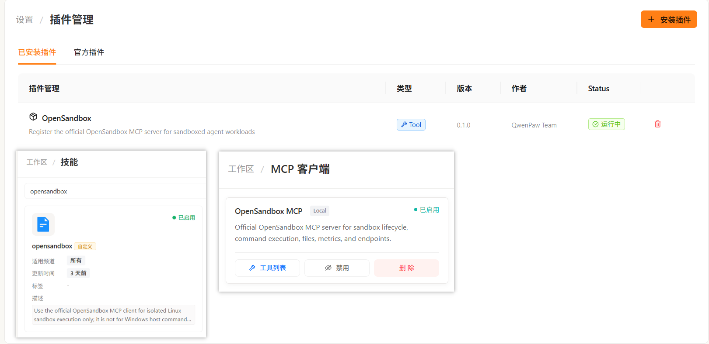
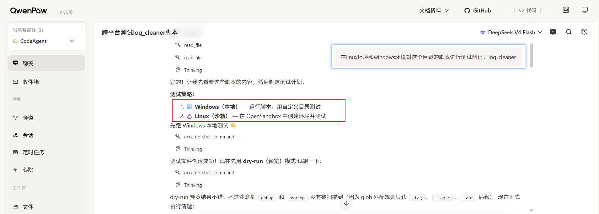

# OpenSandbox 插件

OpenSandbox 插件用于给 QwenPaw Agent 注册官方 `opensandbox-mcp` 服务端，让 Agent 可以把不可信、环境敏感或需要 Linux 隔离环境的研发作业放到远程 sandbox 中执行。

当前插件只用于 Linux sandbox 命令、文件和服务预览，不用于 Windows 宿主命令执行。用户要查看 Windows 版本、运行 PowerShell/CMD、执行 `.bat`/`.ps1`、检查 Windows PATH 或本机进程时，应继续使用 QwenPaw 的本地能力。

## 插件截图
### 插件安装后示例

### 本地命令和远程沙箱混合执行:


## 命令行手动安装插件

在 QwenPaw 仓库根目录执行：

```powershell
qwenpaw plugin install plugins/tool/opensandbox
```

如果本机已经安装过旧版本 OpenSandbox 插件，使用 `--force`
覆盖安装：

```powershell
qwenpaw plugin install plugins/tool/opensandbox --force
```

安装完成后可以用下面的命令确认插件已写入插件目录：

```powershell
qwenpaw plugin list
qwenpaw plugin info opensandbox
```

需要卸载时，使用插件 ID `opensandbox`：

```powershell
qwenpaw plugin uninstall opensandbox
```

卸载命令会提示确认。确认后会移除本地插件文件；如果 QwenPaw 正在运行，
CLI 会尝试通过插件 API 卸载已加载的插件。

当 QwenPaw 正在运行时，CLI 会尝试通过插件 API 热加载；如果没有运行，
插件文件会先复制到本地插件目录，并在下次启动 QwenPaw 时加载。首次加载后，
插件会同步 `opensandbox` skill，并给已有 Agent 注入默认禁用的
`OpenSandbox MCP` client。

## 业务场景

| 场景 | 典型触发 | 沙箱内动作 | 主要收益 | 当前状态 |
| --- | --- | --- | --- | --- |
| 不可信脚本首次运行 | 社区脚本、供应商脚本、Agent 生成脚本、日志清理脚本 | 写入 `/workspace` 后执行最小命令，观察 stdout/stderr/exit code | 避免脚本首次运行直接触碰宿主文件、凭证和网络会话 | 适合 |
| Linux 环境与依赖验证 | `/etc/os-release`、shell 兼容性、`pip install`、构建工具探测 | 创建 Linux sandbox，安装或检查依赖，返回诊断 | 避免污染 Windows 或本地 Python 环境 | 适合 |
| 危险命令预演 | 删除、迁移、批量重命名、压缩解压、日志轮转 | 复制小型样本，在 sandbox 路径执行 | 将破坏面限制在临时文件系统 | 适合 |
| 临时 Web/API 预览 | FastAPI、文档站、Notebook、可视化服务 | 启动服务，使用 `sandbox_get_endpoint` 获取 URL | 不把本机端口、cookie 和内网凭证暴露给未知代码 | 部分适合 |
| 小型夹具测试 | 单文件脚本、小 fixture、配置片段 | 用 `file_write` 复制必要文本，运行测试命令 | 避免整仓、`.env`、`.git` 和依赖缓存进入沙箱 | 适合 |
| 大型项目 build/test | 整仓、`node_modules`、`.venv`、二进制数据 | 需要 host sync / artifact bridge | 需要上传审批、过滤和产物回传 | 待支持 |

默认优先使用 OpenSandbox 的情况：

- 用户明确提到 sandbox、沙箱、隔离执行、危险命令或不可信代码。
- 脚本会删除、迁移、批量重写、清理日志、解压归档或安装依赖。
- 用户要验证 Linux 环境、shell 兼容性、包管理器或构建工具。
- 需要启动临时 Web/API/Notebook/文档服务，且不希望暴露宿主机服务。

默认不使用 OpenSandbox 的情况：

- 任务需要直接访问宿主项目目录、Windows 路径、本地 `.venv`、`.git`、构建缓存或浏览器会话。
- 用户要查看 Windows 本机版本、PATH、进程、PowerShell/CMD 行为或 GUI。
- 输入是整仓、大型二进制、`node_modules`、私钥、`.env` 或大量日志。
- 需要把产物直接保存回宿主文件系统。

## 架构技术设计

### 总体链路

```text
QwenPaw Agent
  -> opensandbox skill
  -> opensandbox MCP client
  -> opensandbox-plugin / opensandbox_mcp_launcher.py
  -> official opensandbox_mcp server in stdio process
  -> opensandbox-server
  -> Docker / Kubernetes / WSL2+k3s runtime
  -> sandbox workload + execd data-plane
```

### 插件职责

插件安装/加载后负责：

- 同步 `opensandbox` skill，默认 disabled。
- 给已有 Agent 注入 `OpenSandbox MCP` client，默认 `enabled=false`。
- 清理旧版本残留的非 MCP 工具：`execute_opensandbox_command`、`check_opensandbox_status`、`inspect_opensandbox_upload`。
- 刷新由插件托管的 MCP client 本地启动字段，包括 `command`、`args[0]` 和 `cwd`。

本版本不再维护自研 `mcp_server.py` 和 `tools/shell.py`。工具能力直接来自官方 OpenSandbox MCP server。

### MCP Client

插件默认注入的 MCP client：

```text
key: opensandbox
name: OpenSandbox MCP
transport: stdio
enabled: false
command: 自动计算为当前 QwenPaw Python 解释器
args: [
  "<plugin_dir>\\opensandbox_mcp_launcher.py",
  "--domain",
  "127.0.0.1:8080",
  "--protocol",
  "http",
  "--use-server-proxy",
  "--audit-enabled",
  "--security-center-url",
  "http://127.0.0.1:8091",
  "--audit-agent-id",
  "<agent-id>",
  "--audit-timeout-seconds",
  "2"
]
cwd: 自动计算为插件安装目录
env:
  OPEN_SANDBOX_API_KEY=
```

`command`、`args[0]`、`cwd` 和 `--audit-agent-id` 由插件根据当前 Python 解释器、插件安装目录和 Agent 配置生成。用户通常只需要修改 `enabled`、`--domain`、`--protocol`、`OPEN_SANDBOX_API_KEY`、`--use-server-proxy`、`--no-use-server-proxy`、`--security-center-url` 或 `--audit-timeout-seconds`。如需关闭审计，可把 `--audit-enabled` 改为 `--audit-disabled`。

### Launcher

`opensandbox_mcp_launcher.py` 启动官方 `opensandbox_mcp.server.create_server()`，并补充插件侧策略：

- 构造 `ConnectionConfig(api_key, domain, protocol, request_timeout, use_server_proxy)`。
- 支持 `OPEN_SANDBOX_USE_SERVER_PROXY`、`--use-server-proxy` 和 `--no-use-server-proxy`。
- 在 `Sandbox.create` 前检查 `sandbox_create.image`。
- 给 `sandbox_create.image` schema 标注唯一可用 enum：`opensandbox/code-interpreter:v1.0.2`。
- 包装 FastMCP tool manager，为每次官方 OpenSandbox MCP 工具调用生成脱敏审计事件。
- 使用 `requests` 把审计事件发送到 Security Center 的 `/security-center/v1/events`。
- 以 stdio 方式运行官方 MCP server。

### Security Center 调用审计

插件启用审计后，每次 OpenSandbox MCP 工具调用结束都会向 8091 上报一条专属 OpenSandbox 事件：

```text
sourceSystem: opensandbox
eventTypeId: opensandbox
schemaVersion: 1.0
```

审计事件包含工具名、操作分类、Agent ID、sandbox ID、执行结果、耗时、参数摘要和参数摘要哈希。`command_run` 可以记录脱敏且限长的命令预览；`file_write` 和 `file_replace_contents` 只记录内容长度与 SHA-256；`sandbox_create.env` 只记录环境变量名；密码、API key、token 和认证信息会替换为 `[REDACTED]`。插件不上传完整 stdout、stderr、文件内容或完整 MCP 返回值。

没有异常的成功调用使用 `DEBUG`，表示可查询的普通调用审计记录，不表示安全风险。工具异常或 `command_run` 非零退出码使用 `HIGH`。

当前实现每次只发送一次 HTTP 请求，不使用本地 outbox、不自动重试，也不处理重复补报。上报通过 `asyncio.to_thread` 调用 `requests.post`，避免阻塞 MCP 事件循环；HTTP 失败只写入 stderr 日志，不会替换官方工具原本的返回值或异常。

### Server Proxy

`use_server_proxy` 决定命令、文件和 endpoint 访问是否通过 `opensandbox-server` 代理到 sandbox 内部 execd。

- `use_server_proxy=false`：客户端直连 sandbox 暴露出来的 execd/endpoint 地址，适合 Docker Desktop 本机直连、端口映射地址可达的场景。
- `use_server_proxy=true`：客户端只访问 `opensandbox-server`，由 server 代理到 sandbox，适合 WSL2 + k3s、Kubernetes、Pod IP/ClusterIP 从 Windows 不可达的场景。

插件默认在 `args` 中使用 `--use-server-proxy`，避免把非敏感连接配置放进会被匿名化显示的 `env`。

### Runtime 配置边界

MCP client 只配置如何连接 `opensandbox-server`。sandbox runtime 的默认镜像配置在 `opensandbox-server` 的 `.sandbox.toml` 中。

Docker runtime：

```toml
[runtime]
type = "docker"
execd_image = "opensandbox/execd:v1.0.16"
```

Kubernetes / WSL2+k3s runtime：

```toml
[runtime]
type = "kubernetes"
execd_image = "opensandbox/execd:v1.0.16"
```

两个镜像语义必须分开：

- `execd_image = "opensandbox/execd:v1.0.16"`：server 注入 sandbox 的 data-plane 镜像，用于 command/file/endpoint 等操作。
- `sandbox_create.image = "opensandbox/code-interpreter:v1.0.2"`：Agent 创建 workload sandbox 时使用的运行环境镜像。

当前插件对 `sandbox_create.image` 做白名单硬拦截，只允许：

```text
opensandbox/code-interpreter:v1.0.2
```

其他镜像会在 MCP launcher 侧直接拒绝：

```text
not support image, pls use "opensandbox/code-interpreter:v1.0.2" instead.
```

### 官方 MCP Tools

- Sandbox 生命周期：`sandbox_create`、`sandbox_connect`、`sandbox_get_info`、`sandbox_list`、`sandbox_renew`、`sandbox_healthcheck`、`sandbox_get_metrics`、`sandbox_get_endpoint`、`sandbox_kill`。
- 命令执行：`command_run`、`command_interrupt`。
- 文件系统：`file_write`、`file_read`、`file_search`、`file_replace_contents`、`file_move`、`file_delete`、`file_create_directories`、`file_delete_directories`。

所有工具都围绕 `sandbox_id` 工作。Agent 应先 `sandbox_create` 或 `sandbox_connect`，再执行命令、读写文件、获取 endpoint 或清理 sandbox。

### Agent 工作流

默认工具链：

```text
sandbox_create
file_create_directories / file_write
command_run
sandbox_get_endpoint 或 file_read
sandbox_kill
```

默认 workload profile：

```text
image: opensandbox/code-interpreter:v1.0.2
entrypoint: ["/opt/opensandbox/code-interpreter.sh"]
env: {"PYTHON_VERSION": "3.11"}
resource: {"cpu": "500m", "memory": "512Mi"}
timeout_seconds: 600
ready_timeout_seconds: 120
```

### 文件和能力边界

- 官方 MCP 文件工具操作 sandbox 内文件系统，不会自动挂载 Windows 宿主路径。
- 小型文本可以经 `file_write` 写入 `/workspace`。
- 宿主目录同步、目录上传、二进制传输和产物回传属于未来 host sync / artifact bridge 能力。
- sandbox 内 `/workspace` 不等同于宿主项目目录。
- E2B/BYOC 是未来 provider 方向，不是当前插件能力。
