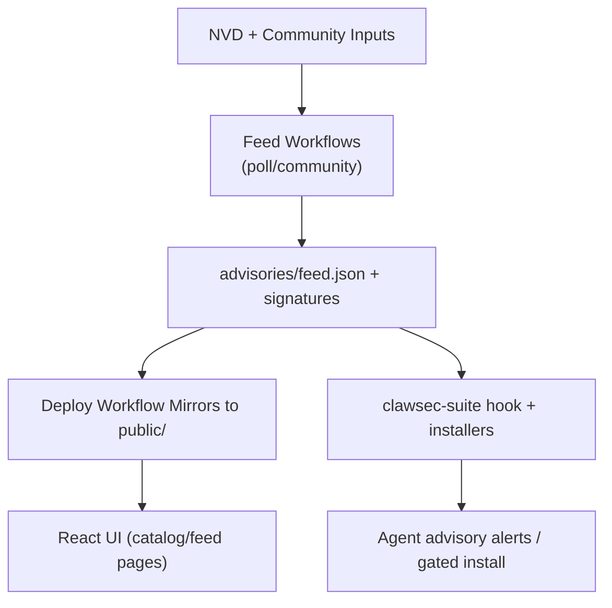

<!-- AUTO-GENERATED TRANSLATION SCAFFOLD (de)
Source: ../architecture.md
Review status: draft
-->

# Architektur

• Systemkontext
- Ja. Diese Seite erscheint unter dem `Start Here` Abschnitt in `INDEX.md`.
- ClawSec sitzt zwischen vorgelagerten Nachrichtenquellen (NVD + Community-Probleme), GitHub Automation und Laufzeit Agent-Umgebungen.
- Ja. Das Repository veröffentlicht sowohl statische Website-Inhalte als auch unterzeichnete Artefakte, die Laufzeitfähigkeiten vor der Verwendung überprüfen.
- Externe Schauspielergruppen:
- GitHub Actions Läufer, die CI-, Release- und Feed-Workflows ausführen.
- OpenClaw/NanoClaw Agenten verbrauchen Fähigkeiten, Berater und Verifikationsskripte.
- Repository-Betreuer, die beratende Fragen und die Verschmelzung von Release/Tag-Änderungen anerkennen.

Komponenten
| Komponente | Standort | Verantwortung |
--- | --- | ---
| Web UI | `App.tsx`, `pages/`, `components/` | Renders-Katalog und Beratungs-Detail-Erfahrungen. |
| Advisory Feed Core | `advisories/feed.json*`, `skills/clawsec-suite/.../feed.mjs` | Stores, überprüft und parses Advisories mit abgelösten Signaturen/Checksums. |
| Skill Packages | `skills/*/` | Verteilt installierbare Sicherheitsfunktionen mit SBOM-Metadaten. |
| Local Automation Scripts | `scripts/*.sh` | Lokale Spiegel, Pre-Push-Checks und manuelle Release-Helfer erstellen. |
| CI/CD Workflows | `.github/workflows/*.yml` | Linting, Tests, NVD-Verschmutzung, Release-Verpackung und Pages bereitstellen. |
| Python Utility Layer | `utils/*.py` | Skill Metadatenvalidierung und Prüfsummengenerierung. |

oder Schlüsselflüsse
- Skill Katalogfluss:
1. Release/tag Workflows veröffentlichen Fähigkeiten Assets.
2. Deploy Workflow entdeckt Freigabevermögen und baut `public/skills/index.json`.
3. UI fetches `public/skills/index.json` und Skill-Docs für `/skills` Seiten.
- Beratender Förderstrom:
1. `poll-nvd-cves.yml` und `community-advisory.yml` update `advisories/feed.json`.
2. Fütterung wird unterschrieben und auf öffentliche Wege gespiegelt.
3. Runtime Haken / Schriften laden Remote Feed und Rückfall auf lokale signierte Kopien.
- Bewachter Installationsfluss:
1. Installer fordert Zielfähigkeit + Version.
2. Beitragsüberprüfungen betroffener Spektifizierer und Schwere-/Risikohinweise.
3. Exit-Code 42 erzwingt die zweite Bestätigung, wenn Berater übereinstimmen.

(Diagramme)



Schnittstellen und Verträge
| Schnittstelle | Vertragsformular | Validierung |
--- | --- | ---
| Skill metadata | `skills/*/skill.json` | Gültig durch Python Dienstprogramm + CI-Versionsparitätsprüfungen. |
| Beratender Feed | JSON + Ed25519 abgelöste Signatur | Verifiziert durch `feed.mjs` und NanoClaw Signaturenprogramme. |
| Checksums manifest | `checksums.json` (+ optional `.sig`) | Parsed and hash-matched before trusting payloads. |
| Hook event interface | `HookEvent` (`type`, `action`, `messages`) | Runtime-Handler verarbeitet nur ausgewählte Ereignisnamen. |
| Workflow Release Benennung | Tag-Muster `<skill>-vX.Y.Z` | Parsed in Release/Deploy Workflows, um Fähigkeiten zu entdecken. |

oder Schlüsselparameter
| Parameter | Default | Effekt |
--- | --- | ---
| `CLAWSEC_FEED_URL` | `https://clawsec.prompt.security/advisories/feed.json` | Remote Advisory source for suite scripts/hooks. |
| `CLAWSEC_ALLOW_UNSIGNED_FEED` | `0` | Ermöglicht temporäre unsignierte Fallback-Kompatibilität. |
| `CLAWSEC_VERIFY_CHECKSUM_MANIFEST` | `1` | Erfordert die Überprüfung der Prüfsumme, wo verfügbar. |
| `CLAWSEC_HOOK_INTERVAL_SECONDS` | `300` | Das Drosselfenster für den Beratenden Haken scannen. |
| `CLAWSEC_SKILLS_INDEX_TIMEOUT_MS` | `5000` | Remote Skill Index fetch timeout for Catalog Discovery. |
| `PROMPTSEC_GIT_PULL` | `0` | Optionales Autopull, bevor das Watchdog Audit läuft. |

Fehlerbehandlung und Zuverlässigkeit
- Fütterung wird für ungültige Unterschriften und fehlerhafte Manifeste nicht geschlossen.
- Remote-Fetch-Ausfälle fallen anmutig zurück zu lokalen signierten Feeds.
- Hook state verwendet Atomdatei schreibt mit strengem Modus, wo unterstützt.
- UI-Seiten erkennen HTML-Rückschläge als JSON und vermeiden, beschädigte Daten zu machen.
- Workflow-Schritte durchsetzen Key-Fingerprint-Konsistenz, um Split-key Drift zu vermeiden.

Beispiel Snippets
```tsx
// Route topology in the web app
<Routes>
  <Route path="/" element={<Home />} />
  <Route path="/skills" element={<SkillsCatalog />} />
  <Route path="/skills/:skillId" element={<SkillDetail />} />
  <Route path="/feed" element={<FeedSetup />} />
  <Route path="/feed/:advisoryId" element={<AdvisoryDetail />} />
  <Route path="/wiki/*" element={<WikiBrowser />} />
</Routes>
```

```ts
// Guarded feed loading contract in advisory hook
const remoteFeed = await loadRemoteFeed(feedUrl, {
  signatureUrl: feedSignatureUrl,
  checksumsUrl: feedChecksumsUrl,
  checksumsSignatureUrl: feedChecksumsSignatureUrl,
  publicKeyPem,
  checksumsPublicKeyPem: publicKeyPem,
  allowUnsigned,
  verifyChecksumManifest,
});
```

Laufzeit und Bereitstellung
| Laufzeit Oberfläche | Ausführungsmodell | Ausgabe |
--- | --- | ---
| Vite App (`npm run dev`) | Lokaler Frontendserver | Interaktive Web-App für Feed/Skills. |
| GitHub CI | Multi-OS-Matrix + dedizierte Jobs | Lint/Typ/Bau/Sicherheit und Testvertrauen. |
| Skill release workflow | Tag-getriebene veröffentlichen + PR-Trocken-run-Checks | Freigabevermögen, unterzeichnete Prüfsummen, optional ClawHub veröffentlichen. |
| Seiten bereitstellen Workflow | Ausgelöst von CI/Release Erfolg | Statische Website + gespiegelte Berater/Releases. |
| Runtime Haken | OpenClaw Event Haken / NanoClaw IPC | Beratende Alarme, Gating Entscheidungen, Integritätskontrollen. |

Skalierungshinweise
- Beratende Volumenwaagen mit Schlüsselwort in NVD-Abfrage; Dedupe und Nachfilterung Steuergeräusche.
- Bereitstellung von Workflow-Prozessen Release-Listen und hält neueste Qualifikationsversionen in Indexausgabe.
- Modulgrenzen nach Fachordner ermöglichen es, neue Sicherheitsfunktionen hinzuzufügen, ohne Frontendstruktur zu ändern.
- Unterschriftsverifikationspfade bleiben leicht, da die Nutzlastgrößen (Feed/Manifests) klein sind.

Quellenangaben
- App.tsx
- Seiten/SkillsCatalog.tsx
- Seiten/FeedSetup.tsx
- Seiten/AdvisoryDetail.tsx
- Seiten/WikiBrowser.tsx
- Fertigkeiten/Clawsec-suite/hooks/clawsec-advisory-guardian/handler.ts
- Fertigkeiten/Clawsec-suite/hooks/clawsec-advisory-guardian/lib/feed.mjs
- Fertigkeiten/Clawsec-suite/scripts/guarded_skill_install.mjs
- Fertigkeiten/Clawsec-suite/scripts/discover_skill_catalog.mjs
- Fertigkeiten/Clawsec-nanoclaw/lib/advisories.ts
- Fertigkeiten/Clawsec-nanoclaw/lib/signatures.ts
- .github/workflows/poll-nvd-cves.yml
- .github/workflows/community-advisory.yml
- .github/workflows/deploy-pages.yml
- .github/workflows/skill-release.yml
