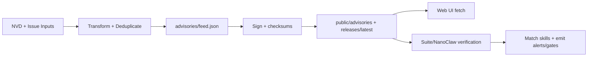

<!-- AUTO-GENERATED TRANSLATION SCAFFOLD (de)
Source: ../data-flow.md
Review status: draft
-->

# Datenfluss

Primäre Ströme
- `Advisory ingestion`: NVD/Gemeinde-Eingänge werden in einen normalisierten Beratungsfeed umgewandelt, signiert, dann für Kunden gespiegelt.
- `Skill catalog publication`: Freigabevermögen werden entdeckt und in `public/skills/index.json` plus per-skill docs/checksums umgewandelt.
- `Runtime enforcement`: Suite- und Nanoclaw-Verbraucher laden beratende Daten, passen gegen Fähigkeiten und senden Alarme oder Bestätigungs-Gate aus.
- Ja. Diese Seite erscheint unter dem `Guides` Abschnitt in `INDEX.md`.

Schritt für Schritt
ANHANG Feed-Produzent Workflow/script holt Quelldaten (`NVD API` oder Ausgabe Payload) ab.
2. JSON-Transformationslogik normalisiert Schwere/Typ/beeinflusste Felder und dedupliziert durch Beratungs-ID.
3. Signatur/Checksum-Schritte erzeugen abgelöste Signaturen und Prüfsummen manifestiert.
4. Bereitstellung von Workflow-Spiegeln signiert Artefakte unter `public/` und `public/releases/latest/download/`.
5. UI-Verbraucher validieren JSON Shape/Content; Laufzeit-Verbraucher überprüfen zusätzlich Signaturen/Checksums vor vertrauensvollen Feed-Daten.
6. Die Matcher vergleichen `affected`-Spezifikatoren mit Geschicksnamen/Versionen und senden Alarme aus oder setzen die Bestätigung durch.

Eingänge und Ausgänge
Inputs/Outputs sind in der folgenden Tabelle zusammengefasst.

| Typ | Name | Standort | Beschreibung |
| --- | --- | ---
| Input | CVE Payloads | `services.nvd.nist.gov/rest/json/cves/2.0` | Source Schwachstellen gefiltert durch ClawSec Keywords. |
| Input | Community Advisory Issue | `.github/workflows/community-advisory.yml` Event Payload | Maintainer-genehmigte Ausgabe verwandelt in Advisory Record. |
| Input | Skill release Assets | GitHub veröffentlicht API + Assets | Wird verwendet, um Webkatalog und Spiegel-Downloads zu erstellen. |
| Input | Local config/env | `OPENCLAW_AUDIT_CONFIG`, `CLAWSEC_*` vars | Controls Feed-Tracking, Unterdrückung und Verifikationsverhalten. |
| Ausgabe | Beratender Feed | `advisories/feed.json` | Canonical Repository Feed. |
| Ausgabe | Beratende Signatur | `advisories/feed.json.sig` | Entschlossene Signatur für Feed-Authentizität. |
| Ausgabe | Skill Katalogindex | `public/skills/index.json` | Runtime Webkatalog verwendet von `/skills` Seiten. |
| Ausgabe | Release Schecksums/signatures | `release-assets/checksums.json(.sig)` | Integrity manifest for release Konsumenten. |
| Ausgabe | Hook state | `~/.openclaw/clawsec-suite-feed-state.json` | Verfolgen Sie Scan-Terminal und angezeigte Spiele. |

oder Datenstrukturen
| Struktur | Schlüsselfelder | Zweck |
--- | --- | ---
| Beratender Feed-Record | `id`, `severity`, `type`, `affected[]`, `published`_ | Einheit der von UI und Installern verwendeten Risikodaten. |
| Skill Metadatensatz | `id`, `name`, `version`, `emoji`, `tag` | Katalogzeile für Web-Browsing und Installationsbefehle. |
| Checksums manifest | `schema_version`, `algorithm`, `files` | Kartendateinamen, die erwartete Verdauungen aufweisen. |
| Beratender Zustand | `known_advisories`, `last_hook_scan`, `notified_matches` | Verhindert wiederholte Warnungen und Drosseln Scans. |
| Suppression config | `enabledFor[]`, `suppressions[]` | Gezielte Liste der Skipisten von `checkId` + `skill`.

(Diagramme)


Zustand und Lagerung
| Pfad/Scope | Pfad schreiben |
--- | --- | ---
| Canonical Advisories | `advisories/` | NVD + Community Workflows und lokales Populärskript. |
| Embedded-Beratungskopien | `skills/clawsec-feed/advisories/` und `skills/clawsec-suite/advisories/` | Sync/Packaging-Prozesse und Release-Workflow. |
| Öffentliche Spiegel | `public/advisories/`, `public/releases/` | Workflow bereitstellen. |
| Laufzeit Zustand | `~/.openclaw/clawsec-suite-feed-state.json` | Beratender Haken Zustand Beharrlichkeit. |
| NanoClaw cache | `/workspace/project/data/clawsec-advisory-cache.json` | Host-side Advisory cache manager. |
| Integritätszustand | `/workspace/project/data/soul-guardian/` (NanoClaw) | Integritätsmonitor Basis-/Auditspeicher. |

Beispiel Snippets
```bash
# Local feed flow (NVD fetch -> transform -> sync)
./scripts/populate-local-feed.sh --days 120
jq '.updated, (.advisories | length)' advisories/feed.json
```

```bash
# Runtime guarded install uses signed feed paths
CLAWSEC_LOCAL_FEED=~/.openclaw/skills/clawsec-suite/advisories/feed.json \
CLAWSEC_FEED_PUBLIC_KEY=~/.openclaw/skills/clawsec-suite/advisories/feed-signing-public.pem \
node skills/clawsec-suite/scripts/guarded_skill_install.mjs --skill test-skill --dry-run
```

Nicht verfügbar
- NVD-Ratenlimits (`403/429`) können die Feed-Erfrischung verzögern und Retries/Backoff benötigen.
- Fehlende oder ungültige abgelöste Signaturen verursachen die Ablehnung von Futtermitteln im fehlgeschlagenen Modus.
- HTML Fallback-Antworten für JSON Endpunkte können falsche Positive erzeugen, es sei denn, explizit gefiltert.
- Die Path-token-Fehlerkonfiguration (`\$HOME`) kann die lokale Fallbackpfadauflösung brechen.
- Unübertroffene öffentliche Schlüssel Fingerabdrücke in Workflows lösen harte CI-Versagen aus.

Quellenangaben
- Berater/feed.json
- Berater/feed.json.sig
- Skripte/Popula-lokal-feed.sh
- Skripte/Popula-lokal-skills.sh
- .github/workflows/poll-nvd-cves.yml
- .github/workflows/community-advisory.yml
- .github/workflows/deploy-pages.yml
- .github/workflows/skill-release.yml
- Fertigkeiten/Clawsec-suite/hooks/clawsec-advisory-guardian/lib/feed.mjs
- Fertigkeiten/Clawsec-suite/hooks/clawsec-advisory-guardian/lib/state.ts
- Fähigkeiten/Clawsec-suite/hooks/clawsec-advisory-guardian/lib/matching.ts
- Fertigkeiten/Clawsec-suite/scripts/guarded_skill_install.mjs
- Fertigkeiten/Clawsec-nanoclaw/lib/advisories.ts
- Fähigkeiten/Clawsec-nanoclaw/host-services/advisory-cache.ts
