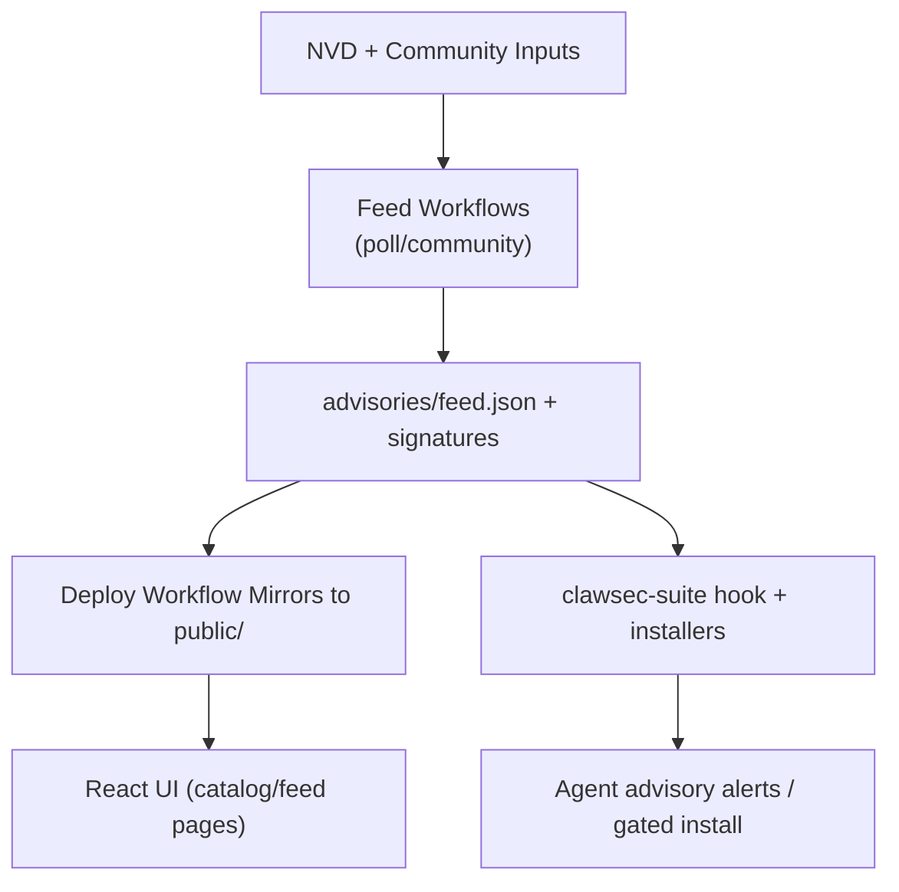

<!-- AUTO-GENERATED TRANSLATION SCAFFOLD (es)
Source: ../architecture.md
Review status: draft
-->

# Architecture

## System Context
- Esta página aparece en la sección `Start Here` en `INDEX.md`.
- ClawSec se encuentra entre fuentes de inteligencia aguas arriba (NVD + problemas comunitarios), automatización GitHub y entornos de agente de tiempo de ejecución.
- El repositorio publica tanto el contenido del sitio estático como los artefactos firmados que las habilidades de ejecución verifican antes de usar.
- Grupos de actores externos:
- GitHub Acciones corredores ejecutando CI, liberando y alimentando flujos de trabajo.
- Agentes OpenClaw/NanoClaw que consumen habilidades, asesorías y scripts de verificación.
- Mantenedores de depósitos que aprueban cuestiones de asesoramiento y fusionan cambios de liberación/tag.

## Componentes
Silencio Componente Silencio Ubicación Silencioso
Silencio.
TEN Web UI TENIDO `App.tsx`, `pages/`, `components/` ANTE Renders skills catalog and advisory detail experiences. Silencio
Silencioso asesor Feed Core Silencio `advisories/feed.json*`, `skills/clawsec-suite/.../feed.mjs` TENIDO Tiendas, verifica y analiza asesorías con firmas/consultos desprendidos. Silencio
← Paquetes de Habilidad Silencio `skills/*/` ← Distribuye capacidades de seguridad instalables con metadatos SBOM. Silencio
Scripts de Automatización Local ← `scripts/*.sh` ← Construir espejos locales, cheques pre-push y ayudantes manuales de liberación. Silencio
TEN CI/CD Workflows ANTE `.github/workflows/*.yml` ANTE Linting, tests, encuestas NVD, embalaje de lanzamiento y páginas implementadas. Silencio
TEN Python Utility Layer ANTE `utils/*.py` ← validación de metadatos de habilidad y generación de checksum. Silencio

## Flujos clave
- Flujo de catálogo de habilidad:
1. Los flujos de trabajo de lanzamiento/tag publican activos de habilidad.
2. Deploy workflow discovers release assets and builds `public/skills/index.json`.
3. UI fetches `public/skills/index.json` y docs de habilidad para las páginas `/skills`.
- Flujo de alimentación:
1. `poll-nvd-cves.yml` y `community-advisory.yml` actualizan `advisories/feed.json`.
2. La alimentación está firmada y reflejada en caminos públicos.
3. Ganchos/scriptos de tiempo de ejecución cargan alimentación remota y retroceso a copias firmadas locales.
- Flujo de instalación vigilado:
1. Installer solicita habilidad objetivo + versión.
2. Consultas del matcher afectan a los especificadores e indicaciones de gravedad/riesgo.
3. Código de salida 42 hace cumplir la segunda confirmación cuando las advertencias coinciden.

## Diagramas



## Interfaces and Contracts
Silencioso Interfaz Silencioso Formulario de Contrato
Silencio.
← Metadatos de Habilidad Silencio `skills/*/skill.json` Silencio Validado por utilidad Python + cheques de paridad de la versión CI. Silencio
← Alimentación de asesoramiento Silencio JSON + Ed25519 firma despreocupada Silencio Verificada por `feed.mjs` y NanoClaw utilidades de firma. Silencio
Silenciosos Checksums manifiesto ← `checksums.json` (+ opcional `.sig`) Silencio Parsed and hash-matched antes de confiar en las cargas de pago. Silencio
Silencio Interfaz de evento de gancho ¦ `HookEvent` (`type`, `action`, `messages`) Silencio El controlador Runtime solo procesa nombres de eventos seleccionados. Silencio
etiqueta: patrón `<skill>-vX.Y.Z` Silencio Parsed in release/deploy workflows to discover skills. Silencio

## Parámetros clave
Silencio parametro Silencioso prefecto Silencioso
Silencio.
Silencio `CLAWSEC_FEED_URL` Silencio `https://clawsec.prompt.security/advisories/feed.json` Silencio Fuente de asesoramiento remota para scripts/hooks de suite. Silencio
Silencio `CLAWSEC_ALLOW_UNSIGNED_FEED` Silencio `0` Silencio Permite una compatibilidad temporal sin firmar. Silencio
Silencio `CLAWSEC_VERIFY_CHECKSUM_MANIFEST` Silencio `1` Silencio Requiere verificación de manifiesto de checksum cuando esté disponible. Silencio
Silencio `CLAWSEC_HOOK_INTERVAL_SECONDS` Silencio `300` Silencioso ventana de escaneo para gancho asesor. Silencio
Silencio `CLAWSEC_SKILLS_INDEX_TIMEOUT_MS` Silencio `5000` Silencio Índice de habilidad remota buscar tiempo libre para el descubrimiento del catálogo. Silencio
Silencio `PROMPTSEC_GIT_PULL` Silencio `0` ← Auto-pull opcional antes de ejecutar la auditoría de relojes. Silencio

## Manejo de errores y fiabilidad
- Feed fetching está bloqueado para firmas inválidas y manifiestos malformados.
- Las fallas remotas de la embrague caen con gracia a los alimentos firmados localmente.
- El estado de gancho utiliza el archivo atómico escribe con el modo estricto donde se apoya.
- Las páginas UI detectan retrocesos HTML servidos como JSON y evitan renderizar datos corruptos.
- Los pasos de flujo de trabajo refuerzan la consistencia de la marca clave para evitar la deriva de la llave dividida.

## Ejemplos Snippets
```tsx
// Route topology in the web app
<Routes>
  <Route path="/" element={<Home />} />
  <Route path="/skills" element={<SkillsCatalog />} />
  <Route path="/skills/:skillId" element={<SkillDetail />} />
  <Route path="/feed" element={<FeedSetup />} />
  <Route path="/feed/:advisoryId" element={<AdvisoryDetail />} />
  <Route path="/wiki/*" element={<WikiBrowser />} />
</Routes>
```

```ts
// Guarded feed loading contract in advisory hook
const remoteFeed = await loadRemoteFeed(feedUrl, {
  signatureUrl: feedSignatureUrl,
  checksumsUrl: feedChecksumsUrl,
  checksumsSignatureUrl: feedChecksumsSignatureUrl,
  publicKeyPem,
  checksumsPublicKeyPem: publicKeyPem,
  allowUnsigned,
  verifyChecksumManifest,
});
```

## Runtime and Deployment
← Runtime Surface Silencioso Modelo de Ejecución
Silencio.
← Aplicación Vite (`npm run dev`) Silencio Servidor de frontend local Silencio Aplicación interactiva web para feed/skills. Silencio
Silencio GitHub CI tención Matriz multi-OS + trabajos dedicados ← Lint/type/build/security and test confidence. Silencio
Silencio Flujo de trabajo de liberación de la piel ← Publicación de la etiqueta + cheques de funcionamiento seco de PR tención Activo de lanzamiento, cheques firmados, publicación opcional ClawHub. Silencio
Silencio Páginas desplegando flujo de trabajo Silencio Triggered by CI/Release success tención Static site + retrovisored advisories/releases. Silencio
← Ganchos de Runtime ← Ganchos de eventos OpenClaw / NanoClaw IPC Silencio Alertas de asesoramiento, decisiones de juego, controles de integridad. Silencio

## Scaling Notes
- Escalas de volumen de asesoramiento con palabras clave establecidas en encuestas NVD; ruido de control de dedupe y post-filtering.
- Implementar listas de lanzamiento de procesos de flujo de trabajo y mantiene nuevas versiones de habilidad en la salida de índice.
- Los límites del módulo por carpeta de habilidad permiten añadir nuevas capacidades de seguridad sin cambiar la estructura de frontend.
- Los caminos de verificación de firmas siguen siendo ligeros porque los tamaños de la carga útil (feed/manifests) son pequeños.

## Referencias Fuente
- App.tsx
- páginas/SkillsCatalog.tsx
- páginas/FeedSetup.tsx
- páginas/AdvisoryDetail.tsx
- páginas/WikiBrowser.tsx
- habilidades/clawsec-suite/hooks/clawsec-advisory-guardian/handler.ts
- habilidades/clawsec-suite/hooks/clawsec-advisory-guardian/lib/feed.mjs
- habilidades/clawsec-suite/scripts/guarded_skill_install.mjs
- habilidades/clawsec-suite/scripts/discover_skill_catalog.mjs
- habilidades/clawsec-nanoclaw/lib/advisories.ts
- habilidades/clawsec-nanoclaw/lib/signatures.ts
- .github/workflows/poll-nvd-cves.yml
- .github/workflows/community-advisory.yml
- .github/workflows/deploy-pages.yml
- .github/workflows/skill-release.yml
