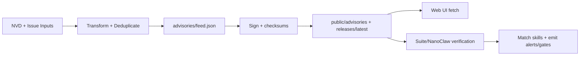

<!-- AUTO-GENERATED TRANSLATION SCAFFOLD (es)
Source: ../data-flow.md
Review status: draft
-->

# Flujo de datos

## Primary Flows
- `Advisory ingestion`: Las entradas de NVD/community se transforman en una alimentación de asesoramiento normalizada, firmada, luego reflejada para clientes.
- `Skill catalog publication`: activos de liberación son descubiertos y convertidos en `public/skills/index.json` más docs/checksums per-skill.
- `Runtime enforcement`: Los consumidores de suite y nanoclaw cargan datos de asesoramiento, coinciden con las habilidades y emiten alertas o puertas de confirmación.
- Esta página aparece en la sección `Guides` en `INDEX.md`.

Paso a paso
1. Datos fuente de flujo de trabajo/script fetches (`NVD API` o payload de emisión).
2. JSON transforma lógica normaliza la severidad/tipo/ campos afectados y deduplica por ID de asesoramiento.
3. Signature/checksum steps generate detached signatures and checksum manifests.
4. Deploy workflow mirrors signed artifacts under `public/` and `public/releases/latest/download/`.
5. Los consumidores de UI validan la forma/contenido de JSON; los consumidores de tiempo de ejecución verifican adicionalmente firmas/consultos antes de confiar en datos de alimentación.
6. Los Matchers comparan los especificadores `affected` con nombres de habilidad/versiones y emiten alertas o imponen confirmación.

## Inputs and Outputs
En el cuadro que figura a continuación se resumen los insumos y los productos.

Silencio Tipo TENIDO Nombre TENIDO Ubicación Silencio Descripción
Silencio --- Silencio ---
← Input Silencio CVE payloads TEN `services.nvd.nist.gov/rest/json/cves/2.0` TEN Fuente vulnerabilidades filtradas por ClawSec keywords. Silencio
Silencio Input Silencio Community advisory issue Silencio `.github/workflows/community-advisory.yml` event payload Silencio Tema aprobado por Maintainer transformado en registro consultivo. Silencio
← Input ← activos de liberación de Habilidad Silencio GitHub Releases API + activos TEN Utilizado para construir catálogo web y descargas de espejo. Silencio
← Input Silencio Local config/env Silencio `OPENCLAW_AUDIT_CONFIG`, `CLAWSEC_*` vars Silencio Controls alimentan caminos, supresión y comportamiento de verificación. Silencio
TENCIÓN TENIDO ANTERIENDA ALIMENTAR TENIDO `advisories/feed.json` TENIDO Alimento de repositorio canónico. Silencio
TENCIÓN ANTERIENTE Firma asesora ANTERI `advisories/feed.json.sig` TENIDO Firma adjunta para la autenticidad del alimento. Silencio
Índice de catálogo de Habilidad Silencioso `public/skills/index.json` Silencioso Catálogo web usado por páginas de `/skills`. Silencio
TENCIÓN ANTERIOR ANTERIENDIENTE Compruebas/signaturas ANTE `release-assets/checksums.json(.sig)` ANTE Integrity manifest for release consumers. Silencio
TENCIÓN ANTERIENTE Hook state ANTE `~/.openclaw/clawsec-suite-feed-state.json` TENIDO Pistas de escaneo y coincidencias notificadas. Silencio

## Estructuras de datos
tención Estructura TENIDO Key Fields
Silencio.
tención Registro de alimentación de mantenimiento de `id`, `severity`, `type`, `affected[]`, `published` TENIDO Unidad de datos de riesgo usados por UI e instaladores. Silencio
← Metadatos de Habilidad Silencio `id`, `name`, `version`, `emoji`, `tag` Silencioso Catálogo fila para navegar por la web e instalar comandos. Silencio
tención Checksums manifiesto Silencioso `schema_version`, `algorithm`, `files` Silencio Mapas nombres de archivos a los digestos esperados. Silencio
tención Estado asesor Silencioso `known_advisories`, `last_hook_scan`, `notified_matches` Silencio Impide las alertas repetidas y los escaneos de aceleradores. Silencio
confidencialidad de la supresión permanente `enabledFor[]`, `suppressions[]` TENIDO Lista de saltos apuntado por `checkId` + `skill`. Silencio

## Diagramas


## State and Storage
← Tienda Silenciosos Sendero/Escopo Silencioso
Silencio.
← Asesorías canónicas Silencio `advisories/` TENIDO NVD + flujos de trabajo comunitarios y script populate local. Silencio
Silencio Copias de asesoramiento incrustadas Silencio `skills/clawsec-feed/advisories/` y `skills/clawsec-suite/advisories/` Silencio Procesos de sincronización/envasado y flujo de trabajo de liberación. Silencio
tención Espejos públicos Silenciosos `public/advisories/`, `public/releases/` ANTE Deploy workflow. Silencio
tención Runtime state ← `~/.openclaw/clawsec-suite-feed-state.json` tención Asesoramiento estado persistencia. Silencio
Silencio NanoClaw cache Silencio `/workspace/project/data/clawsec-advisory-cache.json` Silencio Director de caché de asesoramiento lado anfitrión. Silencio
Silencio Integrity state ← `/workspace/project/data/soul-guardian/` (NanoClaw) TEN Integrity monitor baseline/audit storage. Silencio

## Ejemplos Snippets
```bash
# Local feed flow (NVD fetch -> transform -> sync)
./scripts/populate-local-feed.sh --days 120
jq '.updated, (.advisories | length)' advisories/feed.json
```

```bash
# Runtime guarded install uses signed feed paths
CLAWSEC_LOCAL_FEED=~/.openclaw/skills/clawsec-suite/advisories/feed.json \
CLAWSEC_FEED_PUBLIC_KEY=~/.openclaw/skills/clawsec-suite/advisories/feed-signing-public.pem \
node skills/clawsec-suite/scripts/guarded_skill_install.mjs --skill test-skill --dry-run
```

## Failure Modes
- Los límites de la tasa NVD (`403/429`) pueden retrasar el refresco de alimentación y requerir retries/backoff.
- Las firmas desvinculadas o inválidas causan rechazo de la alimentación en modo cerrado.
- Las respuestas de retroceso HTML para los puntos finales de JSON pueden producir falsos positivos a menos que se filtra explícitamente.
- La malconfiguración token (`\$HOME`) puede romper la resolución de la ruta de retroceso local.
- Las huellas dactilares de clave pública en los flujos de trabajo provocan un duro fallo de la CI.

## Referencias Fuente
- asesorías/feed.json
- asesorías/feed.json.sig
- scripts/populate-local-feed.sh
- scripts/populate-local-skills.sh
- .github/workflows/poll-nvd-cves.yml
- .github/workflows/community-advisory.yml
- .github/workflows/deploy-pages.yml
- .github/workflows/skill-release.yml
- habilidades/clawsec-suite/hooks/clawsec-advisory-guardian/lib/feed.mjs
- habilidades/clawsec-suite/hooks/clawsec-advisory-guardian/lib/state.ts
- habilidades/clawsec-suite/hooks/clawsec-advisory-guardian/lib/matching.ts
- habilidades/clawsec-suite/scripts/guarded_skill_install.mjs
- habilidades/clawsec-nanoclaw/lib/advisories.ts
- habilidades/clawsec-nanoclaw/host-services/advisory-cache.ts
