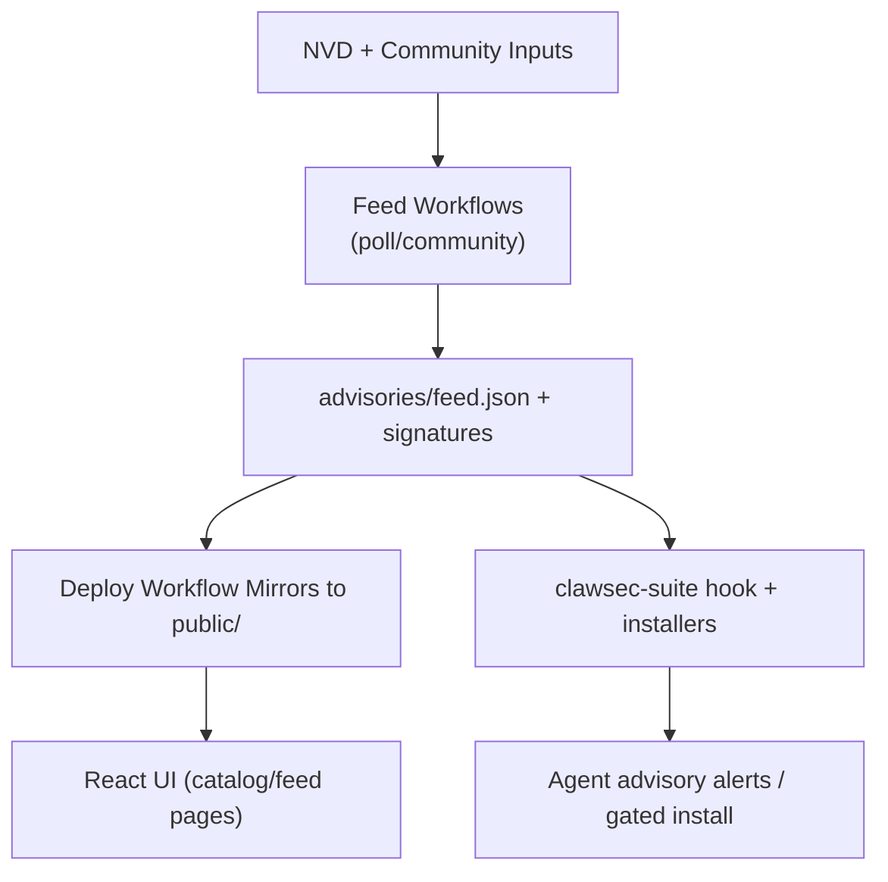

<!-- AUTO-GENERATED TRANSLATION SCAFFOLD (fr)
Source: ../architecture.md
Review status: draft
-->

Architecture

## Contexte du système
- Oui. Cette page apparaît dans la section `Start Here` dans `INDEX.md`.
- ClawSec se situe entre les sources d'intelligence amont (NVD + problèmes communautaires), l'automatisation GitHub, et les environnements d'agents d'exécution.
- Oui. Le dépôt publie à la fois le contenu statique du site et les artefacts signés que les compétences d'exécution vérifient avant d'utiliser.
- Groupes d'acteurs extérieurs :
- Les coureurs GitHub Actions exécutent des flux de travail de CI, release et feed.
- Les agents OpenClaw/NanoClaw consomment des compétences, des avis et des scripts de vérification.
- Les responsables du dépôt approuvent les questions d'avis et fusionnent les modifications de diffusion/d'étiquette.

Composantes
Composante Lieu Responsabilité
- Oui.
USI Web de `App.tsx`, `pages/`, `components/`. - Oui.
Voir la fiche d'information. - Oui.
Des packs de compétences `skills/*/`?Distribue des capacités de sécurité installables avec des métadonnées SBOM. - Oui.
Scripts d'automatisation locale `scripts/*.sh`=Construisez des miroirs locaux, des vérifications pré-poussières et des aides à la libération manuelle. - Oui.
IC/CD Workflows (en anglais seulement) `.github/workflows/*.yml` (en anglais seulement) Doublure, tests, sondage NVD, emballage de libération et déploiement des pages. - Oui.
Python Utility Layer (Python Utility Layer) `utils/*.py` (Python Utility Layer) Validation des métadonnées des compétences et génération de bilans. - Oui.

Oui. Flux clés
- Flux de catalogue des compétences :
1. Les workflows de publication/d'étiquetage publient les compétences.
2. Déployer workflow découvre les actifs de libération et construit `public/skills/index.json`.
3. L'interface utilisateur récupère `public/skills/index.json` et les documents de compétences pour les pages `/skills`.
- Débit d'alimentation consultatif :
1. Mise à jour `poll-nvd-cves.yml` et `community-advisory.yml` `advisories/feed.json`.
2. Les aliments pour animaux sont signés et reproduits sur les voies publiques.
3. Les hameçons/scripts d'exécution chargent le flux à distance et le retour aux copies signées locales.
- Débit d'installation surveillé:
1. Installer demande compétence cible + version.
2. Les contrôles de l'appariement consultatif ont affecté les spécifications et les indices de gravité/risque.
3. Le code de sortie 42 impose une seconde confirmation lorsque les avis correspondent.

Schémas



## Interfaces et contrats
Formulaire de contrat de validation
- Oui.
Validé par l'utilitaire Python + vérification de la parité des versions CI. - Oui.
JSON + Ed25519 signature détachée. - Oui.
Voir le manifeste des contrôles. - Oui.
- Oui. Interface d'événement hook : `HookEvent` (`type`, `action`, `messages`) ► Le gestionnaire d'événements ne traite que les noms d'événement sélectionnés. - Oui.
Motif d'étiquettes `<skill>-vX.Y.Z`.Parsed in release/deploy workflows to discover competences. - Oui.

Oui. Paramètres clés
Paramètre par défaut Effet
- Oui.
`CLAWSEC_FEED_URL`= `https://clawsec.prompt.security/advisories/feed.json`= Source d'avis à distance pour les scripts/hooks de suite. - Oui.
`CLAWSEC_ALLOW_UNSIGNED_FEED`=2 `0`=2 Permet une compatibilité temporaire non signée. - Oui.
`CLAWSEC_VERIFY_CHECKSUM_MANIFEST`.`1`.U. Nécessite une vérification de manifeste de somme de contrôle lorsque disponible. - Oui.
`CLAWSEC_HOOK_INTERVAL_SECONDS`.`300`.Scanner la fenêtre de griffage pour le crochet de conseil. - Oui.
`CLAWSEC_SKILLS_INDEX_TIMEOUT_MS`.`5000`= Indice de compétence à distance récupérer le temps de sortie pour la découverte du catalogue. - Oui.
`PROMPTSEC_GIT_PULL`.`0` en option avant les audits de chien de garde. - Oui.

## Gestion des erreurs et fiabilité
- La récupération du flux est fermée par défaut pour les signatures invalides et les manifestes malformés.
- Remote récupérer les échecs gracieusement revenir aux flux signés locaux.
- Hook state utilise le fichier atomique écrit en mode strict où supporté.
- Les pages d'interface utilisateur détectent les replis HTML utilisés comme JSON et évitent de rendre les données corrompues.
- Les étapes de flux de travail font en sorte que l'empreinte des clés soit cohérente pour éviter la dérive des clés fractionnées.

## Exemples d'extraits
```tsx
// Route topology in the web app
<Routes>
  <Route path="/" element={<Home />} />
  <Route path="/skills" element={<SkillsCatalog />} />
  <Route path="/skills/:skillId" element={<SkillDetail />} />
  <Route path="/feed" element={<FeedSetup />} />
  <Route path="/feed/:advisoryId" element={<AdvisoryDetail />} />
  <Route path="/wiki/*" element={<WikiBrowser />} />
</Routes>
```

```ts
// Guarded feed loading contract in advisory hook
const remoteFeed = await loadRemoteFeed(feedUrl, {
  signatureUrl: feedSignatureUrl,
  checksumsUrl: feedChecksumsUrl,
  checksumsSignatureUrl: feedChecksumsSignatureUrl,
  publicKeyPem,
  checksumsPublicKeyPem: publicKeyPem,
  allowUnsigned,
  verifyChecksumManifest,
});
```

Temps d'exécution et déploiement
Modèle d'exécution
- Oui.
Variez l'application (`npm run dev`) - Oui.
Matrice multi-OS + emplois dédiés. - Oui.
- Oui. Workflow de sortie de compétences ► Publication guidée par l'étiquette + Vérifications de sortie à sec de la RP. - Oui.
- Oui. Déploiement des pages Déclenchement par CI/Succcès de la libération. - Oui.
IPC IPC IPC IPC IPC IPC IPC IPC IPC IPC IPC IPC IPC IPC IPC IPC IPC IPC IPC IPC IPC IPC IPC IPC IPC IPC IPC IPC IPC IPC IPC IPC IPC IPC IPC IPC IPC IPC IPC IPC IPC IPC IPC IPC IPC IPC IPC IPC IPC IPC IPC IPC IPC IPC IPC IPC IPC IPC IPC IPC IPC IPC IPC IPC IPC IPC IPC IPC IPC IPC IPC IPC IPC IPC IPC IPC IPC IPC IPC IPC IPC IPC IPC IPC IPC IPC IPC IPC IPC IPC IPC IPC IPC IPC IPC IPC IPC IPC IPC IPC IPC IPC IPC IPC IPC IPC IG IPC IPC IPC IPC IPC IPC IPC IPC IPC , IPC IPC , IPC STAT STAT STAT STAT STAT STAT STAT - Oui.

Remarques supplémentaires
- Échelles de volume de consultation avec mot-clé fixé dans le sondage NVD; bruit de dédoublement et de contrôle post-filtrage.
- Déployer les processus de flux de travail publie des listes et conserve les nouvelles versions de compétences dans la sortie index.
- Les limites des modules par dossier de compétences permettent d'ajouter de nouvelles capacités de sécurité sans changer la structure de frontend.
- Les voies de vérification des signatures restent légères car les tailles de charge utile (feed/manifestes) sont petites.

Références sources
- App.tsx
- pages / SkillsCatalog.tsx
- pages/FeedSetup.tsx
- pages/conseilDétail.tsx
- pages/WikiBrowser.tsx
- compétences/clawsec-suite/hooks/clawsec-advisory-guardian/handler.ts
- compétences/clawsec-suite/hooks/clawsec-advisory-guardian/lib/feed.mjs
- compétences/clawsec-suite/scripts/guarded_skill_install.mjs
- compétences/clawsec-suite/scripts/discover_skill_catalog.mjs
- compétences/clawsec-nanoclaw/lib/advisories.ts
- compétences/clawsec-nanoclaw/lib/signatures.ts
- .github/workflows/poll-nvd-cves.yml
- .github/workflows/community-advisory.yml
- .github/workflows/deploy-pages.yml
- .github/workflows/kill-release.yml
