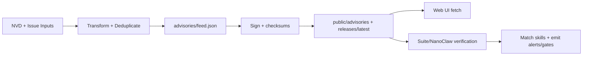

<!-- AUTO-GENERATED TRANSLATION SCAFFOLD (fr)
Source: ../data-flow.md
Review status: draft
-->

# Flux de données

> Contexte produit: ClawSec

Flux primaires
- `Advisory ingestion`: Les entrées NVD/community sont transformées en un flux de consultation normalisé, signé, puis miroir pour les clients.
- `Skill catalog publication`: les actifs de libération sont découverts et convertis en `public/skills/index.json` plus les documents/chèques par compétence.
- `Runtime enforcement`: les consommateurs de suites et nanoclaw chargent des données consultatives, se joignent aux compétences et émettent des alertes ou des portes de confirmation.
- Oui. Cette page apparaît dans la section `Guides` dans `INDEX.md`.

Pas à pas
1. Le workflow/script du producteur d'alimentation récupère les données sources (`NVD API` ou charge utile d'émission).
2. La logique de transformation de JSON normalise les champs de gravité/type/affectés et les doublons par ID-conseil.
3. Les étapes Signature/Checksum génèrent des signatures séparées et des manifestes de checksum.
4. Déployer des miroirs de flux de travail signés artefacts sous `public/` et `public/releases/latest/download/`.
5. Les consommateurs d'interface utilisateur valident la forme/le contenu de JSON; les consommateurs d'exécution vérifient en outre les signatures/chèques avant de faire confiance aux données d'alimentation.
6. Les correspondants comparent les spécifications `affected` aux noms de compétences/versions et émettent des alertes ou forcent la confirmation.

## Entrées et sorties
Les entrées/sorties sont résumées dans le tableau ci-dessous.

Type de type Nom Lieu Description
* * * * * * * * * *
En entrée CVE charge utile. - Oui.
Contribution Question de consultation communautaire Question de consultation `.github/workflows/community-advisory.yml` charge utile événementaire Question approuvée par le mainteneur transformée en dossier de consultation. - Oui.
Entraits de compétences Release actifs de compétences de GitHub Releases API + actifs de compétences Utilisé pour construire le catalogue Web et les téléchargements miroirs. - Oui.
Introduire Config./env. Local `OPENCLAW_AUDIT_CONFIG`, `CLAWSEC_*` vars. - Oui.
SortieSupport consultatifSupport de dépôt canonique. - Oui.
SortieSignature consultativeSignature indépendante pour l'authenticité des aliments. - Oui.
Output (en anglais seulement) Index du catalogue des compétences (en anglais seulement) `public/skills/index.json` (en anglais seulement) Catalogue Web d'exécution utilisé par les pages `/skills`. - Oui.
Sortie Release checksums/signatures Release manifeste for release consumers. - Oui.
Sortie de la commande État de crochet de la commande `~/.openclaw/clawsec-suite-feed-state.json`. - Oui.

Oui. Structures de données
Structure des champs clés
- Oui.
Uniquement pour les données de risque utilisées par l'UI et les installateurs. - Oui.
Enregistrez vos métadonnées de compétences. - Oui.
Voir le manifeste des contrôles. - Oui.
L'état consultatif (`known_advisories`, `last_hook_scan`, `notified_matches`) prévient les alertes répétées et les balayages des gaz. - Oui.
Suppression de la confiscation de `enabledFor[]`, `suppressions[]`. - Oui.

Schémas


État et stockage
Magasin d'écriture
- Oui.
Remarques canoniques: `advisories/` , NVD + workflows communautaires et script popularisé local. - Oui.
- Oui. Copies-conseils intégrées : `skills/clawsec-feed/advisories/` et `skills/clawsec-suite/advisories/`. - Oui.
Rétroviseurs publics (`public/advisories/`, `public/releases/`) Déployer le workflow. - Oui.
L'état d'exécution `~/.openclaw/clawsec-suite-feed-state.json`=La persistance de l'état d'hameçon consultatif. - Oui.
NanoClaw cache. - Oui.
L'état d'intégrité de `/workspace/project/data/soul-guardian/` (NanoClaw) - Oui.

## Exemples d'extraits
```bash
# Local feed flow (NVD fetch -> transform -> sync)
./scripts/populate-local-feed.sh --days 120
jq '.updated, (.advisories | length)' advisories/feed.json
```

```bash
# Runtime guarded install uses signed feed paths
CLAWSEC_LOCAL_FEED=~/.openclaw/skills/clawsec-suite/advisories/feed.json \
CLAWSEC_FEED_PUBLIC_KEY=~/.openclaw/skills/clawsec-suite/advisories/feed-signing-public.pem \
node skills/clawsec-suite/scripts/guarded_skill_install.mjs --skill test-skill --dry-run
```

Modes d'échec
- Les limites de débit NVD (`403/429`) peuvent retarder le rafraîchissement de l'alimentation et nécessiter des retraits/retraits.
- Les signatures détachées manquantes ou non valides provoquent le rejet du flux en mode fermé.
- Les réponses HTML pour les paramètres JSON peuvent produire de faux positifs sauf si elles sont filtrées explicitement.
- L'erreur de configuration (`\$HOME`) peut briser la résolution locale du chemin de repli.
- Les empreintes de clés publiques décomposées dans les flux de travail déclenchent une défaillance de l'IC.

Références sources
- avis/feed.json
- avis/feed.json.sig
- scripts/popular-local-feed.sh
- scripts/popular-local-skills.sh
- .github/workflows/poll-nvd-cves.yml
- .github/workflows/community-advisory.yml
- .github/workflows/deploy-pages.yml
- .github/workflows/kill-release.yml
- compétences/clawsec-suite/hooks/clawsec-advisory-guardian/lib/feed.mjs
- skills/clawsec-suite/hooks/clawsec-advisory-guardian/lib/state.ts
- compétences/clawsec-suite/hooks/clawsec-advisory-guardian/lib/matching.ts
- compétences/clawsec-suite/scripts/guarded_skill_install.mjs
- compétences/clawsec-nanoclaw/lib/advisories.ts
- compétences/clawsec-nanoclaw/host-services/advisory-cache.ts
