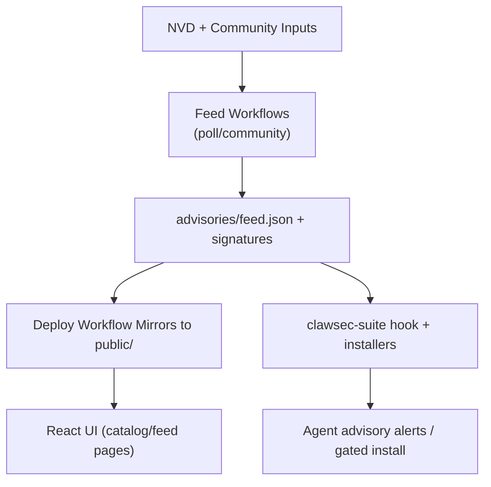

<!-- AUTO-GENERATED TRANSLATION SCAFFOLD (ja)
Source: ../architecture.md
Review status: draft
-->

# 建築

## システムコンテキスト
- - - このページは、`INDEX.md`の`Start Here`セクションで表示されます。
- ClawSecは、上流のインテリジェンスソース(NVD +コミュニティの問題)、GitHubの自動化、およびランタイムエージェントの環境間で動作します。
- - - リポジトリは、静的なサイトコンテンツと、使用前にランタイムスキルが検証する署名済みのアーティファクトの両方を公開します。
- 外部俳優グループ:
- GitHub Actions は、CI の実行、リリース、フィードワークフローを実行します。
- OpenClaw/NanoClawエージェントは、スキル、アドバイザリー、検証スクリプトを消費します。
- 諮問的問題の承認とリリース/タグの変更をマージするリポジトリメンテナー。

## コンポーネント
| 製品情報 | 所在地 | 責任 |
| お問い合わせ |
| Web UI | `App.tsx`、`pages/`、`components/` | レンダリングスキル・カタログ・アドバイザリー体験 お問い合わせ
| アドバイザリーフィードコア | `advisories/feed.json*`, `skills/clawsec-suite/.../feed.mjs` | 店舗情報・店舗情報・店舗情報・店舗情報・店舗情報 お問い合わせ
| スキルパッケージ | `skills/*/` | SBOMメタデータによるインストール可能なセキュリティ機能の配布 お問い合わせ
| ローカルオートメーションスクリプト | `scripts/*.sh` | ローカルミラー、プレプッシュチェック、マニュアルリリースヘルパーの構築 お問い合わせ
| CI/CD ワークフロー | `.github/workflows/*.yml` | ライニング・試験・NVD ポーリング・リリース・パッケージ・ページ展開 お問い合わせ
| Pythonユーティリティレイヤー | `utils/*.py` | スキルメタデータ検証とチェックサム生成 お問い合わせ

ツイート キーフロー
- スキルカタログの流れ:
1. スキルアセットを公開するワークフローのリリース/タグ
2。 ワークフローを展開すると、リリースアセットが発見され、`public/skills/index.json`が構築されます。
3. `/skills`のページの`public/skills/index.json`とスキルドキュメントのUIフェッチ。
- アドバイザリーフィードフロー:
1. `poll-nvd-cves.yml`および`community-advisory.yml`の更新`advisories/feed.json`。
2. 飼料は署名され、公道に映ります。
3. Runtime hooks/scripts はローカル署名されたコピーにリモートフィードとフォールバックをロードします。
- ガードされた取付けの流れ:
1。 インストーラ要求の対象スキル+バージョン。
2. アドバイザリー・マッチダーは影響を受けた分光器および重度/リスクヒントを点検します。
3. 終了コード42は、アドバイザリーが一致したときに2番目の確認を実施します。

##ダイアグラム



## インターフェイスと契約
| インターフェース | 受託フォーム | 検証 |
| お問い合わせ |
| スキルメタデータ | `skills/*/skill.json` | Python ユーティリティ + CI 版画チェックで検証 お問い合わせ
| アドバイザリーフィード | JSON + Ed25519 を取り外すシグネチャ | `feed.mjs` と NanoClaw のシグネチャユーティリティで検証 お問い合わせ
| チェックサムスマニフェスト | `checksums.json`(+オプションの`.sig`) | ペイロードを信頼する前に追跡・ハッシュマッチング お問い合わせ
お問い合わせ ホックイベントインターフェース | `HookEvent`(`type`、`action`、`messages`) | ランタイムハンドラは、選択したイベント名だけを処理します。 お問い合わせ
| ワークフローリリース命名 | タグパターン `<skill>-vX.Y.Z` | リリース・デメリットのワークフローで解析し、スキルを身につける お問い合わせ

ツイート 主変数
| パラメーター | デフォルト | 効果 |
| お問い合わせ |
| `CLAWSEC_FEED_URL` | `https://clawsec.prompt.security/advisories/feed.json` | スイートスクリプト・ホックの遠隔アドバイザリーソース お問い合わせ
| `CLAWSEC_ALLOW_UNSIGNED_FEED` | `0` | 一時無辞フォールバック対応可能 お問い合わせ
| `CLAWSEC_VERIFY_CHECKSUM_MANIFEST` | `1` | 利用可能なチェックサムマニフェスト検証が必要です。 お問い合わせ
| `CLAWSEC_HOOK_INTERVAL_SECONDS` | `300` | アドバイザリー・ホックのためのスキャン回転窓 お問い合わせ
| `CLAWSEC_SKILLS_INDEX_TIMEOUT_MS` | `5000` | リモート・スキル・インデックスは、カタログの発見のためのタイムアウトを取得します。 お問い合わせ
| `PROMPTSEC_GIT_PULL` | `0` | ウォッチドッグオーディション前のオプションオートプル お問い合わせ

## エラー処理と信頼性
- フィードのフェッチングは、無効なシグネチャとmalformedマニフェストのために不閉鎖されます。
- 遠隔フェッチの失敗はローカル署名された供給に優雅に落ちます。
- ホックの状態は支えられる厳密なモードと原子ファイル書き込みを使用します。
- UIページでは、HTMLフォールバックがJSONとして機能し、破損したデータをレンダリングすることを避けます。
- ワークフロー手順は、キーフィンガープリントの一貫性を強化し、スプリットキードリフトを回避します。

## サンプルスニペット
```tsx
// Route topology in the web app
<Routes>
  <Route path="/" element={<Home />} />
  <Route path="/skills" element={<SkillsCatalog />} />
  <Route path="/skills/:skillId" element={<SkillDetail />} />
  <Route path="/feed" element={<FeedSetup />} />
  <Route path="/feed/:advisoryId" element={<AdvisoryDetail />} />
  <Route path="/wiki/*" element={<WikiBrowser />} />
</Routes>
```

```ts
// Guarded feed loading contract in advisory hook
const remoteFeed = await loadRemoteFeed(feedUrl, {
  signatureUrl: feedSignatureUrl,
  checksumsUrl: feedChecksumsUrl,
  checksumsSignatureUrl: feedChecksumsSignatureUrl,
  publicKeyPem,
  checksumsPublicKeyPem: publicKeyPem,
  allowUnsigned,
  verifyChecksumManifest,
});
```

## 実行時間と展開
| 稼働時間表 | 実行モデル | 出力 |
| お問い合わせ |
| Viteアプリ(`npm run dev`) | ローカルフロントエンドサーバー | フィード/スキルのインタラクティブウェブアプリ お問い合わせ
| GitHub CI | マルチOS マトリックス + 専用ジョブ | リント/タイプ/ビルド/セキュリティとテストの信頼性 お問い合わせ
お問い合わせ スキルリリースワークフロー | タグ主導の公開 + PR ドライランチェック | リリースアセット, 署名済みのチェックサム, オプションの ClawHub 公開. お問い合わせ
お問い合わせ ページはワークフローをデプロイ | CI/Release の成功によるトリガ | 静的サイト + 顧問/リリースをミラーリングしました。 お問い合わせ
| Runtime hooks | OpenClaw イベントホック / NanoClaw IPC | 諮問的アラート、判断、完全性チェック お問い合わせ

##スケーリングノート
- NVD のポーリングで置かれるキーワードが付いている Advisory の容積スケール; dedupe およびポストろ過制御騒音。
- ワークフロープロセスのリリースリストをデプロイし、インデックス出力で最新のスキルバージョンを維持します。
- スキルフォルダによるモジュール境界により、フロントエンド構造を変更することなく新しいセキュリティ機能を追加できます。
- ペイロードサイズ(フィード/マニフェスト)が小さいため、シグネチャー検証パスは軽量です。

## ソース参照
- App.tsxアプリ
- ページ/SkillsCatalog.tsx
- ページ/フィードSetup.tsx
- ページ/AdvisoryDetail.tsx
- ページ/WikiBrowser.tsx
- スキル/クローセスイート/ホック/クローセ-アドバイザー/ハンドラー.ts
- スキル/ clawsec-suite/hooks/clawsec-advisory-guardian/lib/feed.mjs
- スキル/clawsec-suite/scripts/guarded_skill_install.mjs
- スキル/clawsec-suite/scripts/discover_skill_catalog.mjs
- スキル/クローセ・ナンクロー/lib/advisories.ts
- スキル/クローセ-ナンクロー/lib/signatures.ts
- .github/workflows/poll-nvd-cves.yml
- .github/workflows/community-advisory.yml
- .github/workflows/deploy-pages.yml
- .github/workflows/skill-release.yml
