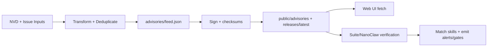

<!-- AUTO-GENERATED TRANSLATION SCAFFOLD (ja)
Source: ../data-flow.md
Review status: draft
-->

ツイート データフロー

## プライマリフロー
- `Advisory ingestion`:NVD/communityの入力は顧客のために、署名された正常化された諮問的な供給に変えられます。
- `Skill catalog publication`: リリースアセットが発見され、`public/skills/index.json`とパースキルのドキュメント/チェックサムに変換されます。
- `Runtime enforcement`: スイートとナノクローの消費者は、アドバイザリーデータをロードし、スキルと一致し、アラートや確認ゲートを発します。
- - - このページは、`INDEX.md`の`Guides`セクションで表示されます。

## ステップバイステップ
1。 フィードプロデューサーワークフロー/スクリプトフェッチソースデータ (`NVD API` または発行ペイロード).
2。 JSON は、ロジックが重度/種類/影響領域を正規化し、アドバイザリー ID による重複排除を行います。
3。 シグネチャー/チェックサムのステップは、分離されたシグネチャとチェックサムマニフェストを生成します。
4。 `public/`と`public/releases/latest/download/`でワークフローミラー署名済みのアーティファクトを展開します。
5。 UI 消費者は JSON 形状/コンテンツを検証します。ランタイムの消費者は、フィードデータを信頼する前に、署名/チェックサムを検証します。
6。 Matchers は、`affected` の仕様をスキル名/バージョンに比較し、アラートを発したり、確認を強制したりします。

## 入力と出力
入力/出力は下の表でまとめられます。

| 種類 | お名前 | 所在地 | 概要 |
| お問い合わせ |
| 入力 | CVE ペイロード | `services.nvd.nist.gov/rest/json/cves/2.0` | ClawSec キーワードでフィルタリングされた脆弱性 お問い合わせ
| 入力 | コミュニティアドバイザリー問題 | `.github/workflows/community-advisory.yml`イベントペイロード | メンテラー承認問題がアドバイザリーレコードに変身 お問い合わせ
| 入力 | スキルリリースアセット | GitHub リリース API + アセット | ウェブカタログ作成・ミラーダウンロード お問い合わせ
| 入力 | ローカルコンフィグ/env | `OPENCLAW_AUDIT_CONFIG`、`CLAWSEC_*` vars | フィードの経路制御・抑制・検証の動作 お問い合わせ
| 出力 | アドバイザリーフィード | `advisories/feed.json` | キヤノンレポジトリフィード お問い合わせ
| アウトプット | アドバイザリーシグネチャ | `advisories/feed.json.sig` | フィード認証のデタケドシグネチャ お問い合わせ
| アウトプット | スキルカタログ | `public/skills/index.json` | `/skills`ページで使用されるランタイムウェブカタログ お問い合わせ
| アウトプット | リリースチェックサム・サイン | `release-assets/checksums.json(.sig)` | リリースコンシューマー向け整合性マニフェスト お問い合わせ
| 出力 | ホックの状態 | `~/.openclaw/clawsec-suite-feed-state.json` | スキャンのタイミングを追跡し、一致を通知して下さい。 お問い合わせ

ツイート データ構造
| 構成 | 主要分野 | 目的 |
| お問い合わせ |
| アドバイザリーフィードレコード | `id`、`severity`、`type`、`affected[]`、`published` | UIやインストーラーが使用するリスクデータの単位 お問い合わせ
| スキルメタデータレコード | `id`、`name`、`version`、`emoji`、`tag` | ウェブ閲覧・インストールの行 お問い合わせ
| チェックサムスマニフェスト | `schema_version`, `algorithm`, `files` | 予想される消化器の名前をマップします。 お問い合わせ
| 諮問状態 | `known_advisories`、`last_hook_scan`、`notified_matches` | 繰り返しのアラートやスロットルのスキャンを防ぎます。 お問い合わせ
| Suppression config | `enabledFor[]`, `suppressions[]` | `checkId` + `skill` によるスキップリストの対象となります。 お問い合わせ

##ダイアグラム


## 状態とストレージ
| 店舗 | パス・スコープ | パス |
| お問い合わせ |
| キヤノンのアドバイザリー | `advisories/` | NVD + コミュニティワークフローとローカルのポピュレーションスクリプト お問い合わせ
お問い合わせ 組込みアドバイザリーコピー | `skills/clawsec-feed/advisories/` と `skills/clawsec-suite/advisories/` | 同期/包装プロセスとリリースワークフロー お問い合わせ
| パブリックミラー | `public/advisories/`、`public/releases/` | ワークフローの展開 お問い合わせ
| 稼働時間状態 | `~/.openclaw/clawsec-suite-feed-state.json` | 諮問ホックの状態の永続性。 お問い合わせ
| NanoClawキャッシュ | `/workspace/project/data/clawsec-advisory-cache.json` | ホスト・サイド・アドバイザリー・キャッシュ・マネージャー お問い合わせ
| 整合状態 | `/workspace/project/data/soul-guardian/`(ナノクロー) | 整合性モニターベースライン・オーディオストレージ お問い合わせ

## サンプルスニペット
```bash
# Local feed flow (NVD fetch -> transform -> sync)
./scripts/populate-local-feed.sh --days 120
jq '.updated, (.advisories | length)' advisories/feed.json
```

```bash
# Runtime guarded install uses signed feed paths
CLAWSEC_LOCAL_FEED=~/.openclaw/skills/clawsec-suite/advisories/feed.json \
CLAWSEC_FEED_PUBLIC_KEY=~/.openclaw/skills/clawsec-suite/advisories/feed-signing-public.pem \
node skills/clawsec-suite/scripts/guarded_skill_install.mjs --skill test-skill --dry-run
```

## 失敗モード
- NVD率の限界(`403/429`)は送りを遅らせ、retries/backoffを要求できます。
- 欠損または無効な離脱署名により、異常終了モードのフィード拒否が発生します。
- JSONエンドポイントのHTMLフォールバック応答は、明示的にフィルタリングされていない限り、偽陽性を生成できます。
- パストークンの誤設定(`\$HOME`)は、ローカルのフォールバックパスの解像度を破ることができます。
- ワークフローで公開鍵のフィンガープリントをミスマッチして、ハードなCI障害が発生します。

## ソース参照
- アドバイザリー/フィード.json
- アドバイザリー/フィード.json.sig
- スクリプト/populate-local-feed.sh
- スクリプト/populate-local-skills.sh
- .github/workflows/poll-nvd-cves.yml
- .github/workflows/community-advisory.yml
- .github/workflows/deploy-pages.yml
- .github/workflows/skill-release.yml
- スキル/ clawsec-suite/hooks/clawsec-advisory-guardian/lib/feed.mjs
- スキル/クローセスイート/ホック/クローセ-アドバイザー/lib/state.ts
- スキル/クローセスイート/ホック/クローセ管理人/lib/matching.ts
- スキル/clawsec-suite/scripts/guarded_skill_install.mjs
- スキル/クローセ・ナンクロー/lib/advisories.ts
- スキル/法律/犯罪サービス/アドバイザー/キャッシュ.ts
