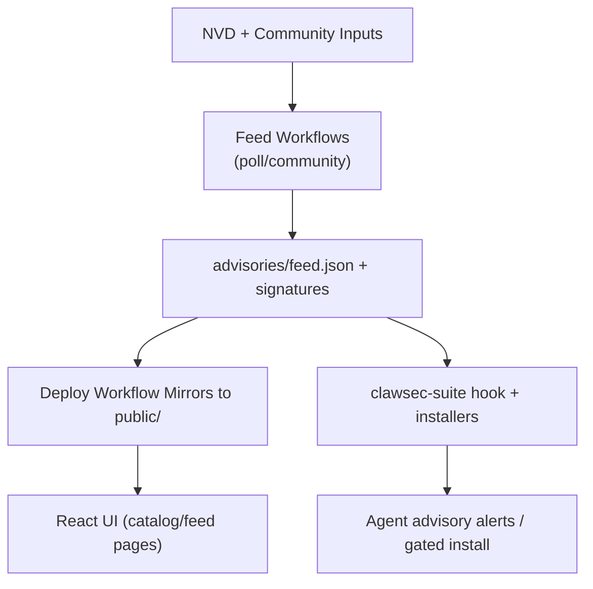

<!-- AUTO-GENERATED TRANSLATION SCAFFOLD (ko)
Source: ../architecture.md
Review status: draft
-->

# 건축

## 체계 콘텍스트
- - - 이 페이지는 `Start Here` 섹션에서 나타납니다.
- ClawSec은 업스트림 인텔리전스 소스 (NVD + 커뮤니티 문제), GitHub 자동화 및 런타임 에이전트 환경 사이에 앉아 있습니다.
- - - Repository는 static 사이트 콘텐츠를 게시하고 사용하기 전에 런타임 기술 검증을 서명했습니다.
- 외부 배우 그룹:
- GitHub Actions runners는 CI, 릴리스 및 피드 워크플로우를 실행합니다.
- OpenClaw/NanoClaw 에이전트 consuming 기술, 고문 및 검증 스크립트.
- Repository maintainers는 자문 문제 및 merging release/tag 변화를 찬성합니다.

## 부품
| 부품 | 위치 | 책임 |
인포메이션
| 웹 UI | `App.tsx`, `pages/`, `components/` | 기술 카탈로그 및 자문 세부 경험 렌더링. ·
| 자문 사료 코어 | `advisories/feed.json*`, `skills/clawsec-suite/.../feed.mjs` | 매장, 검증 및 파스 자문 ·
| 스킬패키지 | `skills/*/` | SBOM 메타데이터를 이용한 분산형 보안 기능 ·
| Local Automation Scripts | `scripts/*.sh` | 현지 미러, 사전 푸시 체크 및 수동 릴리즈 헬퍼 구축 ·
| CI/CD 워크플로 | `.github/workflows/*.yml` | Linting, tests, NVD polling, release Packaging, 페이지 배포. ·
| Python Utility Layer | `utils/*.py` | 기술 메타데이터 검증 및 체크섬 생성 ·

# # # # # # # # # # # 키 흐름
- 기술 카탈로그 흐름:
1. Release/tag 워크플로우 게시 기술 자산.
2. 배포 워크플로우는 릴리스 자산을 발견하고 `public/skills/index.json`를 구축합니다.
3. `/skills` 페이지에 대한 UI fetches `public/skills/index.json` 및 기술 문서.
- 자문 피드 흐름:
1. `poll-nvd-cves.yml` 및 `community-advisory.yml` 업데이트 `advisories/feed.json`.
2. 급식은 서명하고 대중적인 경로에 미러링됩니다.
3. Runtime Hooks/scripts는 국부적으로 서명한 사본에 먼 급식 및 fallback를 적재합니다.
- Guarded 설치 흐름:
1. 설치자 요청 대상 기술 + 버전.
2. 자문 성냥꾼은 specifiers와 severity/risk hints를 검사합니다.
3. 출구 부호 42는 고문 경기 때 두번째 확인을 강제합니다.

## 다이어그램



## 인터페이스 및 계약
| 인터페이스 | 계약서 | 검증 |
인포메이션
| 스킬 메타데이터 | `skills/*/skill.json` | 파이썬 유틸리티 + CI 버전 비교 검사로 검증 ·
| 자문 피드 | JSON + Ed25519 detached 시그니처 | `feed.mjs` 및 NanoClaw 시그니처 유틸리티 인증 ·
| 체크섬 | `checksums.json`(옵션 `.sig`) | 페이로드를 신뢰하기 전에 Parsed 및 해시 일치합니다. ·
· 후크 이벤트 인터페이스 | `HookEvent` (`type`, `action`, `messages`) | 런타임 핸들러만 선택된 이벤트명. ·
| 워크 플로우 릴리즈 naming | 태그 패턴 `<skill>-vX.Y.Z` | 출시/ 배포 워크플로우에서 기술 발견. ·

# # # # # # # # # # # 핵심 모수
| 매개 변수 | 기본 | 효과 |
인포메이션
| `CLAWSEC_FEED_URL` | `https://clawsec.prompt.security/advisories/feed.json` | 스위트 스크립트/훅용 원격 자문 소스 ·
| `CLAWSEC_ALLOW_UNSIGNED_FEED` | `0` | 임시 불신뢰도 무상 호환성이 있습니다. ·
| `CLAWSEC_VERIFY_CHECKSUM_MANIFEST` | `1` | 자주 묻는 질문(FAQ) ·
| `CLAWSEC_HOOK_INTERVAL_SECONDS` | `300` | 고문 후크 스캔 스로틀링 창. ·
| `CLAWSEC_SKILLS_INDEX_TIMEOUT_MS` | `5000` | 카탈로그 검색에 대한 원격 기술 색인 fetch timeout ·
| `PROMPTSEC_GIT_PULL` | `0` | watchdog 감사의 전 선택 자동 요금 ·

## 오류 처리 및 신뢰성
- Feed fetching은 잘못된 서명과 변형 된 표시를 위해 실패합니다.
- 원격 fetch 실패는 완전히 로컬 서명 피드로 돌아갑니다.
- Hook state는 atomic 파일이 지원되는 엄격한 모드로 작성합니다.
- UI 페이지는 JSON으로 제공되는 HTML fallback을 감지하고 손상된 데이터를 렌더링합니다.
- 워크 플로우 단계는 분할 키 드립을 방지하기 위해 키 지문 일관성을 적용합니다.

## 예제 Snippets
```tsx
// Route topology in the web app
<Routes>
  <Route path="/" element={<Home />} />
  <Route path="/skills" element={<SkillsCatalog />} />
  <Route path="/skills/:skillId" element={<SkillDetail />} />
  <Route path="/feed" element={<FeedSetup />} />
  <Route path="/feed/:advisoryId" element={<AdvisoryDetail />} />
  <Route path="/wiki/*" element={<WikiBrowser />} />
</Routes>
```

```ts
// Guarded feed loading contract in advisory hook
const remoteFeed = await loadRemoteFeed(feedUrl, {
  signatureUrl: feedSignatureUrl,
  checksumsUrl: feedChecksumsUrl,
  checksumsSignatureUrl: feedChecksumsSignatureUrl,
  publicKeyPem,
  checksumsPublicKeyPem: publicKeyPem,
  allowUnsigned,
  verifyChecksumManifest,
});
```

## 런타임 및 배포
| 런타임 표면 | 런타임 모델 | 출력 |
인포메이션
| Vite 앱(`npm run dev`) | 로컬 프론트엔드 서버 | 피드/스킬에 대한 인터랙티브 웹 앱. ·
| GitHub CI | 멀티OS 매트릭스 + 전용 구인 | Lint/type/build/security 및 테스트 신뢰 ·
· 기술 릴리스 워크플로우 | 태그 구동 출판 + PR 건식 체크 | 릴리스 자산, 서명된 체크섬, 옵션 ClawHub 출판. ·
· 페이지 배치 워크플로우 | CI/Release Success | 정적 사이트 + 미러링 자문/출판. ·
| 런타임 후크 | OpenClaw 이벤트 후크 / NanoClaw IPC | 자문 경고, 편집 결정, 무결성 검사. ·

## 확장 노트
- NVD polling의 키워드 세트와 자문 볼륨 스케일; dedupe 및 포스트 필터링 제어 소음.
- Deploy 워크플로우 프로세스 릴리스 목록 및 색인 출력의 최신 기술 버전을 유지.
- 기술 폴더에 의해 모듈 경계는 frontend 구조를 변경하지 않고 새로운 보안 기능을 추가 할 수 있습니다.
- 시그니처 검증 경로는 페이로드 크기 (feed/manifests)가 작기 때문에 경량 유지.

## 소스 참조
- 앱.tsx
- 페이지/SkillsCatalog.tsx
- 페이지/FeedSetup.tsx
- 페이지/AdvisoryDetail.tsx
- 페이지/WikiBrowser.tsx
- 기술/하프스위트/훅/하프스위트 자문/handler.ts
- 기술/하프스위트/훅/하프스위트 자문/lib/feed.mjs
- 기술/클래스/scripts/guarded_skill_install.mjs
- 기술/하프스위트/script/discover_skill_catalog.mjs
- 기술/클로슈-nanoclaw/lib/advisories.ts
- 기술/클로슈-nanoclaw/lib/signatures.ts
- .github/workflows/poll-nvd-cves.yml의 경우
- .github/workflows/community-advisory.yml
- .github/workflows/deploy-pages.yml의 경우
- .github/workflows/skill-release.yml의 경우
