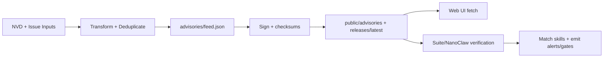

<!-- AUTO-GENERATED TRANSLATION SCAFFOLD (ko)
Source: ../data-flow.md
Review status: draft
-->

₢ 킹 데이터 흐름

## 1 차적인 교류
- `Advisory ingestion`: NVD/community 입력은 정상화된 자문 급식으로, 서명된, 그 후에 클라이언트를 위해 미러링됩니다.
- `Skill catalog publication` : 릴리스 자산은 `public/skills/index.json` 플러스 per-skill docs/checksums로 발견되고 변환됩니다.
- `Runtime enforcement` : 스위트 및 나노 클로 소비자 부하 자문 데이터, 기술에 대한 일치, 경고 또는 확인 게이트를 방출.
- - - 이 페이지는 `Guides` 섹션에서 나타납니다.

## 단계별
1. 명세 피드 프로듀서 워크 플로우 / 기술 fetches 소스 데이터 (`NVD API` 또는 문제 페이로드).
2. 명세 JSON 변형 논리는 severity/type/affected 필드를 정상화하고 고문 ID에 의해 해독합니다.
3. 명세 시그니처/체크섬 단계는 시그니처 및 체크섬을 생성합니다.
4. 명세 배포 워크플로우 미러는 `public/` 및 `public/releases/latest/download/` 아래 artifacts에 서명했습니다.
5. 명세 UI 소비자는 JSON 모양/내용을 유효하게 합니다; 런타임 소비자는 추가적으로 피드 데이터를 신뢰하기 전에 서명/체크를 확인합니다.
6. 명세 Matchers는 기술 이름/버전에 `affected` specifiers를 비교하고 경고 또는 시행 확인을 방출합니다.

## 입력 및 출력
입력/출력은 아래에 테이블에서 요약됩니다.

| 유형 | 이름 | 위치 | 묘사 |
| | | | | | | | | | | | | | | | | | | | | | | | | | | | | |
| 입력 | CVE 페이로드 | `services.nvd.nist.gov/rest/json/cves/2.0` | ClawSec 키워드로 필터링하는 소스 취약점. ·
| 입력 | 커뮤니티 자문 문제 | `.github/workflows/community-advisory.yml` 이벤트 페이로드 | 옹호자 등록 ·
| 입력 | 기술 릴리스 자산 | GitHub Releases API + Asset | 웹 카탈로그 및 미러 다운로드를 구축하는 데 사용됩니다. ·
| 입력 | Local config/env | `OPENCLAW_AUDIT_CONFIG`, `CLAWSEC_*` vars | 제어 피드 경로, 억제 및 검증 행동. ·
| 출력 | 자문 피드 | `advisories/feed.json` | Canonical repository Feed. ·
| 출력 | 자문 시그니처 | `advisories/feed.json.sig` | 피드 인증 시그니처 ·
| 산출 | 기술 카탈로그 인덱스 | `public/skills/index.json` | `/skills` 페이지에 사용된 런타임 웹 카탈로그. ·
| 출력 | 릴리즈 체크섬/신문 | `release-assets/checksums.json(.sig)` | 출시 소비자의 정수입니다. ·
| 출력 | 후크 상태 | `~/.openclaw/clawsec-suite-feed-state.json` | 타이밍 및 알림을 추적합니다. ·

# # # # # # # # # # # 데이터 구조
| 구조 | 핵심 분야 | 용도 |
인포메이션
| 자문 사료 기록 | `id`, `severity`, `type`, `affected[]`, `published` | UI 및 설치자가 사용하는 위험 데이터 단위. ·
| 기술 메타데이터 레코드 | `id`, `name`, `version`, `emoji`, `tag` | 웹 브라우징 및 설치 명령의 카탈로그 행. ·
| 체크섬 | `schema_version`, `algorithm`, `files` | 예상되는 다이제스트 파일 이름. ·
| 자문 상태 | `known_advisories`, `last_hook_scan`, `notified_matches` | 반복 경고 및 흉상 검사를 방지합니다. ·
| Suppression config | `enabledFor[]`, `suppressions[]` | `checkId` + `skill`의 뚜렷한 건너뛰기 목록. ·

## 다이어그램


## 국가 및 저장
| Store | Path/Scope | 글쓰기 경로 |
인포메이션
| Canonical advisories | `advisories/` | NVD + 커뮤니티 워크플로우 및 로컬 포뮬러 스크립트. ·
· 임베디드 자문부 | `skills/clawsec-feed/advisories/` 및 `skills/clawsec-suite/advisories/` | 동기화/패킹 프로세스 및 릴리스 워크플로우. ·
| 공개 미러 | `public/advisories/`, `public/releases/` | 배포 워크플로우. ·
| 런타임 상태 | `~/.openclaw/clawsec-suite-feed-state.json` | 자문 훅 상태 지속 ·
| 나노 클로 캐시 | `/workspace/project/data/clawsec-advisory-cache.json` | 호스트 사이드 자문 캐시 관리자. ·
| Integrity state | `/workspace/project/data/soul-guardian/`(NanoClaw) | Integrity 모니터 기본/오디오 저장. ·

## 예제 Snippets
```bash
# Local feed flow (NVD fetch -> transform -> sync)
./scripts/populate-local-feed.sh --days 120
jq '.updated, (.advisories | length)' advisories/feed.json
```

```bash
# Runtime guarded install uses signed feed paths
CLAWSEC_LOCAL_FEED=~/.openclaw/skills/clawsec-suite/advisories/feed.json \
CLAWSEC_FEED_PUBLIC_KEY=~/.openclaw/skills/clawsec-suite/advisories/feed-signing-public.pem \
node skills/clawsec-suite/scripts/guarded_skill_install.mjs --skill test-skill --dry-run
```

## 실패 모드
- NVD 비율 한계 (`403/429`)는 급식을 상쾌하게 연기하고 retries/backoff를 요구합니다.
- 미싱 또는 잘못된 분리 된 서명은 실패 닫힌 모드에서 피드 거부를 유발합니다.
- JSON endpoints에 대한 HTML fallback 응답은 명시적으로 필터링하지 않는 한 false 긍정을 생성할 수 있습니다.
- Path-token misconfiguration (`\$HOME`)는 로컬 fallback 경로 해상도를 깰 수 있습니다.
- 워크플로우에서 매끄러운 공공 키 지문은 어려운 CI 실패를 유발합니다.

## 소스 참조
- 고문/feed.json
- 고문/feed.json.sig
- 스크립트/populate-local-feed.sh
- 스크립트/populate-local-skills.sh
- .github/workflows/poll-nvd-cves.yml의 경우
- .github/workflows/community-advisory.yml
- .github/workflows/deploy-pages.yml의 경우
- .github/workflows/skill-release.yml의 경우
- 기술/하프스위트/훅/하프스위트 자문/lib/feed.mjs
- 기술/하프스위트/훅/하프스위트 자문/lib/state.ts
- 기술/하프스위트/훅/하프스위트 자문/lib/matching.ts
- 기술/클래스/scripts/guarded_skill_install.mjs
- 기술/클로슈-nanoclaw/lib/advisories.ts
- 기술/하프-nanoclaw/host-services/advisory-cache.ts
